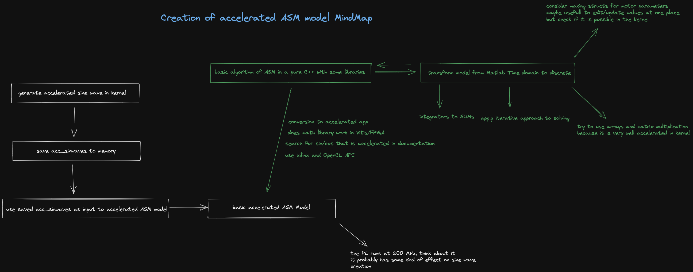

# Poznatky 27.11.2022

[MindMap of ASM model creation](../misc/asm-model-mindmap.excalidraw.png) - vytvořeno s [ExcaliDraw](https://excalidraw.com/) (je to možné deploynout i na svůj server nebo jako docker image, je to super a Open Source)

- kria nejde, hlásí to chybu že pro SW simulaci to není vybuilděné, pro HW emulaci to vybuilní ale nevytvoří SD soubory, pro Hardware to vytvoří soubory ale nelze spustit emulátor a říká, že to je pro SW emulaci - začarovaný kruh - nejde mi zatím vyřešit ani když jsem postupoval přímo podle návodu
- začal jsem psát postup základní tvorby HW ve Vivado - možná se pak přidá část, jak nastavit přístup na externí piny, ale flow bude stejný a jen se dodá buďto blok nebo nastavení
