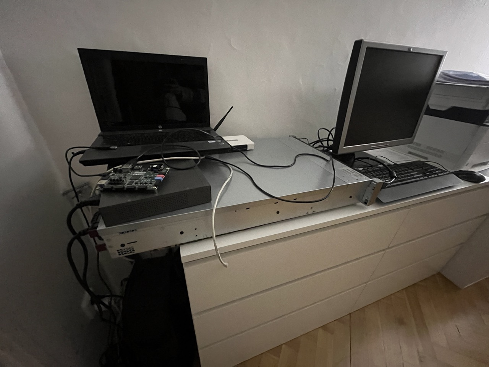

# Poznatky 06.02.2023

- list of cheap fpga dev boards (without HW accel - just fpga) [joelw.id.au](https://www.joelw.id.au/FPGA/CheapFPGADevelopmentBoards)
- krásný článek zachycující retrospektivu hw accelerace [specbranch](https://specbranch.com/posts/fpgas-what-happened/)
- nádherný popis akcelerace od Xilinxu v OpenCL [xilinx](https://www.xilinx.com/developer/articles/data-acceleration-with-vitis.html)

- pozor na SoC a All programmable system-on-chip (APSoC) - vyřešit, co tedy vlastně používám

- článek o designování SoC s ARM cortex [Designing with ARM Cortex-M based System-On-Chips (SoCs) – Part I: The basics](https://www.embedded.com/designing-with-arm-cortex-m-based-system-on-chips-socs-part-i-the-basics/)

- sepsal jsem něco do textu ohledně SoC a předepsal si názvy, které platformy by bylo fajn ještě popsat s Artix a Spartanem
- zkoušel jsem dělat RK4 v C++ a přenést do kernelu, šlo to složitěji, zápasil jsem s float reprezentací a využíval hls stream, funguje to jako FIFO, když se z toho čte, tak už ty data tam nejsou dle dokumentace, proto mi to dávalo asi špatné údaje někdy a někdy, když jsem použil zas reprezentaci už zkopírované hodnoty, tak to šlo dobře, zkusit použít jiný způsob než hls stream
- zítra vyzkoušet jiné předávání argumentů než jen stream jako FIFO, což je vhodné na sekvenční data, např. času atd. uvidíme, co se bude dít
- zkoušel jsem porovnat mojí RK4 diff v c++ a wolfram a trochu se to lišilo...

---

## Setup

---

fun fact: našel jsem docela fajn theme na vs code: [Ayu](https://marketplace.visualstudio.com/items?itemName=teabyii.ayu), jak jinak než Dark Mode, používá se vůbec světlé téma? ⚡️

### nápady na dizertaci a dále

- zkusit porovnat algoritmus v HLS a pak algoritmus přímo ve vhdl na FPGA - naučit se vhdl a implementovat řešení non linear diff equations
- bude to běh na dlouhou trať ale je dost článků na ODE v FPGA a non ODE
- nebo zkusit jen openCL hls - byla by akcelerace formou offline
- když bych chtěl on-line on-site, je třeba FPGA které nebude deska no, bude minimální a bude rychle počítat
- open source fpga designs and tutorials [papilio](http://papilio.cc/index.php?n=Papilio.PapilioPro)
