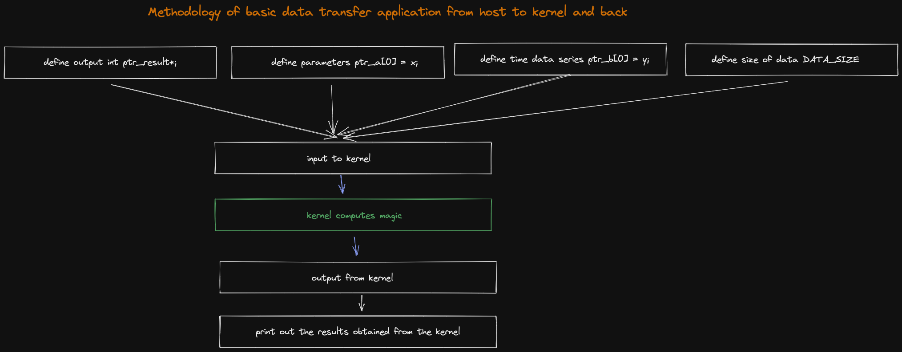

# Poznatky 08.02.2023

- informace o open cl flags při přesunu dat [stack overflow](https://stackoverflow.com/questions/57854782/how-opencl-memory-transfer-functions-work)
- nějaké informace z dokumentace ohledně přesunu dat když se jedná o vektor a nemusí se dělat mapování bufferů, připadalo mi, že to fungovalo (dodat kód) [xilinx](https://xilinx.github.io/Vitis_Accel_Examples/2019.2/html/data_transfer.html)
- projet lépe cheap fpga development boards [joelw](https://www.joelw.id.au/FPGA/CheapFPGADevelopmentBoards)
- ještě jsem nevyzkoušel fixed points [xilinx](https://docs.xilinx.com/r/en-US/ug1399-vitis-hls/Fixed-Point-Identifier-Summary?tocId=2WXwm9qjdMCmnr~DrNERyg)
- zkusit se podívat přímo na možnosti vektorů od xilinx vitisu a ne vector library základu c++ c11 [xilinx](https://docs.xilinx.com/r/2021.2-English/ug1399-vitis-hls/Vector-Data-Types)
- zkusit zahodit vektor a prostě definovat vše pointery přes buffer
- zkouším ještě vyhodit definovanou proměnnou a jestli to bude dělat to samé
- struktura nepůjde asi, budu předávat data stylem

```c++
// parametry stroje - konstanty
ptr_a[0] = 12; // R2
ptr_a[1] = 24; // L1
// etc.


// okamžiky, pro které potřebuji vypočíst výsledek diff rovnic
ptr_b[0] = 1;
ptr_b[1] = 2;

// etc.

// data z kernelu ve stylu

std::cout << ptr_result[0]; // i1alpha
std::cout << ptr_result[1]; // i1beta
// etc.

```

- je třeba zjistit, jestli bude fungovat float
- DATA_SIZE znamená, kolik dat proměnných bude v `ptr_a[DATA_SIZE]` vlastně, násobí se to totiž `sizeof(int)` a při `float` se bude muset změnit na `sizeof(float)`

- udělat pro každou diff rovnici zvlášť funkci, v jejíž argumentu bude pointer na funkci - abych vkládal v kernelu funkci co chci do rungekutty řešení a nemusel to kopírovat a celkově přepisovat

## Metodologie základní aplikace pro transfer dat - návrh



## Funkční testovací kód

```c++
// vadd.cpp

/*******************************************************************************
Vendor: Xilinx
Associated Filename: vadd.cpp
Purpose: VITIS vector addition

*******************************************************************************
Copyright (C) 2019 XILINX, Inc.

This file contains confidential and proprietary information of Xilinx, Inc. and
is protected under U.S. and international copyright and other intellectual
property laws.

DISCLAIMER
This disclaimer is not a license and does not grant any rights to the materials
distributed herewith. Except as otherwise provided in a valid license issued to
you by Xilinx, and to the maximum extent permitted by applicable law:
(1) THESE MATERIALS ARE MADE AVAILABLE "AS IS" AND WITH ALL FAULTS, AND XILINX
HEREBY DISCLAIMS ALL WARRANTIES AND CONDITIONS, EXPRESS, IMPLIED, OR STATUTORY,
INCLUDING BUT NOT LIMITED TO WARRANTIES OF MERCHANTABILITY, NON-INFRINGEMENT, OR
FITNESS FOR ANY PARTICULAR PURPOSE; and (2) Xilinx shall not be liable (whether
in contract or tort, including negligence, or under any other theory of
liability) for any loss or damage of any kind or nature related to, arising under
or in connection with these materials, including for any direct, or any indirect,
special, incidental, or consequential loss or damage (including loss of data,
profits, goodwill, or any type of loss or damage suffered as a result of any
action brought by a third party) even if such damage or loss was reasonably
foreseeable or Xilinx had been advised of the possibility of the same.

CRITICAL APPLICATIONS
Xilinx products are not designed or intended to be fail-safe, or for use in any
application requiring fail-safe performance, such as life-support or safety
devices or systems, Class III medical devices, nuclear facilities, applications
related to the deployment of airbags, or any other applications that could lead
to death, personal injury, or severe property or environmental damage
(individually and collectively, "Critical Applications"). Customer assumes the
sole risk and liability of any use of Xilinx products in Critical Applications,
subject only to applicable laws and regulations governing limitations on product
liability.

THIS COPYRIGHT NOTICE AND DISCLAIMER MUST BE RETAINED AS PART OF THIS FILE AT
ALL TIMES.

*******************************************************************************/

#define OCL_CHECK(error, call)                                                                   \
    call;                                                                                        \
    if (error != CL_SUCCESS) {                                                                   \
        printf("%s:%d Error calling " #call ", error code is: %d\n", __FILE__, __LINE__, error); \
        exit(EXIT_FAILURE);                                                                      \
    }

#include "vadd.h"
#include <fstream>
#include <iostream>
#include <stdlib.h>
#include <vector>

static const int DATA_SIZE = 4096;

static const std::string error_message =
    "Error: Result mismatch:\n"
    "i = %d CPU result = %d Device result = %d\n";

int main(int argc, char* argv[]) {
    // TARGET_DEVICE macro needs to be passed from gcc command line
    if (argc != 2) {
        std::cout << "Usage: " << argv[0] << " <xclbin>" << std::endl;
        return EXIT_FAILURE;
    }

    std::string xclbinFilename = argv[1];

    // Compute the size of array in bytes
    size_t size_in_bytes = DATA_SIZE * sizeof(int);

    // Creates a vector of DATA_SIZE elements with an initial value of 10 and 32
    // using customized allocator for getting buffer alignment to 4k boundary

    std::vector<cl::Device> devices;
    cl_int err;
    cl::Context context;
    cl::CommandQueue q;
    cl::Kernel krnl_vector_add;
    cl::Program program;
    std::vector<cl::Platform> platforms;
    bool found_device = false;

    // traversing all Platforms To find Xilinx Platform and targeted
    // Device in Xilinx Platform
    cl::Platform::get(&platforms);
    for (size_t i = 0; (i < platforms.size()) & (found_device == false); i++) {
        cl::Platform platform = platforms[i];
        std::string platformName = platform.getInfo<CL_PLATFORM_NAME>();
        if (platformName == "Xilinx") {
            devices.clear();
            platform.getDevices(CL_DEVICE_TYPE_ACCELERATOR, &devices);
            if (devices.size()) {
                found_device = true;
                break;
            }
        }
    }
    if (found_device == false) {
        std::cout << "Error: Unable to find Target Device " << std::endl;
        return EXIT_FAILURE;
    }

    std::cout << "INFO: Reading " << xclbinFilename << std::endl;
    FILE* fp;
    if ((fp = fopen(xclbinFilename.c_str(), "r")) == nullptr) {
        printf("ERROR: %s xclbin not available please build\n", xclbinFilename.c_str());
        exit(EXIT_FAILURE);
    }
    // Load xclbin
    std::cout << "Loading: '" << xclbinFilename << "'\n";
    std::ifstream bin_file(xclbinFilename, std::ifstream::binary);
    bin_file.seekg(0, bin_file.end);
    unsigned nb = bin_file.tellg();
    bin_file.seekg(0, bin_file.beg);
    char* buf = new char[nb];
    bin_file.read(buf, nb);

    // Creating Program from Binary File
    cl::Program::Binaries bins;
    bins.push_back({buf, nb});
    bool valid_device = false;
    for (unsigned int i = 0; i < devices.size(); i++) {
        auto device = devices[i];
        // Creating Context and Command Queue for selected Device
        OCL_CHECK(err, context = cl::Context(device, nullptr, nullptr, nullptr, &err));
        OCL_CHECK(err, q = cl::CommandQueue(context, device, CL_QUEUE_PROFILING_ENABLE, &err));
        std::cout << "Trying to program device[" << i << "]: " << device.getInfo<CL_DEVICE_NAME>() << std::endl;
        cl::Program program(context, {device}, bins, nullptr, &err);
        if (err != CL_SUCCESS) {
            std::cout << "Failed to program device[" << i << "] with xclbin file!\n";
        } else {
            std::cout << "Device[" << i << "]: program successful!\n";
            OCL_CHECK(err, krnl_vector_add = cl::Kernel(program, "krnl_vadd", &err));
            valid_device = true;
            break; // we break because we found a valid device
        }
    }
    if (!valid_device) {
        std::cout << "Failed to program any device found, exit!\n";
        exit(EXIT_FAILURE);
    }

    // These commands will allocate memory on the Device. The cl::Buffer objects can
    // be used to reference the memory locations on the device.
    OCL_CHECK(err, cl::Buffer buffer_a(context, CL_MEM_READ_ONLY, size_in_bytes, NULL, &err));
    OCL_CHECK(err, cl::Buffer buffer_b(context, CL_MEM_READ_ONLY, size_in_bytes, NULL, &err));
    OCL_CHECK(err, cl::Buffer buffer_result(context, CL_MEM_WRITE_ONLY, size_in_bytes, NULL, &err));

    // set the kernel Arguments
    int narg = 0;
    OCL_CHECK(err, err = krnl_vector_add.setArg(narg++, buffer_a));
    OCL_CHECK(err, err = krnl_vector_add.setArg(narg++, buffer_b));
    OCL_CHECK(err, err = krnl_vector_add.setArg(narg++, buffer_result));
    OCL_CHECK(err, err = krnl_vector_add.setArg(narg++, DATA_SIZE));

    // We then need to map our OpenCL buffers to get the pointers
    int* ptr_a;
    int* ptr_b;
    int* ptr_result;
    OCL_CHECK(err,
              ptr_a = (int*)q.enqueueMapBuffer(buffer_a, CL_TRUE, CL_MAP_WRITE, 0, size_in_bytes, NULL, NULL, &err));
    OCL_CHECK(err,
              ptr_b = (int*)q.enqueueMapBuffer(buffer_b, CL_TRUE, CL_MAP_WRITE, 0, size_in_bytes, NULL, NULL, &err));
    OCL_CHECK(err, ptr_result = (int*)q.enqueueMapBuffer(buffer_result, CL_TRUE, CL_MAP_READ, 0, size_in_bytes, NULL,
                                                         NULL, &err));

    // Initialize the vectors used in the test
    for (int i = 0; i < DATA_SIZE; i++) {
        ptr_a[i] = rand() % DATA_SIZE;
        ptr_b[i] = rand() % DATA_SIZE;
    }

    // Data will be migrated to kernel space
    OCL_CHECK(err, err = q.enqueueMigrateMemObjects({buffer_a, buffer_b}, 0 /* 0 means from host*/));

    // Launch the Kernel
    OCL_CHECK(err, err = q.enqueueTask(krnl_vector_add));

    // The result of the previous kernel execution will need to be retrieved in
    // order to view the results. This call will transfer the data from FPGA to
    // source_results vector
    OCL_CHECK(err, q.enqueueMigrateMemObjects({buffer_result}, CL_MIGRATE_MEM_OBJECT_HOST));

    OCL_CHECK(err, q.finish());

    // Verify the result
    // for (int i = 0; i < DATA_SIZE; i++) {
    //   std::cout << "result " << i << " :" <<ptr_result[i] << "\n";
    // }

     std::cout << "result at 1st index for first kernel run" << " :" <<ptr_result[1] << "\n";


        ptr_a[1] = 21;
        ptr_b[1] = 10;

        std::vector<int> v = {7, 5, 16, 8};
        std::cout << "vector in CPU at 2nd index:\n";
    std::cout << v.at(2) <<"\n";

// Data will be migrated to kernel space
    OCL_CHECK(err, err = q.enqueueMigrateMemObjects({buffer_a, buffer_b}, 0 /* 0 means from host*/));

    // Launch the Kernel
    OCL_CHECK(err, err = q.enqueueTask(krnl_vector_add));

    // The result of the previous kernel execution will need to be retrieved in
    // order to view the results. This call will transfer the data from FPGA to
    // source_results vector
    OCL_CHECK(err, q.enqueueMigrateMemObjects({buffer_result}, CL_MIGRATE_MEM_OBJECT_HOST));

    OCL_CHECK(err, q.finish());

     std::cout << "result at 1st index for first kernel run" << " :" <<ptr_result[1] << "\n";


    OCL_CHECK(err, err = q.enqueueUnmapMemObject(buffer_a, ptr_a));
    OCL_CHECK(err, err = q.enqueueUnmapMemObject(buffer_b, ptr_b));
    OCL_CHECK(err, err = q.enqueueUnmapMemObject(buffer_result, ptr_result));
    OCL_CHECK(err, err = q.finish());


    return 0;
}


```

```c++
// krnl_vadd.cpp

/*******************************************************************************
Vendor: Xilinx
Associated Filename: vadd.h
Purpose: VITIS vector addition

*******************************************************************************
Copyright (C) 2019 XILINX, Inc.

This file contains confidential and proprietary information of Xilinx, Inc. and
is protected under U.S. and international copyright and other intellectual
property laws.

DISCLAIMER
This disclaimer is not a license and does not grant any rights to the materials
distributed herewith. Except as otherwise provided in a valid license issued to
you by Xilinx, and to the maximum extent permitted by applicable law:
(1) THESE MATERIALS ARE MADE AVAILABLE "AS IS" AND WITH ALL FAULTS, AND XILINX
HEREBY DISCLAIMS ALL WARRANTIES AND CONDITIONS, EXPRESS, IMPLIED, OR STATUTORY,
INCLUDING BUT NOT LIMITED TO WARRANTIES OF MERCHANTABILITY, NON-INFRINGEMENT, OR
FITNESS FOR ANY PARTICULAR PURPOSE; and (2) Xilinx shall not be liable (whether
in contract or tort, including negligence, or under any other theory of
liability) for any loss or damage of any kind or nature related to, arising under
or in connection with these materials, including for any direct, or any indirect,
special, incidental, or consequential loss or damage (including loss of data,
profits, goodwill, or any type of loss or damage suffered as a result of any
action brought by a third party) even if such damage or loss was reasonably
foreseeable or Xilinx had been advised of the possibility of the same.

CRITICAL APPLICATIONS
Xilinx products are not designed or intended to be fail-safe, or for use in any
application requiring fail-safe performance, such as life-support or safety
devices or systems, Class III medical devices, nuclear facilities, applications
related to the deployment of airbags, or any other applications that could lead
to death, personal injury, or severe property or environmental damage
(individually and collectively, "Critical Applications"). Customer assumes the
sole risk and liability of any use of Xilinx products in Critical Applications,
subject only to applicable laws and regulations governing limitations on product
liability.

THIS COPYRIGHT NOTICE AND DISCLAIMER MUST BE RETAINED AS PART OF THIS FILE AT
ALL TIMES.

*******************************************************************************/

/*******************************************************************************
Description:

    This example uses the load/compute/store coding style which is generally
    the most efficient for implementing kernels using HLS. The load and store
    functions are responsible for moving data in and out of the kernel as
    efficiently as possible. The core functionality is decomposed across one
    of more compute functions. Whenever possible, the compute function should
    pass data through HLS streams and should contain a single set of nested loops.

    HLS stream objects are used to pass data between producer and consumer
    functions. Stream read and write operations have a blocking behavior which
    allows consumers and producers to synchronize with each other automatically.

    The dataflow pragma instructs the compiler to enable task-level pipelining.
    This is required for to load/compute/store functions to execute in a parallel
    and pipelined manner. Here the kernel loads, computes and stores NUM_WORDS integer values per
    clock cycle and is implemented as below:
                                       _____________
                                      |             |<----- Input Vector 1 from Global Memory
                                      |  load_input |       __
                                      |_____________|----->|  |
                                       _____________       |  | in1_stream
Input Vector 2 from Global Memory --->|             |      |__|
                               __     |  load_input |        |
                              |  |<---|_____________|        |
                   in2_stream |  |     _____________         |
                              |__|--->|             |<--------
                                      | compute_add |      __
                                      |_____________|---->|  |
                                       ______________     |  | out_stream
                                      |              |<---|__|
                                      | store_result |
                                      |______________|-----> Output result to Global Memory

*******************************************************************************/

// Includes
#include <stdint.h>
#include <hls_stream.h>

#define DATA_SIZE 4096

// TRIPCOUNT identifier
const int c_size = DATA_SIZE;

static void load_input(uint32_t* in, hls::stream<uint32_t>& inStream, int size) {
mem_rd:
    for (int i = 0; i < size; i++) {
#pragma HLS LOOP_TRIPCOUNT min = c_size max = c_size
        inStream << in[i];
    }
}

static void compute_add(hls::stream<uint32_t>& in1_stream,
                        hls::stream<uint32_t>& in2_stream,
                        hls::stream<uint32_t>& out_stream,
                        int size) {
// The kernel is operating with vector of NUM_WORDS integers. The + operator performs
// an element-wise add, resulting in NUM_WORDS parallel additions.
execute:
    for (int i = 0; i < size; i++) {
#pragma HLS LOOP_TRIPCOUNT min = c_size max = c_size
        out_stream << (in1_stream.read() + in2_stream.read());
    }
}

static void store_result(uint32_t* out, hls::stream<uint32_t>& out_stream, int size) {
mem_wr:
    for (int i = 0; i < size; i++) {
#pragma HLS LOOP_TRIPCOUNT min = c_size max = c_size
        out[i] = out_stream.read();
    }
}

extern "C" {

/*
    Vector Addition Kernel

    Arguments:
        in1  (input)  --> Input vector 1
        in2  (input)  --> Input vector 2
        out  (output) --> Output vector
        size (input)  --> Number of elements in vector
*/

void krnl_vadd(uint32_t* in1, uint32_t* in2, uint32_t* out, int size) {
#pragma HLS INTERFACE m_axi port = in1 bundle = gmem0
#pragma HLS INTERFACE m_axi port = in2 bundle = gmem1
#pragma HLS INTERFACE m_axi port = out bundle = gmem0

    static hls::stream<uint32_t> in1_stream("input_stream_1");
    static hls::stream<uint32_t> in2_stream("input_stream_2");
    static hls::stream<uint32_t> out_stream("output_stream");

#pragma HLS dataflow
    // dataflow pragma instruct compiler to run following three APIs in parallel
    load_input(in1, in1_stream, size);
    load_input(in2, in2_stream, size);
    compute_add(in1_stream, in2_stream, out_stream, size);
    store_result(out, out_stream, size);
}
}


```

## Info about vector and pointers on them

```c++

int main(int nArgs, char ** vArgs)
{
    vector<int> *v = new vector<int>(10);
    v->at(2); //Retrieve using pointer to member
    v->operator[](2); //Retrieve using pointer to operator member
    v->size(); //Retrieve size
    vector<int> &vr = *v; //Create a reference
    vr[2]; //Normal access through reference
    delete &vr; //Delete the reference. You could do the same with
                //a pointer (but not both!)
}

```

## Toto taky funguje

nepoužívá to stream jako FIFO ale vlastně array - pointer

```c++
//vadd.cpp

#define OCL_CHECK(error, call)                                                                   \
    call;                                                                                        \
    if (error != CL_SUCCESS) {                                                                   \
        printf("%s:%d Error calling " #call ", error code is: %d\n", __FILE__, __LINE__, error); \
        exit(EXIT_FAILURE);                                                                      \
    }

#include "vadd.h"
#include <fstream>
#include <iostream>
#include <stdlib.h>
#include <vector>

static const int DATA_SIZE = 4096;

static const std::string error_message =
    "Error: Result mismatch:\n"
    "i = %d CPU result = %d Device result = %d\n";

int main(int argc, char* argv[]) {
    // TARGET_DEVICE macro needs to be passed from gcc command line
    if (argc != 2) {
        std::cout << "Usage: " << argv[0] << " <xclbin>" << std::endl;
        return EXIT_FAILURE;
    }

    std::string xclbinFilename = argv[1];

    // Compute the size of array in bytes
    size_t size_in_bytes = DATA_SIZE * sizeof(int);

    // Creates a vector of DATA_SIZE elements with an initial value of 10 and 32
    // using customized allocator for getting buffer alignment to 4k boundary

    std::vector<cl::Device> devices;
    cl_int err;
    cl::Context context;
    cl::CommandQueue q;
    cl::Kernel krnl_vector_add;
    cl::Program program;
    std::vector<cl::Platform> platforms;
    bool found_device = false;

    // traversing all Platforms To find Xilinx Platform and targeted
    // Device in Xilinx Platform
    cl::Platform::get(&platforms);
    for (size_t i = 0; (i < platforms.size()) & (found_device == false); i++) {
        cl::Platform platform = platforms[i];
        std::string platformName = platform.getInfo<CL_PLATFORM_NAME>();
        if (platformName == "Xilinx") {
            devices.clear();
            platform.getDevices(CL_DEVICE_TYPE_ACCELERATOR, &devices);
            if (devices.size()) {
                found_device = true;
                break;
            }
        }
    }
    if (found_device == false) {
        std::cout << "Error: Unable to find Target Device " << std::endl;
        return EXIT_FAILURE;
    }

    std::cout << "INFO: Reading " << xclbinFilename << std::endl;
    FILE* fp;
    if ((fp = fopen(xclbinFilename.c_str(), "r")) == nullptr) {
        printf("ERROR: %s xclbin not available please build\n", xclbinFilename.c_str());
        exit(EXIT_FAILURE);
    }
    // Load xclbin
    std::cout << "Loading: '" << xclbinFilename << "'\n";
    std::ifstream bin_file(xclbinFilename, std::ifstream::binary);
    bin_file.seekg(0, bin_file.end);
    unsigned nb = bin_file.tellg();
    bin_file.seekg(0, bin_file.beg);
    char* buf = new char[nb];
    bin_file.read(buf, nb);

    // Creating Program from Binary File
    cl::Program::Binaries bins;
    bins.push_back({buf, nb});
    bool valid_device = false;
    for (unsigned int i = 0; i < devices.size(); i++) {
        auto device = devices[i];
        // Creating Context and Command Queue for selected Device
        OCL_CHECK(err, context = cl::Context(device, nullptr, nullptr, nullptr, &err));
        OCL_CHECK(err, q = cl::CommandQueue(context, device, CL_QUEUE_PROFILING_ENABLE, &err));
        std::cout << "Trying to program device[" << i << "]: " << device.getInfo<CL_DEVICE_NAME>() << std::endl;
        cl::Program program(context, {device}, bins, nullptr, &err);
        if (err != CL_SUCCESS) {
            std::cout << "Failed to program device[" << i << "] with xclbin file!\n";
        } else {
            std::cout << "Device[" << i << "]: program successful!\n";
            OCL_CHECK(err, krnl_vector_add = cl::Kernel(program, "krnl_vadd", &err));
            valid_device = true;
            break; // we break because we found a valid device
        }
    }
    if (!valid_device) {
        std::cout << "Failed to program any device found, exit!\n";
        exit(EXIT_FAILURE);
    }

    // These commands will allocate memory on the Device. The cl::Buffer objects can
    // be used to reference the memory locations on the device.
    OCL_CHECK(err, cl::Buffer buffer_a(context, CL_MEM_READ_ONLY, size_in_bytes, NULL, &err));
    OCL_CHECK(err, cl::Buffer buffer_b(context, CL_MEM_READ_ONLY, size_in_bytes, NULL, &err));
    OCL_CHECK(err, cl::Buffer buffer_result(context, CL_MEM_WRITE_ONLY, size_in_bytes, NULL, &err));

    // set the kernel Arguments
    int narg = 0;
    OCL_CHECK(err, err = krnl_vector_add.setArg(narg++, buffer_a));
    OCL_CHECK(err, err = krnl_vector_add.setArg(narg++, buffer_b));
    OCL_CHECK(err, err = krnl_vector_add.setArg(narg++, buffer_result));
    OCL_CHECK(err, err = krnl_vector_add.setArg(narg++, DATA_SIZE));

    // We then need to map our OpenCL buffers to get the pointers
    int* ptr_a;
    int* ptr_b;
    int* ptr_result;
    OCL_CHECK(err,
              ptr_a = (int*)q.enqueueMapBuffer(buffer_a, CL_TRUE, CL_MAP_WRITE, 0, size_in_bytes, NULL, NULL, &err));
    OCL_CHECK(err,
              ptr_b = (int*)q.enqueueMapBuffer(buffer_b, CL_TRUE, CL_MAP_WRITE, 0, size_in_bytes, NULL, NULL, &err));
    OCL_CHECK(err, ptr_result = (int*)q.enqueueMapBuffer(buffer_result, CL_TRUE, CL_MAP_READ, 0, size_in_bytes, NULL,
                                                         NULL, &err));

        ptr_a[0] = 21;
        ptr_b[0] = 10;


    // Data will be migrated to kernel space
    OCL_CHECK(err, err = q.enqueueMigrateMemObjects({buffer_a, buffer_b}, 0 /* 0 means from host*/));

    // Launch the Kernel
    OCL_CHECK(err, err = q.enqueueTask(krnl_vector_add));

    // The result of the previous kernel execution will need to be retrieved in
    // order to view the results. This call will transfer the data from FPGA to
    // source_results vector
    OCL_CHECK(err, q.enqueueMigrateMemObjects({buffer_result}, CL_MIGRATE_MEM_OBJECT_HOST));

    OCL_CHECK(err, q.finish());


     std::cout << "result at 1st index for first kernel run" << " :" <<ptr_result[0] << "\n";


    std::vector<int> v = {7, 5, 16, 8};
    std::cout << "vector in CPU at 2nd index:\n";
    std::cout << v.at(2) <<"\n";


    OCL_CHECK(err, err = q.enqueueUnmapMemObject(buffer_a, ptr_a));
    OCL_CHECK(err, err = q.enqueueUnmapMemObject(buffer_b, ptr_b));
    OCL_CHECK(err, err = q.enqueueUnmapMemObject(buffer_result, ptr_result));
    OCL_CHECK(err, err = q.finish());


    return 0;
}
```

```c++
//krnl_vadd.cpp

// Includes
#include <stdint.h>
#include <hls_stream.h>

#define DATA_SIZE 4096

// TRIPCOUNT identifier
const int c_size = DATA_SIZE;


extern "C" {

/*
    Vector Addition Kernel

    Arguments:
        in1  (input)  --> Input vector 1
        in2  (input)  --> Input vector 2
        out  (output) --> Output vector
        size (input)  --> Number of elements in vector
*/

void krnl_vadd(uint32_t* in1, uint32_t* in2, uint32_t* out, int size) {
#pragma HLS INTERFACE m_axi port = in1 bundle = gmem0
#pragma HLS INTERFACE m_axi port = in2 bundle = gmem1
#pragma HLS INTERFACE m_axi port = out bundle = gmem0


#pragma HLS dataflow
    // dataflow pragma instruct compiler to run following three APIs in parallel
  out[0] = in1[0];
}
}

```

---

## Funkční kód

kód dělá to, že v kernelu z vektoru z hostu přesune data do výstupního bufferu a proměnné, poté je zobrazen výstup

na konci se poté ještě ukazuje, že lze vypsat i z vektoru data v hostu

problém je, že když je to takto udělané, kopírují se všechny data do výstupní proměnné a ne jen vybraná a první a poslední hodnota je docela random, na indexu 0 je nultá hodnota z vektoru a kernelu = divné

```c++
//vadd.cpp
//vadd.cpp
#define OCL_CHECK(error, call)                                                                   \
    call;                                                                                        \
    if (error != CL_SUCCESS) {                                                                   \
        printf("%s:%d Error calling " #call ", error code is: %d\n", __FILE__, __LINE__, error); \
        exit(EXIT_FAILURE);                                                                      \
    }

#include "vadd.h"
#include <fstream>
#include <iostream>
#include <stdlib.h>
#include <vector>


static const int DATA_SIZE = 4096;

static const std::string error_message =
    "Error: Result mismatch:\n"
    "i = %d CPU result = %d Device result = %d\n";

int main(int argc, char* argv[]) {
    // TARGET_DEVICE macro needs to be passed from gcc command line
    if (argc != 2) {
        std::cout << "Usage: " << argv[0] << " <xclbin>" << std::endl;
        return EXIT_FAILURE;
    }

    std::string xclbinFilename = argv[1];

    // Compute the size of array in bytes
    size_t size_in_bytes = DATA_SIZE * sizeof(int);

    // Creates a vector of DATA_SIZE elements with an initial value of 10 and 32
    // using customized allocator for getting buffer alignment to 4k boundary

    std::vector<cl::Device> devices;
    cl_int err;
    cl::Context context;
    cl::CommandQueue q;
    cl::Kernel krnl_vector_add;
    cl::Program program;
    std::vector<cl::Platform> platforms;
    bool found_device = false;

    // traversing all Platforms To find Xilinx Platform and targeted
    // Device in Xilinx Platform
    cl::Platform::get(&platforms);
    for (size_t i = 0; (i < platforms.size()) & (found_device == false); i++) {
        cl::Platform platform = platforms[i];
        std::string platformName = platform.getInfo<CL_PLATFORM_NAME>();
        if (platformName == "Xilinx") {
            devices.clear();
            platform.getDevices(CL_DEVICE_TYPE_ACCELERATOR, &devices);
            if (devices.size()) {
                found_device = true;
                break;
            }
        }
    }
    if (found_device == false) {
        std::cout << "Error: Unable to find Target Device " << std::endl;
        return EXIT_FAILURE;
    }

    std::cout << "INFO: Reading " << xclbinFilename << std::endl;
    FILE* fp;
    if ((fp = fopen(xclbinFilename.c_str(), "r")) == nullptr) {
        printf("ERROR: %s xclbin not available please build\n", xclbinFilename.c_str());
        exit(EXIT_FAILURE);
    }
    // Load xclbin
    std::cout << "Loading: '" << xclbinFilename << "'\n";
    std::ifstream bin_file(xclbinFilename, std::ifstream::binary);
    bin_file.seekg(0, bin_file.end);
    unsigned nb = bin_file.tellg();
    bin_file.seekg(0, bin_file.beg);
    char* buf = new char[nb];
    bin_file.read(buf, nb);

    // Creating Program from Binary File
    cl::Program::Binaries bins;
    bins.push_back({buf, nb});
    bool valid_device = false;
    for (unsigned int i = 0; i < devices.size(); i++) {
        auto device = devices[i];
        // Creating Context and Command Queue for selected Device
        OCL_CHECK(err, context = cl::Context(device, nullptr, nullptr, nullptr, &err));
        OCL_CHECK(err, q = cl::CommandQueue(context, device, CL_QUEUE_PROFILING_ENABLE, &err));
        std::cout << "Trying to program device[" << i << "]: " << device.getInfo<CL_DEVICE_NAME>() << std::endl;
        cl::Program program(context, {device}, bins, nullptr, &err);
        if (err != CL_SUCCESS) {
            std::cout << "Failed to program device[" << i << "] with xclbin file!\n";
        } else {
            std::cout << "Device[" << i << "]: program successful!\n";
            OCL_CHECK(err, krnl_vector_add = cl::Kernel(program, "krnl_vadd", &err));
            valid_device = true;
            break; // we break because we found a valid device
        }
    }
    if (!valid_device) {
        std::cout << "Failed to program any device found, exit!\n";
        exit(EXIT_FAILURE);
    }


    std::vector<int, aligned_allocator<int>> host_memory;
    host_memory = {48, 99, 125, 150};
    // These commands will allocate memory on the Device. The cl::Buffer objects can
    // be used to reference the memory locations on the device.
    OCL_CHECK(err, cl::Buffer buffer_a(context, CL_MEM_READ_ONLY, size_in_bytes, NULL, &err));
    OCL_CHECK(err, cl::Buffer buffer_mem(context, CL_MEM_USE_HOST_PTR, size_in_bytes,host_memory.data(),nullptr););
    OCL_CHECK(err, cl::Buffer buffer_result(context, CL_MEM_WRITE_ONLY, size_in_bytes, NULL, &err));

    // set the kernel Arguments
    int narg = 0;
    OCL_CHECK(err, err = krnl_vector_add.setArg(narg++, buffer_a));
    OCL_CHECK(err, err = krnl_vector_add.setArg(narg++, buffer_mem));
    OCL_CHECK(err, err = krnl_vector_add.setArg(narg++, buffer_result));
    OCL_CHECK(err, err = krnl_vector_add.setArg(narg++, DATA_SIZE));

    // We then need to map our OpenCL buffers to get the pointers
    int* ptr_a;
    int* ptr_result;
    OCL_CHECK(err,
              ptr_a = (int*)q.enqueueMapBuffer(buffer_a, CL_TRUE, CL_MAP_WRITE, 0, size_in_bytes, NULL, NULL, &err));
    // OCL_CHECK(err,
    //           ptr_b = (int*)q.enqueueMapBuffer(buffer_b, CL_TRUE, CL_MAP_WRITE, 0, size_in_bytes, NULL, NULL, &err));

    ptr_a[0]=111;

    OCL_CHECK(err, ptr_result = (int*)q.enqueueMapBuffer(buffer_result, CL_TRUE, CL_MAP_READ, 0, size_in_bytes, NULL,
                                                         NULL, &err));


    OCL_CHECK(err, q.enqueueMigrateMemObjects({buffer_a, buffer_mem},0 /* 0 means from host*/););
    // Data will be migrated to kernel space

    // Launch the Kernel
    OCL_CHECK(err, err = q.enqueueTask(krnl_vector_add));

    // The result of the previous kernel execution will need to be retrieved in
    // order to view the results. This call will transfer the data from FPGA to
    // source_results vector
    OCL_CHECK(err, q.enqueueMigrateMemObjects({buffer_result}, CL_MIGRATE_MEM_OBJECT_HOST));

    OCL_CHECK(err, q.finish());


     std::cout << "result at 0 index for first kernel run from vector" << " :" <<ptr_result[0] << "\n";
     std::cout << "result at 1 index for first kernel run from vector" << " :" <<ptr_result[1] << "\n";
     std::cout << "result at 2 index for first kernel run from vector" << " :" <<ptr_result[2] << "\n";
     std::cout << "result at 3 index for first kernel run from dataTest" << " :" <<ptr_result[3] << "\n";
     std::cout << "result at 4 index for first kernel run from dataTest" << " :" <<ptr_result[4] << "\n";


    std::vector<int> v = {7, 5, 16, 8};
    std::cout << "vector in CPU at 2nd index:\n";
    std::cout << v.at(2) <<"\n";


    OCL_CHECK(err, err = q.enqueueUnmapMemObject(buffer_a, ptr_a));
    OCL_CHECK(err, err = q.enqueueUnmapMemObject(buffer_result, ptr_result));
    OCL_CHECK(err, err = q.finish());


    return 0;
}

```

```c++
//krnl_vadd.cpp
//krnl_vadd.cpp
// Includes
#include <stdint.h>
#include <hls_stream.h>

#define DATA_SIZE 4096
#define DATA_TEST 111

// TRIPCOUNT identifier
const int c_size = DATA_SIZE;
const int dataTest = DATA_TEST;
extern "C" {

/*
    Vector Addition Kernel

    Arguments:
        in1  (input)  --> Input vector 1
        in2  (input)  --> Input vector 2
        out  (output) --> Output vector
        size (input)  --> Number of elements in vector
*/

void krnl_vadd(uint32_t* in1, uint32_t* in2, uint32_t* out, int size) {
#pragma HLS INTERFACE m_axi port = in1 bundle = gmem0
#pragma HLS INTERFACE m_axi port = in2 bundle = gmem1
#pragma HLS INTERFACE m_axi port = out bundle = gmem2


//#pragma HLS dataflow
    // dataflow pragma instruct compiler to run following three APIs in parallel
  out[0] = in2[0];
  out[1] = in2[1];
  out[2] = in2[2];
  out[3] = in1[0];
  out[4] = dataTest;
}
}


```
