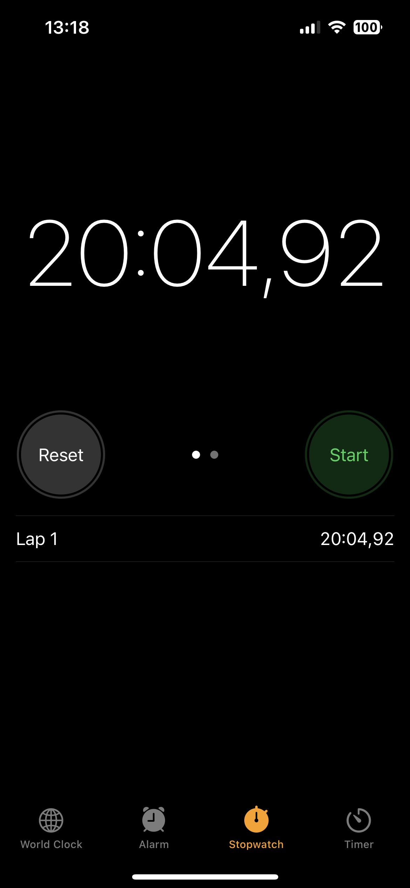
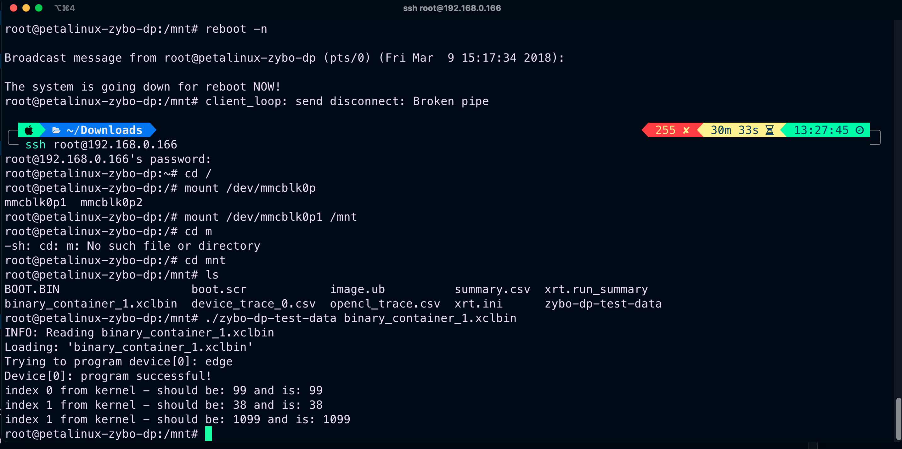

# Poznatky 09.02.2023

- z [08.02.2023](20230208.md) bylo zjištěno, že HW emulace na PL nefunguje tak, jak bylo očekáváno a musí se dělat HW build a dávat všechny soubory do PL, restartovat a pak vyzkoušet
- základní HW build trvá cca `20:04:92`, pak je to už rychlé
  
- vím, že jsem se přepslav textu indexu - místo 1 tam má být 2 ale ukázka, že to funguje:

- ukázka je z SSH iTerm2, kterým jsem připojen na FPGA
- je na čase vyzkoušet float/vektor atd. to vše co jsem chtěl dělat v pondělí a úterý ale vyskytly se problémy
- zkusil jsem a i floaty fungují, dávám si na chvíli volno (budu pracovat) - den a půl max
