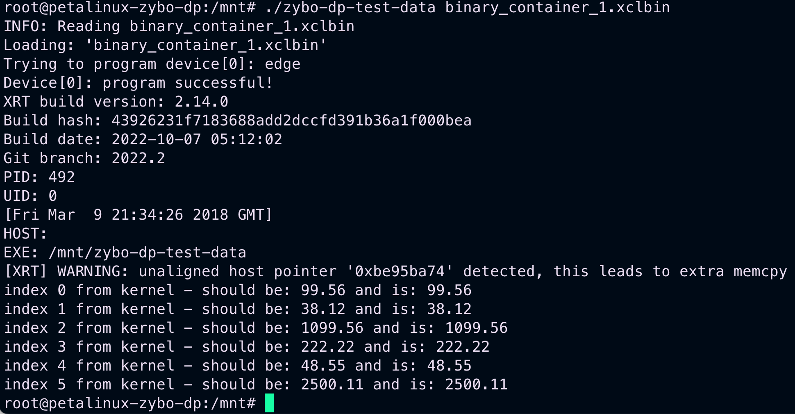

# Poznatky 10.02.2023

## Pro kopírování na kód

```c++
//main.cpp

```

```c++
//krnl_main.cpp

```

```c++
//allocator.h

```

## Dnešní todo list

- zkusit zda v kernelu bude možné jako argument funkce používat jinou funkci - resp. pointer na tu funkci - ukázka je ve zkoušecím souboru [main.cpp](/code/test-program/cmodel/main.cpp), aby bylo možné udělat pouze jednu funkci na numerické řešení diff. rovnic a tu používat na řešení všech
- zkusit, jak to bylo původně zamýšleno použít pointery z hosta na vytvoření třeba struktury a tu poté dávat do kernelu - ukázka v [20230208](./20230208.md)

```c++
// něco jako toto
    std::vector<int, aligned_allocator<int>> host_memory; // zde místo struktury je uveden vektor
    host_memory = {48, 99, 125, 150};
    OCL_CHECK(err, cl::Buffer buffer_mem(context, CL_MEM_USE_HOST_PTR, size_in_bytes,host_memory.data(),nullptr););
     OCL_CHECK(err, err = krnl_vector_add.setArg(narg++, buffer_mem));
     q.enqueueMigrateMemObjects({buffer_mem},0 /* 0 means from host*/);
```

inspirace z [xilinx](https://xilinx.github.io/Vitis_Accel_Examples/2019.2/html/data_transfer.html)

- **[SPLNĚNO A JE FUNKČNÍ]** přejmenovat kernely - v hostu, jméno souboru, jméno v kernelu v extern C
- **[VEKTOR SE POVEDL, JE ZAROVNÁN, ZKOUŠÍM ZAROVNÁVAT STRUKTURU POMOCÍ PRAGMA HLS AGGREGATE - to nejde, protože pragma je do kernelu a ne do host :D, zkousím jiný přístup k datům, abych se vyhnul segmentation fault, POVEDLO SE, KÓD FUNKČNÍ JE DOLE]** podle toho, zda půjdou struktury a vektory nebo ne, tak začít řešit tvorbu dat a parametrů pro motor
  
- je třeba zkusit pragmu na allignutí v kernelu `#pragma HLS aggregate variable=<variable> compact=<arg>` z [xilinx](https://docs.xilinx.com/r/2021.2-English/ug1399-vitis-hls/HLS-Pragmas) a další info o allignutí je zde [xilinx](https://docs.xilinx.com/r/2021.2-English/ug1399-vitis-hls/Struct-Padding-and-Alignment) - **VYŘEŠENO POMOCÍ POSIX MEM ALLOCATE, zkusit, zda to jde i bez pragma v kernelu**, **_ano jde to i bez pragma_**, kód dole
- vyscreenovat a popsat postup buildění a následného transferování kernelu a hostu do SoC, popis představen v [20230208](./20230208.md), **zatím pouze nakreslen flow ve figma, je třeba popsat a napsat kódy do kódových bloků**
- podívat se do dp.tex a přepsat část o tom, že nejde HW akcelerace a co to dělá, že to nevybuildí `BOOT.BIN`, jinak všechny potřebné soubory jo a kvůli tomu to nejde, jak dlouho trvá vybuildit kernel základní a poté složitější, jaké je vytížení serveru
- **[POKUSIL JSEM SE A VLOŽIL JSEM DO DP.TEX JEN JAKO OBRÁZEK]** nakreslit ve figmě flow buildění a transferu do fpga hezky + **UPRAVIL JSEM NA ŠIPKY V OBRÁZCÍCH NA ZAKULACENÉ**
- navíc: vyhledat, jak z hostu je možné třeba rozsvítit LED nebo dát signál na GPIO - pozor, zda nebude třeba předělat vivado projekt/petalinux, musel by se změnit soubour, ve kterém je definovaný i ethernet atd. zazálohovat si to a podívat se na to, **ano, je třeba změnit vivado projekt a přidat tam gpio a změnit soubor `system-user.dtsi`** asi za usb přidat něco jako

```
&axi_gpio_0 {

   compatible = "generic-uio"

   };

&axi_gpio_led {
	compatible = "generic-uio";
};


&axi_gpio_sw_btn {
	compatible = "generic-uio";
};
```

Poslední řádky jsem vzal z [20221029](./20221029.md), to předtím z [support.xilinx](https://support.xilinx.com/s/question/0D52E000077tJN4SAM/how-to-access-zybo-z7-gpios-on-petalinux-20212-?language=en_US)

- po splnění todo listu buďto pokračovat v bádání nebo si dát „volno“ a pracovat
- hackster návod dát do zdrojů pokud tam již není
- pokud jsem ještě nepopsal tak popsat petalinux mountování a dělání partition [Petalinux ZYBO](https://github.com/Digilent/Petalinux-Zybo)

## Velice zajímavý YouTube kanál dělající na stejném SoC od Digilent

- [Andrew Powell](https://www.youtube.com/@andrewpowell3723)
- jeho GitHub repozitář [Github Adrew](https://github.com/andrewandrepowell/zybo_petalinux)

## Funkční kód před změnou kernelů

```c++
//krnl_vadd.cpp

/*******************************************************************************
Vendor: Xilinx
Associated Filename: vadd.h
Purpose: VITIS vector addition

*******************************************************************************
Copyright (C) 2019 XILINX, Inc.

This file contains confidential and proprietary information of Xilinx, Inc. and
is protected under U.S. and international copyright and other intellectual
property laws.

DISCLAIMER
This disclaimer is not a license and does not grant any rights to the materials
distributed herewith. Except as otherwise provided in a valid license issued to
you by Xilinx, and to the maximum extent permitted by applicable law:
(1) THESE MATERIALS ARE MADE AVAILABLE "AS IS" AND WITH ALL FAULTS, AND XILINX
HEREBY DISCLAIMS ALL WARRANTIES AND CONDITIONS, EXPRESS, IMPLIED, OR STATUTORY,
INCLUDING BUT NOT LIMITED TO WARRANTIES OF MERCHANTABILITY, NON-INFRINGEMENT, OR
FITNESS FOR ANY PARTICULAR PURPOSE; and (2) Xilinx shall not be liable (whether
in contract or tort, including negligence, or under any other theory of
liability) for any loss or damage of any kind or nature related to, arising under
or in connection with these materials, including for any direct, or any indirect,
special, incidental, or consequential loss or damage (including loss of data,
profits, goodwill, or any type of loss or damage suffered as a result of any
action brought by a third party) even if such damage or loss was reasonably
foreseeable or Xilinx had been advised of the possibility of the same.

CRITICAL APPLICATIONS
Xilinx products are not designed or intended to be fail-safe, or for use in any
application requiring fail-safe performance, such as life-support or safety
devices or systems, Class III medical devices, nuclear facilities, applications
related to the deployment of airbags, or any other applications that could lead
to death, personal injury, or severe property or environmental damage
(individually and collectively, "Critical Applications"). Customer assumes the
sole risk and liability of any use of Xilinx products in Critical Applications,
subject only to applicable laws and regulations governing limitations on product
liability.

THIS COPYRIGHT NOTICE AND DISCLAIMER MUST BE RETAINED AS PART OF THIS FILE AT
ALL TIMES.

*******************************************************************************/

/*******************************************************************************
Description:

   This example uses the load/compute/store coding style which is generally
   the most efficient for implementing kernels using HLS. The load and store
   functions are responsible for moving data in and out of the kernel as
   efficiently as possible. The core functionality is decomposed across one
   of more compute functions. Whenever possible, the compute function should
   pass data through HLS streams and should contain a single set of nested loops.

   HLS stream objects are used to pass data between producer and consumer
   functions. Stream read and write operations have a blocking behavior which
   allows consumers and producers to synchronize with each other automatically.

   The dataflow pragma instructs the compiler to enable task-level pipelining.
   This is required for to load/compute/store functions to execute in a parallel
   and pipelined manner. Here the kernel loads, computes and stores NUM_WORDS integer values per
   clock cycle and is implemented as below:
                                      _____________
                                     |             |<----- Input Vector 1 from Global Memory
                                     |  load_input |       __
                                     |_____________|----->|  |
                                      _____________       |  | in1_stream
Input Vector 2 from Global Memory --->|             |      |__|
                              __     |  load_input |        |
                             |  |<---|_____________|        |
                  in2_stream |  |     _____________         |
                             |__|--->|             |<--------
                                     | compute_add |      __
                                     |_____________|---->|  |
                                      ______________     |  | out_stream
                                     |              |<---|__|
                                     | store_result |
                                     |______________|-----> Output result to Global Memory

*******************************************************************************/

// Includes
#include <stdint.h>
#include <hls_stream.h>


extern "C" {

/*
   Vector Addition Kernel

   Arguments:
       in1  (input)  --> Input vector 1
       in2  (input)  --> Input vector 2
       out  (output) --> Output vector
       size (input)  --> Number of elements in vector
*/

void krnl_vadd(float* in1, float* in2, float* out, int size) {
out[0] = in1[0];
out[1] = in2[0];
out[2] = in1[0] + 1000;
out[3] = in1[1]*2;
}
}

```

```c++
//vadd.cpp
/*******************************************************************************
Vendor: Xilinx
Associated Filename: vadd.cpp
Purpose: VITIS vector addition

*******************************************************************************
Copyright (C) 2019 XILINX, Inc.

This file contains confidential and proprietary information of Xilinx, Inc. and
is protected under U.S. and international copyright and other intellectual
property laws.

DISCLAIMER
This disclaimer is not a license and does not grant any rights to the materials
distributed herewith. Except as otherwise provided in a valid license issued to
you by Xilinx, and to the maximum extent permitted by applicable law:
(1) THESE MATERIALS ARE MADE AVAILABLE "AS IS" AND WITH ALL FAULTS, AND XILINX
HEREBY DISCLAIMS ALL WARRANTIES AND CONDITIONS, EXPRESS, IMPLIED, OR STATUTORY,
INCLUDING BUT NOT LIMITED TO WARRANTIES OF MERCHANTABILITY, NON-INFRINGEMENT, OR
FITNESS FOR ANY PARTICULAR PURPOSE; and (2) Xilinx shall not be liable (whether
in contract or tort, including negligence, or under any other theory of
liability) for any loss or damage of any kind or nature related to, arising under
or in connection with these materials, including for any direct, or any indirect,
special, incidental, or consequential loss or damage (including loss of data,
profits, goodwill, or any type of loss or damage suffered as a result of any
action brought by a third party) even if such damage or loss was reasonably
foreseeable or Xilinx had been advised of the possibility of the same.

CRITICAL APPLICATIONS
Xilinx products are not designed or intended to be fail-safe, or for use in any
application requiring fail-safe performance, such as life-support or safety
devices or systems, Class III medical devices, nuclear facilities, applications
related to the deployment of airbags, or any other applications that could lead
to death, personal injury, or severe property or environmental damage
(individually and collectively, "Critical Applications"). Customer assumes the
sole risk and liability of any use of Xilinx products in Critical Applications,
subject only to applicable laws and regulations governing limitations on product
liability.

THIS COPYRIGHT NOTICE AND DISCLAIMER MUST BE RETAINED AS PART OF THIS FILE AT
ALL TIMES.

*******************************************************************************/

#define OCL_CHECK(error, call)                                                                   \
  call;                                                                                        \
  if (error != CL_SUCCESS) {                                                                   \
      printf("%s:%d Error calling " #call ", error code is: %d\n", __FILE__, __LINE__, error); \
      exit(EXIT_FAILURE);                                                                      \
  }

#include "vadd.h"
#include <fstream>
#include <iostream>
#include <stdlib.h>

static const int DATA_SIZE = 4096;

static const std::string error_message =
  "Error: Result mismatch:\n"
  "i = %d CPU result = %d Device result = %d\n";

int main(int argc, char* argv[]) {
  // TARGET_DEVICE macro needs to be passed from gcc command line
  if (argc != 2) {
      std::cout << "Usage: " << argv[0] << " <xclbin>" << std::endl;
      return EXIT_FAILURE;
  }

  std::string xclbinFilename = argv[1];

  // Compute the size of array in bytes
  size_t size_in_bytes = DATA_SIZE * sizeof(float);

  // Creates a vector of DATA_SIZE elements with an initial value of 10 and 32
  // using customized allocator for getting buffer alignment to 4k boundary

  std::vector<cl::Device> devices;
  cl_int err;
  cl::Context context;
  cl::CommandQueue q;
  cl::Kernel krnl_vector_add;
  cl::Program program;
  std::vector<cl::Platform> platforms;
  bool found_device = false;

  // traversing all Platforms To find Xilinx Platform and targeted
  // Device in Xilinx Platform
  cl::Platform::get(&platforms);
  for (size_t i = 0; (i < platforms.size()) & (found_device == false); i++) {
      cl::Platform platform = platforms[i];
      std::string platformName = platform.getInfo<CL_PLATFORM_NAME>();
      if (platformName == "Xilinx") {
          devices.clear();
          platform.getDevices(CL_DEVICE_TYPE_ACCELERATOR, &devices);
          if (devices.size()) {
              found_device = true;
              break;
          }
      }
  }
  if (found_device == false) {
      std::cout << "Error: Unable to find Target Device " << std::endl;
      return EXIT_FAILURE;
  }

  std::cout << "INFO: Reading " << xclbinFilename << std::endl;
  FILE* fp;
  if ((fp = fopen(xclbinFilename.c_str(), "r")) == nullptr) {
      printf("ERROR: %s xclbin not available please build\n", xclbinFilename.c_str());
      exit(EXIT_FAILURE);
  }
  // Load xclbin
  std::cout << "Loading: '" << xclbinFilename << "'\n";
  std::ifstream bin_file(xclbinFilename, std::ifstream::binary);
  bin_file.seekg(0, bin_file.end);
  unsigned nb = bin_file.tellg();
  bin_file.seekg(0, bin_file.beg);
  char* buf = new char[nb];
  bin_file.read(buf, nb);

  // Creating Program from Binary File
  cl::Program::Binaries bins;
  bins.push_back({buf, nb});
  bool valid_device = false;
  for (unsigned int i = 0; i < devices.size(); i++) {
      auto device = devices[i];
      // Creating Context and Command Queue for selected Device
      OCL_CHECK(err, context = cl::Context(device, nullptr, nullptr, nullptr, &err));
      OCL_CHECK(err, q = cl::CommandQueue(context, device, CL_QUEUE_PROFILING_ENABLE, &err));
      std::cout << "Trying to program device[" << i << "]: " << device.getInfo<CL_DEVICE_NAME>() << std::endl;
      cl::Program program(context, {device}, bins, nullptr, &err);
      if (err != CL_SUCCESS) {
          std::cout << "Failed to program device[" << i << "] with xclbin file!\n";
      } else {
          std::cout << "Device[" << i << "]: program successful!\n";
          OCL_CHECK(err, krnl_vector_add = cl::Kernel(program, "krnl_vadd", &err));
          valid_device = true;
          break; // we break because we found a valid device
      }
  }
  if (!valid_device) {
      std::cout << "Failed to program any device found, exit!\n";
      exit(EXIT_FAILURE);
  }

  // These commands will allocate memory on the Device. The cl::Buffer objects can
  // be used to reference the memory locations on the device.
  OCL_CHECK(err, cl::Buffer buffer_a(context, CL_MEM_READ_ONLY, size_in_bytes, NULL, &err));
  OCL_CHECK(err, cl::Buffer buffer_b(context, CL_MEM_READ_ONLY, size_in_bytes, NULL, &err));
  OCL_CHECK(err, cl::Buffer buffer_result(context, CL_MEM_WRITE_ONLY, size_in_bytes, NULL, &err));

  // set the kernel Arguments
  int narg = 0;
  OCL_CHECK(err, err = krnl_vector_add.setArg(narg++, buffer_a));
  OCL_CHECK(err, err = krnl_vector_add.setArg(narg++, buffer_b));
  OCL_CHECK(err, err = krnl_vector_add.setArg(narg++, buffer_result));
  OCL_CHECK(err, err = krnl_vector_add.setArg(narg++, DATA_SIZE));

  // We then need to map our OpenCL buffers to get the pointers
  float* ptr_a;
  float* ptr_b;
  float* ptr_result;
  OCL_CHECK(err,
            ptr_a = (float*)q.enqueueMapBuffer(buffer_a, CL_TRUE, CL_MAP_WRITE, 0, size_in_bytes, NULL, NULL, &err));
  OCL_CHECK(err,
            ptr_b = (float*)q.enqueueMapBuffer(buffer_b, CL_TRUE, CL_MAP_WRITE, 0, size_in_bytes, NULL, NULL, &err));
  OCL_CHECK(err, ptr_result = (float*)q.enqueueMapBuffer(buffer_result, CL_TRUE, CL_MAP_READ, 0, size_in_bytes, NULL,
                                                       NULL, &err));


      ptr_a[0] = 99.56;
      ptr_b[0] = 38.12;
      ptr_a[1] = 111.11;


  // Data will be migrated to kernel space
  OCL_CHECK(err, err = q.enqueueMigrateMemObjects({buffer_a, buffer_b}, 0 /* 0 means from host*/));

  // Launch the Kernel
  OCL_CHECK(err, err = q.enqueueTask(krnl_vector_add));

  // The result of the previous kernel execution will need to be retrieved in
  // order to view the results. This call will transfer the data from FPGA to
  // source_results vector
  OCL_CHECK(err, q.enqueueMigrateMemObjects({buffer_result}, CL_MIGRATE_MEM_OBJECT_HOST));

  OCL_CHECK(err, q.finish());


  OCL_CHECK(err, err = q.enqueueUnmapMemObject(buffer_a, ptr_a));
  OCL_CHECK(err, err = q.enqueueUnmapMemObject(buffer_b, ptr_b));
  OCL_CHECK(err, err = q.enqueueUnmapMemObject(buffer_result, ptr_result));
  OCL_CHECK(err, err = q.finish());


  std::cout << "index 0 from kernel - should be: " << ptr_a[0] << " and is: " << ptr_result[0] <<"\n";
  std::cout << "index 1 from kernel - should be: " << ptr_b[0] << " and is: "<< ptr_result[1] <<"\n";
  std::cout << "index 2 from kernel - should be: " << (ptr_a[0]+1000) << " and is: "<< ptr_result[2] <<"\n";
  std::cout << "index 3 from kernel - should be: " << (ptr_a[1]*2) << " and is: "<< ptr_result[3] <<"\n";
  return 0;
}


```

## Funkční kód po změně kernelu a přidání vektoru jako vstupu do kernelu

```c++
//main.cpp
/*******************************************************************************
Author: FEE CTU
Purpose: Host program

*******************************************************************************/

#define OCL_CHECK(error, call)                                                                   \
    call;                                                                                        \
    if (error != CL_SUCCESS) {                                                                   \
        printf("%s:%d Error calling " #call ", error code is: %d\n", __FILE__, __LINE__, error); \
        exit(EXIT_FAILURE);                                                                      \
    }

#include "allocator.h"
#include <fstream>
#include <iostream>
#include <stdlib.h>

static const int DATA_SIZE = 4096;

static const std::string error_message =
    "Error: Result mismatch:\n"
    "i = %d CPU result = %d Device result = %d\n";

int main(int argc, char* argv[]) {
    // TARGET_DEVICE macro needs to be passed from gcc command line
    if (argc != 2) {
        std::cout << "Usage: " << argv[0] << " <xclbin>" << std::endl;
        return EXIT_FAILURE;
    }

    std::string xclbinFilename = argv[1];

    // Compute the size of array in bytes
    size_t size_in_bytes = DATA_SIZE * sizeof(float);

    // Creates a vector of DATA_SIZE elements with an initial value of 10 and 32
    // using customized allocator for getting buffer alignment to 4k boundary

    std::vector<cl::Device> devices;
    cl_int err;
    cl::Context context;
    cl::CommandQueue q;
    cl::Kernel krnl_compute;
    cl::Program program;
    std::vector<cl::Platform> platforms;
    bool found_device = false;

    // traversing all Platforms To find Xilinx Platform and targeted
    // Device in Xilinx Platform
    cl::Platform::get(&platforms);
    for (size_t i = 0; (i < platforms.size()) & (found_device == false); i++) {
        cl::Platform platform = platforms[i];
        std::string platformName = platform.getInfo<CL_PLATFORM_NAME>();
        if (platformName == "Xilinx") {
            devices.clear();
            platform.getDevices(CL_DEVICE_TYPE_ACCELERATOR, &devices);
            if (devices.size()) {
                found_device = true;
                break;
            }
        }
    }
    if (found_device == false) {
        std::cout << "Error: Unable to find Target Device " << std::endl;
        return EXIT_FAILURE;
    }

    std::cout << "INFO: Reading " << xclbinFilename << std::endl;
    FILE* fp;
    if ((fp = fopen(xclbinFilename.c_str(), "r")) == nullptr) {
        printf("ERROR: %s xclbin not available please build\n", xclbinFilename.c_str());
        exit(EXIT_FAILURE);
    }
    // Load xclbin
    std::cout << "Loading: '" << xclbinFilename << "'\n";
    std::ifstream bin_file(xclbinFilename, std::ifstream::binary);
    bin_file.seekg(0, bin_file.end);
    unsigned nb = bin_file.tellg();
    bin_file.seekg(0, bin_file.beg);
    char* buf = new char[nb];
    bin_file.read(buf, nb);

    // Creating Program from Binary File
    cl::Program::Binaries bins;
    bins.push_back({buf, nb});
    bool valid_device = false;
    for (unsigned int i = 0; i < devices.size(); i++) {
        auto device = devices[i];
        // Creating Context and Command Queue for selected Device
        OCL_CHECK(err, context = cl::Context(device, nullptr, nullptr, nullptr, &err));
        OCL_CHECK(err, q = cl::CommandQueue(context, device, CL_QUEUE_PROFILING_ENABLE, &err));
        std::cout << "Trying to program device[" << i << "]: " << device.getInfo<CL_DEVICE_NAME>() << std::endl;
        cl::Program program(context, {device}, bins, nullptr, &err);
        if (err != CL_SUCCESS) {
            std::cout << "Failed to program device[" << i << "] with xclbin file!\n";
        } else {
            std::cout << "Device[" << i << "]: program successful!\n";
            OCL_CHECK(err, krnl_compute = cl::Kernel(program, "krnl_main", &err));
            valid_device = true;
            break; // we break because we found a valid device
        }
    }
    if (!valid_device) {
        std::cout << "Failed to program any device found, exit!\n";
        exit(EXIT_FAILURE);
    }

    std::vector<float, aligned_allocator<float>> host_memory; // zde místo struktury je uveden vektor
    host_memory = {48.55, 99, 125, 150};


    // These commands will allocate memory on the Device. The cl::Buffer objects can
    // be used to reference the memory locations on the device.
    OCL_CHECK(err, cl::Buffer buffer_a(context, CL_MEM_READ_ONLY, size_in_bytes, NULL, &err));
    OCL_CHECK(err, cl::Buffer buffer_b(context, CL_MEM_READ_ONLY, size_in_bytes, NULL, &err));
    OCL_CHECK(err, cl::Buffer buffer_result(context, CL_MEM_WRITE_ONLY, size_in_bytes, NULL, &err));
    OCL_CHECK(err, cl::Buffer buffer_mem(context, CL_MEM_USE_HOST_PTR, size_in_bytes,host_memory.data(),&err));

    // set the kernel Arguments
    int narg = 0;
    OCL_CHECK(err, err = krnl_compute.setArg(narg++, buffer_a));
    OCL_CHECK(err, err = krnl_compute.setArg(narg++, buffer_b));
    OCL_CHECK(err, err = krnl_compute.setArg(narg++, buffer_result));
    OCL_CHECK(err, err = krnl_compute.setArg(narg++, DATA_SIZE));
    OCL_CHECK(err, err = krnl_compute.setArg(narg++, buffer_mem));

    // We then need to map our OpenCL buffers to get the pointers
    float* ptr_a;
    float* ptr_b;
    float* ptr_result;
    OCL_CHECK(err,
              ptr_a = (float*)q.enqueueMapBuffer(buffer_a, CL_TRUE, CL_MAP_WRITE, 0, size_in_bytes, NULL, NULL, &err));
    OCL_CHECK(err,
              ptr_b = (float*)q.enqueueMapBuffer(buffer_b, CL_TRUE, CL_MAP_WRITE, 0, size_in_bytes, NULL, NULL, &err));
    OCL_CHECK(err, ptr_result = (float*)q.enqueueMapBuffer(buffer_result, CL_TRUE, CL_MAP_READ, 0, size_in_bytes, NULL,
                                                         NULL, &err));


        ptr_a[0] = 99.56;
        ptr_b[0] = 38.12;
        ptr_a[1] = 111.11;


    // Data will be migrated to kernel space
    OCL_CHECK(err, err = q.enqueueMigrateMemObjects({buffer_a, buffer_b, buffer_mem}, 0 /* 0 means from host*/));

    // Launch the Kernel
    OCL_CHECK(err, err = q.enqueueTask(krnl_compute));

    // The result of the previous kernel execution will need to be retrieved in
    // order to view the results. This call will transfer the data from FPGA to
    // source_results vector
    OCL_CHECK(err, q.enqueueMigrateMemObjects({buffer_result}, CL_MIGRATE_MEM_OBJECT_HOST));

    OCL_CHECK(err, q.finish());


    OCL_CHECK(err, err = q.enqueueUnmapMemObject(buffer_a, ptr_a));
    OCL_CHECK(err, err = q.enqueueUnmapMemObject(buffer_b, ptr_b));
    OCL_CHECK(err, err = q.enqueueUnmapMemObject(buffer_result, ptr_result));
    OCL_CHECK(err, err = q.finish());


    std::cout << "index 0 from kernel - should be: " << ptr_a[0] << " and is: " << ptr_result[0] <<"\n";
    std::cout << "index 1 from kernel - should be: " << ptr_b[0] << " and is: "<< ptr_result[1] <<"\n";
    std::cout << "index 2 from kernel - should be: " << (ptr_a[0]+1000) << " and is: "<< ptr_result[2] <<"\n";
    std::cout << "index 3 from kernel - should be: " << (ptr_a[1]*2) << " and is: "<< ptr_result[3] <<"\n";
    std::cout << "index 4 from kernel - should be: " << (host_memory.at(0)) << " and is: "<< ptr_result[4] <<"\n";
    return 0;
}

```

```c++
//krnl_main.cpp
/*******************************************************************************
Author: FEE CVUT
Purpose: Kernel

*******************************************************************************/
// Includes
#include <stdint.h>
#include <hls_stream.h>


extern "C" {

/*
    Main Kernel

    TODO:
    Arguments:
        in1  (input)  --> Input vector 1
        in2  (input)  --> Input vector 2
        out  (output) --> Output vector
        size (input)  --> Number of elements in vector
*/

void krnl_main(float* in1, float* in2, float* out, int size, float* hostVector) {
out[0] = in1[0];
out[1] = in2[0];
out[2] = in1[0] + 1000;
out[3] = in1[1]*2;
out[4] = hostVector[0];
}
}

```

## Funkční kód struct

```c++
//main.cpp
/*******************************************************************************
Author: FEE CTU
Purpose: Host program

*******************************************************************************/

#define OCL_CHECK(error, call)                                                                   \
    call;                                                                                        \
    if (error != CL_SUCCESS) {                                                                   \
        printf("%s:%d Error calling " #call ", error code is: %d\n", __FILE__, __LINE__, error); \
        exit(EXIT_FAILURE);                                                                      \
}
// Includes
#include "allocator.h"
#include <fstream>
#include <iostream>
#include <stdlib.h>

// Size of Arrrays etc. Change later
static const int DATA_SIZE = 4096;


typedef struct motorParameters
{
    float R1;
    float R2;
    float L1s;
    float L2s;
    float Lm;
    float L1;
    float L2;
}motorParametersStruct;


int main(int argc, char* argv[]) {

    motorParametersStruct motorParameters;
   motorParameters.R1 = 2500.11;
    motorParameters.L1s = 3222.11;
    // TARGET_DEVICE macro needs to be passed from gcc command line
    if (argc != 2)
    {
        std::cout << "Usage: " << argv[0] << " <xclbin>" << std::endl;
        return EXIT_FAILURE;
    }

    std::string xclbinFilename = argv[1];

    // Compute the size of array in bytes
    size_t size_in_bytes = DATA_SIZE * sizeof(float);


    std::vector<cl::Device> devices;
    cl_int err;
    cl::Context context;
    cl::CommandQueue q;
    cl::Kernel krnl_compute;
    cl::Program program;
    std::vector<cl::Platform> platforms;
    bool found_device = false;

    // Searching through devices on a platform and connecting from CPU to device (PL)
    cl::Platform::get(&platforms);

    // Loop through all the platforms based on a vector of platforms size till the device is found (found_device==true)
    for (size_t i = 0; (i < platforms.size()) & (found_device == false); i++)
    {
        cl::Platform platform = platforms[i];
        std::string platformName = platform.getInfo<CL_PLATFORM_NAME>();

        // If the found device is Xilinx device
        if (platformName == "Xilinx")
        {
            devices.clear();
            // Gets list of devices for selected platform and pastes them on the adress of devices Device
            platform.getDevices(CL_DEVICE_TYPE_ACCELERATOR, &devices);
            if (devices.size())
            {
                found_device = true;
                break;
            }
        }
    }

    if (found_device == false) {
        std::cout << "Error: Unable to find Target Device " << std::endl;
        return EXIT_FAILURE;
    }


    // Check for availability of PL program
    std::cout << "INFO: Reading " << xclbinFilename << std::endl;
    FILE* fp;
    if ((fp = fopen(xclbinFilename.c_str(), "r")) == nullptr)
    {
        printf("ERROR: %s xclbin not available please build\n", xclbinFilename.c_str());
        exit(EXIT_FAILURE);
    }

    // Load xclbin
    std::cout << "Loading: '" << xclbinFilename << "'\n";
    std::ifstream bin_file(xclbinFilename, std::ifstream::binary);

    // Sets the position of the next character to be extracted from the input stream.
    // istream& seekg (streamoff off, ios_base::seekdir way); off = offset from way - where you are offseting from
    // Basically moving pointer in the stream
    bin_file.seekg(0, bin_file.end);
    unsigned nb = bin_file.tellg();  // Returns the position of the current character in the input stream.
    bin_file.seekg(0, bin_file.beg); // Setting position of the next character to be extracted from the input stream
    char* buf = new char[nb]; // Creating buffer/array with the length of the stream => bin_file

    // buf - pointer of the array where the extracted characters are stored
    // nb – number of characters to extract.
    bin_file.read(buf, nb);

    // Creating Program from Binary File
    cl::Program::Binaries bins;
    // {} initialization of vector - array
    // push_back - Adds a new element at the end of the vector, after its current last element.
    bins.push_back({buf, nb});
    bool valid_device = false;
    for (unsigned int i = 0; i < devices.size(); i++)
    {
        auto device = devices[i];
        // Creating Context and Command Queue for selected Device

        OCL_CHECK(err, context = cl::Context(device, nullptr, nullptr, nullptr, &err));

        OCL_CHECK(err, q = cl::CommandQueue(context, device, CL_QUEUE_PROFILING_ENABLE, &err));

        std::cout << "Trying to program device[" << i << "]: " << device.getInfo<CL_DEVICE_NAME>() << std::endl;

        // cl:Program - Construct a program object from a list of devices and a per-device list of binaries.
        cl::Program program(context, {device}, bins, nullptr, &err);

        if (err != CL_SUCCESS)
        {
            std::cout << "Failed to program device[" << i << "] with xclbin file!\n";
        }
        else
        {
            std::cout << "Device[" << i << "]: program successful!\n";

            // This call will get the kernel object from program. A kernel is an
            // OpenCL function that is executed on the FPGA.
            OCL_CHECK(err, krnl_compute = cl::Kernel(program, "krnl_main", &err)); // assign to krnl_compute the new PL kernel, which is found in kernel_main and called kernel_main

            valid_device = true;
            break; // break because found a valid device
        }
    }
    if (!valid_device) {
        std::cout << "Failed to program any device found, exit!\n";
        exit(EXIT_FAILURE);
    }

    std::vector<float, aligned_allocator<float>> host_memory; // zde místo struktury je uveden vektor
    host_memory = {48.55, 99, 125, 150};


    // These commands will allocate memory on the Device. The cl::Buffer objects can
    // be used to reference the memory locations on the device.
    // Allowed flags for cl::Buffer https://man.opencl.org/clCreateBuffer.html
    OCL_CHECK(err, cl::Buffer buffer_a(context, CL_MEM_READ_ONLY, size_in_bytes, NULL, &err));
    OCL_CHECK(err, cl::Buffer buffer_b(context, CL_MEM_READ_ONLY, size_in_bytes, NULL, &err));
    OCL_CHECK(err, cl::Buffer buffer_result(context, CL_MEM_WRITE_ONLY, size_in_bytes, NULL, &err));
    OCL_CHECK(err, cl::Buffer buffer_mem(context, CL_MEM_USE_HOST_PTR, size_in_bytes,host_memory.data(),&err));
    OCL_CHECK(err, cl::Buffer buffer_struct(context, CL_MEM_USE_HOST_PTR, sizeof(motorParameters),&motorParameters,&err));

    // set the kernel Arguments
    int narg = 0;
    OCL_CHECK(err, err = krnl_compute.setArg(narg++, buffer_a));
    OCL_CHECK(err, err = krnl_compute.setArg(narg++, buffer_b));
    OCL_CHECK(err, err = krnl_compute.setArg(narg++, buffer_result));
    OCL_CHECK(err, err = krnl_compute.setArg(narg++, DATA_SIZE));
    OCL_CHECK(err, err = krnl_compute.setArg(narg++, buffer_mem));
    OCL_CHECK(err, err = krnl_compute.setArg(narg++, buffer_struct));

    // Need to map OpenCL buffers to get the pointers to assign values when using approach of buffers and then pointers
    // When using host data buffer with flag CL_MEM_USE_HOST_PTR, it is not needed to enqueueMapBuffer
    float* ptr_a;
    float* ptr_b;
    float* ptr_result;
    OCL_CHECK(err, ptr_a = (float*)q.enqueueMapBuffer(buffer_a, CL_TRUE, CL_MAP_WRITE, 0, size_in_bytes, NULL, NULL, &err));
    OCL_CHECK(err, ptr_b = (float*)q.enqueueMapBuffer(buffer_b, CL_TRUE, CL_MAP_WRITE, 0, size_in_bytes, NULL, NULL, &err));
    OCL_CHECK(err, ptr_result = (float*)q.enqueueMapBuffer(buffer_result, CL_TRUE, CL_MAP_READ, 0, size_in_bytes, NULL, NULL, &err));


        ptr_a[0] = 99.56;
        ptr_b[0] = 38.12;
        ptr_a[1] = 111.11;


    // Data will be migrated to kernel space
    OCL_CHECK(err, err = q.enqueueMigrateMemObjects({buffer_a, buffer_b, buffer_mem, buffer_struct}, 0 /* 0 means from host*/));

    // Launch the Kernel
    OCL_CHECK(err, err = q.enqueueTask(krnl_compute));

    // The result of the previous kernel execution will need to be retrieved in
    // order to view the results. This call will transfer the data from FPGA to
    // source_results vector
    OCL_CHECK(err, q.enqueueMigrateMemObjects({buffer_result}, CL_MIGRATE_MEM_OBJECT_HOST));

    OCL_CHECK(err, q.finish());


    OCL_CHECK(err, err = q.enqueueUnmapMemObject(buffer_a, ptr_a));
    OCL_CHECK(err, err = q.enqueueUnmapMemObject(buffer_b, ptr_b));
    OCL_CHECK(err, err = q.enqueueUnmapMemObject(buffer_result, ptr_result));
    OCL_CHECK(err, err = q.finish());


    std::cout << "index 0 from kernel - should be: " << ptr_a[0] << " and is: " << ptr_result[0] <<"\n";
    std::cout << "index 1 from kernel - should be: " << ptr_b[0] << " and is: "<< ptr_result[1] <<"\n";
    std::cout << "index 2 from kernel - should be: " << (ptr_a[0]+1000) << " and is: "<< ptr_result[2] <<"\n";
    std::cout << "index 3 from kernel - should be: " << (ptr_a[1]*2) << " and is: "<< ptr_result[3] <<"\n";
    std::cout << "index 4 from kernel - should be: " << (host_memory.at(0)) << " and is: "<< ptr_result[4] <<"\n";
    std::cout << "index 5 from kernel - should be: " << motorParameters.R1 << " and is: "<< ptr_result[5] <<"\n";
    //std::cout << "index 6 from kernel - should be: " << motorParameters.L1s << " and is: "<< ptr_result[6] <<"\n";
    return 0;
}

```

```c++
//krnl_main.cpp
/*******************************************************************************
Author: FEE CVUT
Purpose: Kernel

*******************************************************************************/
// Includes
#include <stdint.h>
#include <hls_stream.h>

typedef struct motorParameters
{
    float R1;
    float R2;
    float L1s;
    float L2s;
    float Lm;
    float L1;
    float L2;
}motorParametersStruct;

extern "C" {

/*
    Main Kernel

    TODO:
    Arguments:
        in1  (input)  --> Input vector 1
        in2  (input)  --> Input vector 2
        out  (output) --> Output vector
        size (input)  --> Number of elements in vector
*/

void krnl_main(float* in1, float* in2, float* out, int size, float* hostVector, motorParametersStruct* hostStruct) {
out[0] = in1[0];
out[1] = in2[0];
out[2] = in1[0] + 1000;
out[3] = in1[1]*2;
out[4] = hostVector[0];
out[5] = hostStruct->R1;
}
}

```

## Funkční kód, který řeší problém alokace paměti v hostu na 4K

```c++
//main.cpp
/*******************************************************************************
Author: FEE CTU
Purpose: Host program

*******************************************************************************/

#define OCL_CHECK(error, call)                                                                   \
    call;                                                                                        \
    if (error != CL_SUCCESS) {                                                                   \
        printf("%s:%d Error calling " #call ", error code is: %d\n", __FILE__, __LINE__, error); \
        exit(EXIT_FAILURE);                                                                      \
}
// Includes
#include "allocator.h"
#include <fstream>
#include <iostream>
#include <stdlib.h>

// Size of Arrrays etc. Change later
static const int DATA_SIZE = 4096;


typedef struct motorParameters
{
    float R1;
    float R2;
    float L1s;
    float L2s;
    float Lm;
    float L1;
    float L2;
}motorParametersStruct;


int main(int argc, char* argv[]) {

/*NEW STRUCT POINTER */
motorParametersStruct *bufStruct = NULL; // declaring variable of pointer to struct motorParametersStruct
posix_memalign((void **)&bufStruct /*pointer to a location, where posix can store pointer to a memory*/, 4096 /*alignment*/, sizeof(motorParametersStruct) /*size*/); // (void **)&bufStruct =  A pointer to a location where posix_memalign() can store a pointer to the memory.
//  The function posix_memalign() allocates size bytes and places the address of the allocated memory in *memptr.
bufStruct->R1 = 852;
bufStruct->R2 = 1200;

    // old struct with problem with memcpy
    //motorParametersStruct motorParameters;
   //motorParameters.R1 = 2500.11;
    //motorParameters.L1s = 3222.11;
    // TARGET_DEVICE macro needs to be passed from gcc command line
    if (argc != 2)
    {
        std::cout << "Usage: " << argv[0] << " <xclbin>" << std::endl;
        return EXIT_FAILURE;
    }

    std::string xclbinFilename = argv[1];

    // Compute the size of array in bytes
    size_t size_in_bytes = DATA_SIZE * sizeof(float);


    std::vector<cl::Device> devices;
    cl_int err;
    cl::Context context;
    cl::CommandQueue q;
    cl::Kernel krnl_compute;
    cl::Program program;
    std::vector<cl::Platform> platforms;
    bool found_device = false;

    // Searching through devices on a platform and connecting from CPU to device (PL)
    cl::Platform::get(&platforms);

    // Loop through all the platforms based on a vector of platforms size till the device is found (found_device==true)
    for (size_t i = 0; (i < platforms.size()) & (found_device == false); i++)
    {
        cl::Platform platform = platforms[i];
        std::string platformName = platform.getInfo<CL_PLATFORM_NAME>();

        // If the found device is Xilinx device
        if (platformName == "Xilinx")
        {
            devices.clear();
            // Gets list of devices for selected platform and pastes them on the adress of devices Device
            platform.getDevices(CL_DEVICE_TYPE_ACCELERATOR, &devices);
            if (devices.size())
            {
                found_device = true;
                break;
            }
        }
    }

    if (found_device == false) {
        std::cout << "Error: Unable to find Target Device " << std::endl;
        return EXIT_FAILURE;
    }


    // Check for availability of PL program
    std::cout << "INFO: Reading " << xclbinFilename << std::endl;
    FILE* fp;
    if ((fp = fopen(xclbinFilename.c_str(), "r")) == nullptr)
    {
        printf("ERROR: %s xclbin not available please build\n", xclbinFilename.c_str());
        exit(EXIT_FAILURE);
    }

    // Load xclbin
    std::cout << "Loading: '" << xclbinFilename << "'\n";
    std::ifstream bin_file(xclbinFilename, std::ifstream::binary);

    // Sets the position of the next character to be extracted from the input stream.
    // istream& seekg (streamoff off, ios_base::seekdir way); off = offset from way - where you are offseting from
    // Basically moving pointer in the stream
    bin_file.seekg(0, bin_file.end);
    unsigned nb = bin_file.tellg();  // Returns the position of the current character in the input stream.
    bin_file.seekg(0, bin_file.beg); // Setting position of the next character to be extracted from the input stream
    char* buf = new char[nb]; // Creating buffer/array with the length of the stream => bin_file

    // buf - pointer of the array where the extracted characters are stored
    // nb – number of characters to extract.
    bin_file.read(buf, nb);

    // Creating Program from Binary File
    cl::Program::Binaries bins;
    // {} initialization of vector - array
    // push_back - Adds a new element at the end of the vector, after its current last element.
    bins.push_back({buf, nb});
    bool valid_device = false;
    for (unsigned int i = 0; i < devices.size(); i++)
    {
        auto device = devices[i];
        // Creating Context and Command Queue for selected Device

        OCL_CHECK(err, context = cl::Context(device, nullptr, nullptr, nullptr, &err));

        OCL_CHECK(err, q = cl::CommandQueue(context, device, CL_QUEUE_PROFILING_ENABLE, &err));

        std::cout << "Trying to program device[" << i << "]: " << device.getInfo<CL_DEVICE_NAME>() << std::endl;

        // cl:Program - Construct a program object from a list of devices and a per-device list of binaries.
        cl::Program program(context, {device}, bins, nullptr, &err);

        if (err != CL_SUCCESS)
        {
            std::cout << "Failed to program device[" << i << "] with xclbin file!\n";
        }
        else
        {
            std::cout << "Device[" << i << "]: program successful!\n";

            // This call will get the kernel object from program. A kernel is an
            // OpenCL function that is executed on the FPGA.
            OCL_CHECK(err, krnl_compute = cl::Kernel(program, "krnl_main", &err)); // assign to krnl_compute the new PL kernel, which is found in kernel_main and called kernel_main

            valid_device = true;
            break; // break because found a valid device
        }
    }
    if (!valid_device) {
        std::cout << "Failed to program any device found, exit!\n";
        exit(EXIT_FAILURE);
    }

    std::vector<float, aligned_allocator<float>> host_memory; // zde místo struktury je uveden vektor
    host_memory = {48.55, 99, 125, 150};


    // These commands will allocate memory on the Device. The cl::Buffer objects can
    // be used to reference the memory locations on the device.
    // Allowed flags for cl::Buffer https://man.opencl.org/clCreateBuffer.html
    OCL_CHECK(err, cl::Buffer buffer_a(context, CL_MEM_READ_ONLY, size_in_bytes, NULL, &err));
    OCL_CHECK(err, cl::Buffer buffer_b(context, CL_MEM_READ_ONLY, size_in_bytes, NULL, &err));
    OCL_CHECK(err, cl::Buffer buffer_result(context, CL_MEM_WRITE_ONLY, size_in_bytes, NULL, &err));
    OCL_CHECK(err, cl::Buffer buffer_mem(context, CL_MEM_USE_HOST_PTR, size_in_bytes,host_memory.data(),&err));
    //OCL_CHECK(err, cl::Buffer buffer_struct(context, CL_MEM_USE_HOST_PTR, sizeof(motorParameters),&motorParameters,&err)); // OLD STRUCT
    OCL_CHECK(err, cl::Buffer buffer_struct(context, CL_MEM_USE_HOST_PTR, sizeof(motorParameters),bufStruct,&err)); // with posix_memalign NEW STRUCUT

    // set the kernel Arguments
    int narg = 0;
    OCL_CHECK(err, err = krnl_compute.setArg(narg++, buffer_a));
    OCL_CHECK(err, err = krnl_compute.setArg(narg++, buffer_b));
    OCL_CHECK(err, err = krnl_compute.setArg(narg++, buffer_result));
    OCL_CHECK(err, err = krnl_compute.setArg(narg++, DATA_SIZE));
    OCL_CHECK(err, err = krnl_compute.setArg(narg++, buffer_mem));
    //OCL_CHECK(err, err = krnl_compute.setArg(narg++, buffer_struct)); // old struct
    OCL_CHECK(err, err = krnl_compute.setArg(narg++, buffer_struct)); // with posix_memalign

    // Need to map OpenCL buffers to get the pointers to assign values when using approach of buffers and then pointers
    // When using host data buffer with flag CL_MEM_USE_HOST_PTR, it is not needed to enqueueMapBuffer
    float* ptr_a;
    float* ptr_b;
    float* ptr_result;
    OCL_CHECK(err, ptr_a = (float*)q.enqueueMapBuffer(buffer_a, CL_TRUE, CL_MAP_WRITE, 0, size_in_bytes, NULL, NULL, &err));
    OCL_CHECK(err, ptr_b = (float*)q.enqueueMapBuffer(buffer_b, CL_TRUE, CL_MAP_WRITE, 0, size_in_bytes, NULL, NULL, &err));
    OCL_CHECK(err, ptr_result = (float*)q.enqueueMapBuffer(buffer_result, CL_TRUE, CL_MAP_READ, 0, size_in_bytes, NULL, NULL, &err));


        ptr_a[0] = 99.56;
        ptr_b[0] = 38.12;
        ptr_a[1] = 111.11;


    // Data will be migrated to kernel space
    OCL_CHECK(err, err = q.enqueueMigrateMemObjects({buffer_a, buffer_b, buffer_mem, buffer_struct}, 0 /* 0 means from host*/));

    // Launch the Kernel
    OCL_CHECK(err, err = q.enqueueTask(krnl_compute));

    // The result of the previous kernel execution will need to be retrieved in
    // order to view the results. This call will transfer the data from FPGA to
    // source_results vector
    OCL_CHECK(err, q.enqueueMigrateMemObjects({buffer_result}, CL_MIGRATE_MEM_OBJECT_HOST));

    OCL_CHECK(err, q.finish());


    OCL_CHECK(err, err = q.enqueueUnmapMemObject(buffer_a, ptr_a));
    OCL_CHECK(err, err = q.enqueueUnmapMemObject(buffer_b, ptr_b));
    OCL_CHECK(err, err = q.enqueueUnmapMemObject(buffer_result, ptr_result));
    OCL_CHECK(err, err = q.finish());


    std::cout << "index 0 from kernel - should be: " << ptr_a[0] << " and is: " << ptr_result[0] <<"\n";
    std::cout << "index 1 from kernel - should be: " << ptr_b[0] << " and is: "<< ptr_result[1] <<"\n";
    std::cout << "index 2 from kernel - should be: " << (ptr_a[0]+1000) << " and is: "<< ptr_result[2] <<"\n";
    std::cout << "index 3 from kernel - should be: " << (ptr_a[1]*2) << " and is: "<< ptr_result[3] <<"\n";
    std::cout << "index 4 from kernel - should be: " << (host_memory.at(0)) << " and is: "<< ptr_result[4] <<"\n";
    // std::cout << "index 5 from kernel - should be: " << motorParameters.R1 << " and is: "<< ptr_result[5] <<"\n";
    std::cout << "index 5 from kernel - should be: " << bufStruct->R1 << " and is: "<< ptr_result[5] <<"\n";
    //std::cout << "index 6 from kernel - should be: " << motorParameters.L1s << " and is: "<< ptr_result[6] <<"\n";

    free(bufStruct);
    return 0;
}

```

```c++
//krnl_main.cpp
/*******************************************************************************
Author: FEE CVUT
Purpose: Kernel

*******************************************************************************/
// Includes
#include <stdint.h>
#include <hls_stream.h>

typedef struct motorParameters
{
    float R1;
    float R2;
    float L1s;
    float L2s;
    float Lm;
    float L1;
    float L2;
}motorParametersStruct;

extern "C" {

/*
    Main Kernel

    TODO:
    Arguments:
        in1  (input)  --> Input vector 1
        in2  (input)  --> Input vector 2
        out  (output) --> Output vector
        size (input)  --> Number of elements in vector
*/

void krnl_main(float* in1, float* in2, float* out, int size, float* hostVector, motorParametersStruct* hostStruct) {
#pragma HLS interface hostStruct port=structure
#pragma HLS aggregate variable=hostStruct compact=auto

out[0] = in1[0];
out[1] = in2[0];
out[2] = in1[0] + 1000;
out[3] = in1[1]*2;
out[4] = hostVector[0];
out[5] = hostStruct->R1;
}
}

```

```c++
// allocator.h
/*******************************************************************************
Vendor: Xilinx
Associated Filename: vadd.h
Purpose: VITIS vector addition
Revision History: January 28, 2016

*******************************************************************************
Copyright (C) 2019 XILINX, Inc.

This file contains confidential and proprietary information of Xilinx, Inc. and
is protected under U.S. and international copyright and other intellectual
property laws.

DISCLAIMER
This disclaimer is not a license and does not grant any rights to the materials
distributed herewith. Except as otherwise provided in a valid license issued to
you by Xilinx, and to the maximum extent permitted by applicable law:
(1) THESE MATERIALS ARE MADE AVAILABLE "AS IS" AND WITH ALL FAULTS, AND XILINX
HEREBY DISCLAIMS ALL WARRANTIES AND CONDITIONS, EXPRESS, IMPLIED, OR STATUTORY,
INCLUDING BUT NOT LIMITED TO WARRANTIES OF MERCHANTABILITY, NON-INFRINGEMENT, OR
FITNESS FOR ANY PARTICULAR PURPOSE; and (2) Xilinx shall not be liable (whether
in contract or tort, including negligence, or under any other theory of
liability) for any loss or damage of any kind or nature related to, arising under
or in connection with these materials, including for any direct, or any indirect,
special, incidental, or consequential loss or damage (including loss of data,
profits, goodwill, or any type of loss or damage suffered as a result of any
action brought by a third party) even if such damage or loss was reasonably
foreseeable or Xilinx had been advised of the possibility of the same.

CRITICAL APPLICATIONS
Xilinx products are not designed or intended to be fail-safe, or for use in any
application requiring fail-safe performance, such as life-support or safety
devices or systems, Class III medical devices, nuclear facilities, applications
related to the deployment of airbags, or any other applications that could lead
to death, personal injury, or severe property or environmental damage
(individually and collectively, "Critical Applications"). Customer assumes the
sole risk and liability of any use of Xilinx products in Critical Applications,
subject only to applicable laws and regulations governing limitations on product
liability.

THIS COPYRIGHT NOTICE AND DISCLAIMER MUST BE RETAINED AS PART OF THIS FILE AT
ALL TIMES.

*******************************************************************************/

#pragma once

#define CL_HPP_CL_1_2_DEFAULT_BUILD
#define CL_HPP_TARGET_OPENCL_VERSION 120
#define CL_HPP_MINIMUM_OPENCL_VERSION 120
#define CL_HPP_ENABLE_PROGRAM_CONSTRUCTION_FROM_ARRAY_COMPATIBILITY 1

#include <CL/cl2.hpp>

//Customized buffer allocation for 4K boundary alignment
template <typename T>
struct aligned_allocator
{
  using value_type = T;
  T* allocate(std::size_t num)
  {
    void* ptr = nullptr;
    if (posix_memalign(&ptr,4096,num*sizeof(T)))
      throw std::bad_alloc();
    return reinterpret_cast<T*>(ptr);
  }
  void deallocate(T* p, std::size_t num)
  {
    free(p);
  }
};

```

```c++
//main.cpp
/*******************************************************************************
Author: FEE CTU
Purpose: Host program

*******************************************************************************/

#define OCL_CHECK(error, call)                                                                   \
    call;                                                                                        \
    if (error != CL_SUCCESS) {                                                                   \
        printf("%s:%d Error calling " #call ", error code is: %d\n", __FILE__, __LINE__, error); \
        exit(EXIT_FAILURE);                                                                      \
}
// Includes
#include "allocator.h"
#include <fstream>
#include <iostream>
#include <stdlib.h>

// Size of Arrrays etc. Change later
static const int DATA_SIZE = 4096;


typedef struct motorParameters
{
    float R1;
    float R2;
    float L1s;
    float L2s;
    float Lm;
    float L1;
    float L2;
}motorParametersStruct;


int main(int argc, char* argv[]) {

/*NEW STRUCT POINTER */
motorParametersStruct *bufStruct = NULL; // declaring variable of pointer to struct motorParametersStruct
posix_memalign((void **)&bufStruct /*pointer to a location, where posix can store pointer to a memory*/, 4096 /*alignment*/, sizeof(motorParametersStruct) /*size*/); // (void **)&bufStruct =  A pointer to a location where posix_memalign() can store a pointer to the memory.
//  The function posix_memalign() allocates size bytes and places the address of the allocated memory in *memptr.
bufStruct->R1 = 852;
bufStruct->R2 = 1200;

    // old struct with problem with memcpy
    //motorParametersStruct motorParameters;
   //motorParameters.R1 = 2500.11;
    //motorParameters.L1s = 3222.11;
    // TARGET_DEVICE macro needs to be passed from gcc command line
    if (argc != 2)
    {
        std::cout << "Usage: " << argv[0] << " <xclbin>" << std::endl;
        return EXIT_FAILURE;
    }

    std::string xclbinFilename = argv[1];

    // Compute the size of array in bytes
    size_t size_in_bytes = DATA_SIZE * sizeof(float);


    std::vector<cl::Device> devices;
    cl_int err;
    cl::Context context;
    cl::CommandQueue q;
    cl::Kernel krnl_compute;
    cl::Program program;
    std::vector<cl::Platform> platforms;
    bool found_device = false;

    // Searching through devices on a platform and connecting from CPU to device (PL)
    cl::Platform::get(&platforms);

    // Loop through all the platforms based on a vector of platforms size till the device is found (found_device==true)
    for (size_t i = 0; (i < platforms.size()) & (found_device == false); i++)
    {
        cl::Platform platform = platforms[i];
        std::string platformName = platform.getInfo<CL_PLATFORM_NAME>();

        // If the found device is Xilinx device
        if (platformName == "Xilinx")
        {
            devices.clear();
            // Gets list of devices for selected platform and pastes them on the adress of devices Device
            platform.getDevices(CL_DEVICE_TYPE_ACCELERATOR, &devices);
            if (devices.size())
            {
                found_device = true;
                break;
            }
        }
    }

    if (found_device == false) {
        std::cout << "Error: Unable to find Target Device " << std::endl;
        return EXIT_FAILURE;
    }


    // Check for availability of PL program
    std::cout << "INFO: Reading " << xclbinFilename << std::endl;
    FILE* fp;
    if ((fp = fopen(xclbinFilename.c_str(), "r")) == nullptr)
    {
        printf("ERROR: %s xclbin not available please build\n", xclbinFilename.c_str());
        exit(EXIT_FAILURE);
    }

    // Load xclbin
    std::cout << "Loading: '" << xclbinFilename << "'\n";
    std::ifstream bin_file(xclbinFilename, std::ifstream::binary);

    // Sets the position of the next character to be extracted from the input stream.
    // istream& seekg (streamoff off, ios_base::seekdir way); off = offset from way - where you are offseting from
    // Basically moving pointer in the stream
    bin_file.seekg(0, bin_file.end);
    unsigned nb = bin_file.tellg();  // Returns the position of the current character in the input stream.
    bin_file.seekg(0, bin_file.beg); // Setting position of the next character to be extracted from the input stream
    char* buf = new char[nb]; // Creating buffer/array with the length of the stream => bin_file

    // buf - pointer of the array where the extracted characters are stored
    // nb – number of characters to extract.
    bin_file.read(buf, nb);

    // Creating Program from Binary File
    cl::Program::Binaries bins;
    // {} initialization of vector - array
    // push_back - Adds a new element at the end of the vector, after its current last element.
    bins.push_back({buf, nb});
    bool valid_device = false;
    for (unsigned int i = 0; i < devices.size(); i++)
    {
        auto device = devices[i];
        // Creating Context and Command Queue for selected Device

        OCL_CHECK(err, context = cl::Context(device, nullptr, nullptr, nullptr, &err));

        OCL_CHECK(err, q = cl::CommandQueue(context, device, CL_QUEUE_PROFILING_ENABLE, &err));

        std::cout << "Trying to program device[" << i << "]: " << device.getInfo<CL_DEVICE_NAME>() << std::endl;

        // cl:Program - Construct a program object from a list of devices and a per-device list of binaries.
        cl::Program program(context, {device}, bins, nullptr, &err);

        if (err != CL_SUCCESS)
        {
            std::cout << "Failed to program device[" << i << "] with xclbin file!\n";
        }
        else
        {
            std::cout << "Device[" << i << "]: program successful!\n";

            // This call will get the kernel object from program. A kernel is an
            // OpenCL function that is executed on the FPGA.
            OCL_CHECK(err, krnl_compute = cl::Kernel(program, "krnl_main", &err)); // assign to krnl_compute the new PL kernel, which is found in kernel_main and called kernel_main

            valid_device = true;
            break; // break because found a valid device
        }
    }
    if (!valid_device) {
        std::cout << "Failed to program any device found, exit!\n";
        exit(EXIT_FAILURE);
    }

    std::vector<float, aligned_allocator<float>> host_memory; // zde místo struktury je uveden vektor
    host_memory = {48.55, 99, 125, 150};


    // These commands will allocate memory on the Device. The cl::Buffer objects can
    // be used to reference the memory locations on the device.
    // Allowed flags for cl::Buffer https://man.opencl.org/clCreateBuffer.html
    OCL_CHECK(err, cl::Buffer buffer_a(context, CL_MEM_READ_ONLY, size_in_bytes, NULL, &err));
    OCL_CHECK(err, cl::Buffer buffer_b(context, CL_MEM_READ_ONLY, size_in_bytes, NULL, &err));
    OCL_CHECK(err, cl::Buffer buffer_result(context, CL_MEM_WRITE_ONLY, size_in_bytes, NULL, &err));
    OCL_CHECK(err, cl::Buffer buffer_mem(context, CL_MEM_USE_HOST_PTR, size_in_bytes,host_memory.data(),&err));
    //OCL_CHECK(err, cl::Buffer buffer_struct(context, CL_MEM_USE_HOST_PTR, sizeof(motorParameters),&motorParameters,&err)); // OLD STRUCT
    OCL_CHECK(err, cl::Buffer buffer_struct(context, CL_MEM_USE_HOST_PTR, sizeof(motorParameters),bufStruct,&err)); // with posix_memalign NEW STRUCUT

    // set the kernel Arguments
    int narg = 0;
    OCL_CHECK(err, err = krnl_compute.setArg(narg++, buffer_a));
    OCL_CHECK(err, err = krnl_compute.setArg(narg++, buffer_b));
    OCL_CHECK(err, err = krnl_compute.setArg(narg++, buffer_result));
    OCL_CHECK(err, err = krnl_compute.setArg(narg++, DATA_SIZE));
    OCL_CHECK(err, err = krnl_compute.setArg(narg++, buffer_mem));
    //OCL_CHECK(err, err = krnl_compute.setArg(narg++, buffer_struct)); // old struct
    OCL_CHECK(err, err = krnl_compute.setArg(narg++, buffer_struct)); // with posix_memalign

    // Need to map OpenCL buffers to get the pointers to assign values when using approach of buffers and then pointers
    // When using host data buffer with flag CL_MEM_USE_HOST_PTR, it is not needed to enqueueMapBuffer
    float* ptr_a;
    float* ptr_b;
    float* ptr_result;
    OCL_CHECK(err, ptr_a = (float*)q.enqueueMapBuffer(buffer_a, CL_TRUE, CL_MAP_WRITE, 0, size_in_bytes, NULL, NULL, &err));
    OCL_CHECK(err, ptr_b = (float*)q.enqueueMapBuffer(buffer_b, CL_TRUE, CL_MAP_WRITE, 0, size_in_bytes, NULL, NULL, &err));
    OCL_CHECK(err, ptr_result = (float*)q.enqueueMapBuffer(buffer_result, CL_TRUE, CL_MAP_READ, 0, size_in_bytes, NULL, NULL, &err));


        ptr_a[0] = 99.56;
        ptr_b[0] = 38.12;
        ptr_a[1] = 111.11;


    // Data will be migrated to kernel space
    OCL_CHECK(err, err = q.enqueueMigrateMemObjects({buffer_a, buffer_b, buffer_mem, buffer_struct}, 0 /* 0 means from host*/));

    // Launch the Kernel
    OCL_CHECK(err, err = q.enqueueTask(krnl_compute));

    // The result of the previous kernel execution will need to be retrieved in
    // order to view the results. This call will transfer the data from FPGA to
    // source_results vector
    OCL_CHECK(err, q.enqueueMigrateMemObjects({buffer_result}, CL_MIGRATE_MEM_OBJECT_HOST));

    OCL_CHECK(err, q.finish());


    OCL_CHECK(err, err = q.enqueueUnmapMemObject(buffer_a, ptr_a));
    OCL_CHECK(err, err = q.enqueueUnmapMemObject(buffer_b, ptr_b));
    OCL_CHECK(err, err = q.enqueueUnmapMemObject(buffer_result, ptr_result));
    OCL_CHECK(err, err = q.finish());


    std::cout << "index 0 from kernel - should be: " << ptr_a[0] << " and is: " << ptr_result[0] <<"\n";
    std::cout << "index 1 from kernel - should be: " << ptr_b[0] << " and is: "<< ptr_result[1] <<"\n";
    std::cout << "index 2 from kernel - should be: " << (ptr_a[0]+1000) << " and is: "<< ptr_result[2] <<"\n";
    std::cout << "index 3 from kernel - should be: " << (ptr_a[1]*2) << " and is: "<< ptr_result[3] <<"\n";
    std::cout << "index 4 from kernel - should be: " << (host_memory.at(0)) << " and is: "<< ptr_result[4] <<"\n";
    // std::cout << "index 5 from kernel - should be: " << motorParameters.R1 << " and is: "<< ptr_result[5] <<"\n";
    std::cout << "index 5 from kernel - should be: " << bufStruct->R1 << " and is: "<< ptr_result[5] <<"\n";
    //std::cout << "index 6 from kernel - should be: " << motorParameters.L1s << " and is: "<< ptr_result[6] <<"\n";

    free(bufStruct);
    return 0;
}

```

```c++
//krnl_main.cpp
/*******************************************************************************
Author: FEE CVUT
Purpose: Kernel

*******************************************************************************/
// Includes
#include <stdint.h>
#include <hls_stream.h>

typedef struct motorParameters
{
    float R1;
    float R2;
    float L1s;
    float L2s;
    float Lm;
    float L1;
    float L2;
}motorParametersStruct;

extern "C" {

/*
    Main Kernel

    TODO:
    Arguments:
        in1  (input)  --> Input vector 1
        in2  (input)  --> Input vector 2
        out  (output) --> Output vector
        size (input)  --> Number of elements in vector
*/

void krnl_main(float* in1, float* in2, float* out, int size, float* hostVector, motorParametersStruct* hostStruct) {
//#pragma HLS interface hostStruct port=structure
//#pragma HLS aggregate variable=hostStruct compact=auto

out[0] = in1[0];
out[1] = in2[0];
out[2] = in1[0] + 1000;
out[3] = in1[1]*2;
out[4] = hostVector[0];
out[5] = hostStruct->R1;
}
}

```

```c++
//allocator.h
/*******************************************************************************
Vendor: Xilinx
Associated Filename: vadd.h
Purpose: VITIS vector addition
Revision History: January 28, 2016

*******************************************************************************
Copyright (C) 2019 XILINX, Inc.

This file contains confidential and proprietary information of Xilinx, Inc. and
is protected under U.S. and international copyright and other intellectual
property laws.

DISCLAIMER
This disclaimer is not a license and does not grant any rights to the materials
distributed herewith. Except as otherwise provided in a valid license issued to
you by Xilinx, and to the maximum extent permitted by applicable law:
(1) THESE MATERIALS ARE MADE AVAILABLE "AS IS" AND WITH ALL FAULTS, AND XILINX
HEREBY DISCLAIMS ALL WARRANTIES AND CONDITIONS, EXPRESS, IMPLIED, OR STATUTORY,
INCLUDING BUT NOT LIMITED TO WARRANTIES OF MERCHANTABILITY, NON-INFRINGEMENT, OR
FITNESS FOR ANY PARTICULAR PURPOSE; and (2) Xilinx shall not be liable (whether
in contract or tort, including negligence, or under any other theory of
liability) for any loss or damage of any kind or nature related to, arising under
or in connection with these materials, including for any direct, or any indirect,
special, incidental, or consequential loss or damage (including loss of data,
profits, goodwill, or any type of loss or damage suffered as a result of any
action brought by a third party) even if such damage or loss was reasonably
foreseeable or Xilinx had been advised of the possibility of the same.

CRITICAL APPLICATIONS
Xilinx products are not designed or intended to be fail-safe, or for use in any
application requiring fail-safe performance, such as life-support or safety
devices or systems, Class III medical devices, nuclear facilities, applications
related to the deployment of airbags, or any other applications that could lead
to death, personal injury, or severe property or environmental damage
(individually and collectively, "Critical Applications"). Customer assumes the
sole risk and liability of any use of Xilinx products in Critical Applications,
subject only to applicable laws and regulations governing limitations on product
liability.

THIS COPYRIGHT NOTICE AND DISCLAIMER MUST BE RETAINED AS PART OF THIS FILE AT
ALL TIMES.

*******************************************************************************/

#pragma once

#define CL_HPP_CL_1_2_DEFAULT_BUILD
#define CL_HPP_TARGET_OPENCL_VERSION 120
#define CL_HPP_MINIMUM_OPENCL_VERSION 120
#define CL_HPP_ENABLE_PROGRAM_CONSTRUCTION_FROM_ARRAY_COMPATIBILITY 1

#include <CL/cl2.hpp>

//Customized buffer allocation for 4K boundary alignment
template <typename T>
struct aligned_allocator
{
  using value_type = T;
  T* allocate(std::size_t num)
  {
    void* ptr = nullptr;
    if (posix_memalign(&ptr,4096,num*sizeof(T)))
      throw std::bad_alloc();
    return reinterpret_cast<T*>(ptr);
  }
  void deallocate(T* p, std::size_t num)
  {
    free(p);
  }
};

```
