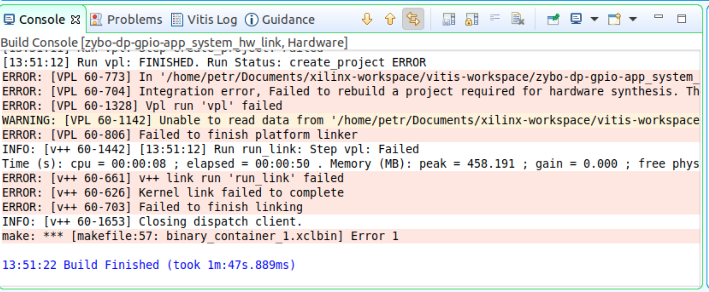

# Poznatky 14.02.2023

- objective ze včera - vybuildil jsem nové zybo pouze na gpio a linux, zkusit to flashnout a zkusit opět gpio od 906+54=960=>1023 **NEFNGUJE, ZASE UDÁVÁ CHYBU LINKER**
- projíždět pomocí skriptu všechny piny
- pochopit lépe optimalizaci a vitis analyzer
- pokud nepůjde GPIO, odložit to na neurčito
- ukázkový device tree [system-user.dtsi](https://github.com/Digilent/Petalinux-Zybo/blob/master/Zybo/project-spec/meta-user/recipes-bsp/device-tree/files/system-user.dtsi)

- opět, po vygenerování designu z vivado a vytvoření petalinuxu tak ve vitis při kompilaci HW aplikace došlo k problému, zkusím, zda to není problém v postupu, že jsem se někde uklikl tím, že zkopíruji funkční design a celý proces udělám bez AXI GPIO jen vlastně jako kopie DP
  
- [Xilinx Forum](https://support.xilinx.com/s/question/0D52E000075bES3SAM/how-to-fix-rebuildtcl?language=en_US) zde mluví o tom, že mu přestal ukazovat linker chybu při negenerování bitstreamu ve vivado, ale to se mi nějak nezdá, každopádně to zkusím pak vyzkoušet, ono i na serveru trvá tvorba petalinuxu dost a zkoušet něco dalšího je nemožné, protože jádra jsou vytížená, tak se snažím řešit ostatní věci a momentálně řešit optimalizaci a debugging - číst
- [Profiling and Debugging](https://docs.xilinx.com/r/en-US/ug1393-vitis-application-acceleration/Profiling-and-Debugging-the-Application)
- [XRT.ini flags](https://docs.xilinx.com/r/en-US/ug1393-vitis-application-acceleration/xrt.ini-File)
- [Using the Vitis Analyzer](https://docs.xilinx.com/r/en-US/ug1393-vitis-application-acceleration/Using-the-Vitis-Analyzer)
- přečíst a sepsat si design principles do DP [Design Principles](https://docs.xilinx.com/r/en-US/ug1399-vitis-hls/Design-Principles) => v tomto dokumentu jsou i informace o pragmas a direktivách pro optimalizaci

- celý den jsem zkoušel GPIO vivado a generování petalinuxu, vše od znova a hází to stejnou chybu při linkování
- je divný, že pokud zkopíruji původní vivado design a jen ho vyexportuji, udělám petalinux atd. tak stejně to udělá tu chybu při linkování
- už 11 hodin mi jede server (23:06 h večer)
- když jsem udělal nový design ve vivado s GPIO a petalinux a vše a pak vitis, tak zase chyba ve vitisu při linkování
- ale když se použijí petalinux a hw design již vyexportovaný, který funguje, tak to funguje
- zkouším tedy udělat stejný starý design, co funguje a s tím i petalinux
- jen ten proces trvá prakticky dvě hodiny a pořádně nelze dále nic zkoumat a řešit

## Debugging

- ukázka debuggingu v tomto repozitáři [GitHub – Debug Profile (C)](https://github.com/Xilinx/Vitis_Accel_Examples/tree/master/host/debug_profile) = přímo od Xilinxu

## Pro kopírování na kód

```c++
//main.cpp

```

```c++
//krnl_main.cpp

```

```c++
//allocator.h

```
