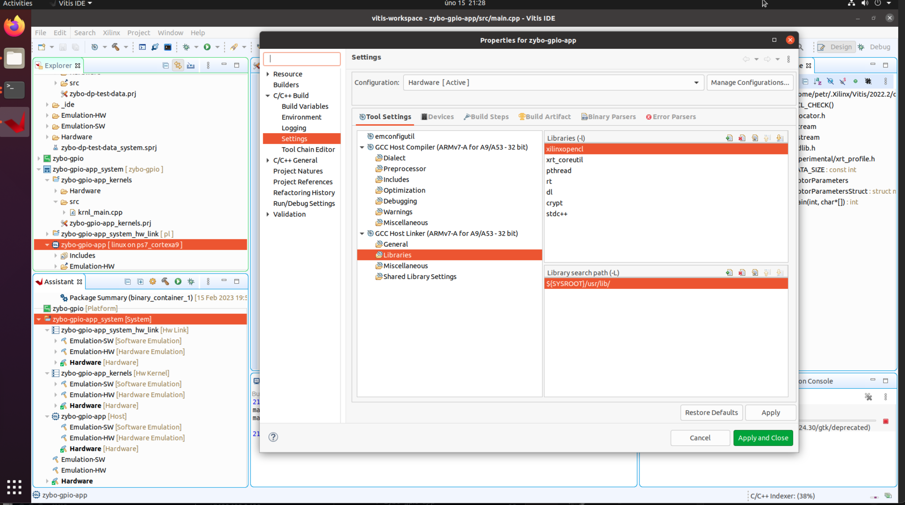
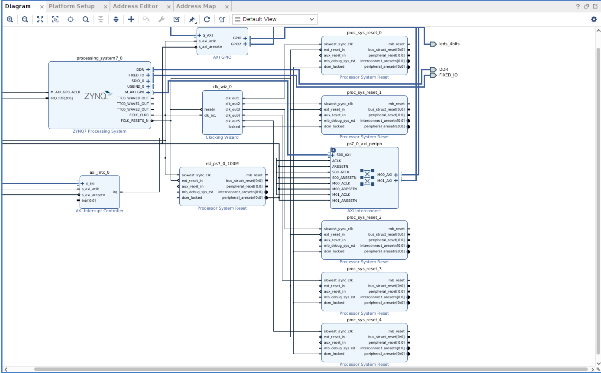
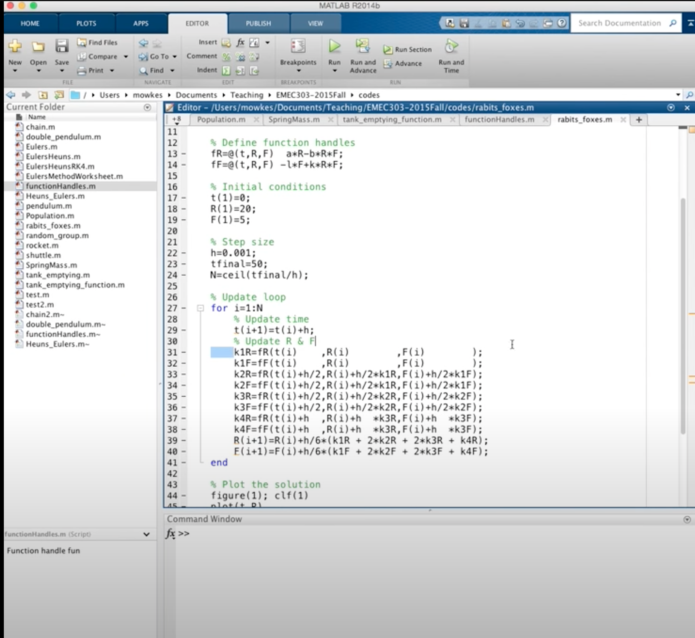

# Poznatky 15.02.2023

- pracuji na c++ matematickém modelu, ale asi v tomto řešení, kdy definuji v kernelu a hostu zvlášť funkce není vhodné používat classy atd.
- použil jsem na block design připravené nastavení ve vivado od digilentu a prošlo to všemi steps, zkusím to flashnout...

- povedlo se částečně GPIO ale zas nejde asi kernel...
- ale při použití nastavení ve vivado od digilentu

```
#gpiochip1016

gpio1016 -> LD0(M14)
gpio1017 -> LD1(M15)
gpio1018 -> LD2(G14)
gpio1019 -> LD3(D18)

gpio1020 -> BTN0(R18)
gpio1021 -> BTN1(P16)
gpio1022 -> BTN2(U16)
gpio1023 -> BTN3(Y16)

#gpiochip898 – podobné jako 906, je tam 118 portů z PS

gpio948 -> BTN4(MIO050)
```

- a pozor, **GPIO I VADD KERNEL FUNGUJE**
- teďka je třeba vložit soubory do projektů a pokračovat v zybo-gpio
- design byl použit ten vivado, kde jsou vloženy věci z digilentu ze záložky „board“, nedocházelo k žádné úpravě device tree `system-user.dtsi`, pouze klasicky z [20221128](./20221126.md)
- petalinux se neupravoval jinak, než jak je opět postup v [20221128](./20221126.md)

- pokud není vidět HW function v `<name of app>_system/<name of app>_kernels/<name of app>_kernels.prj` jen stačí počkat na projetí indexace
- důležité je také nastavení `C/C++ Build settings` v `<name of app> [linux on ps7 cortexa9]` -> `C/C++ Build setting/settings/GCC Host Linker/Libraries` vložit další knihovnu při řešení debuggingu, jinak bude make file (makefile) error `xrt_coreutil` (to je na vitis analyzer)




- pro odstranění uloženého key v ssh (macOS i Linux)

```bash
ssh-keygen -R "hostname" #kde hostname je hostname a nebo IP adresa
```

- runge kutta pro více proměnných je jako klasická pro jednu, ale vypočítávají se koeficienty od 1 -> 4 pro všechny funkce a na konci se vypočte pro všechny funkční hodnota, nevím, zda to jako obecně citovat nebo ne, našel jsem ale krásný předpis z videa, který toto ukazoval hezky [Runge-Kutta solution to a System of ODEs](https://www.youtube.com/watch?v=0LzDiScAcJI)

- momentálně se pokouším upravit vivado tak, že tam budou i switches, zda to bude fungovat..., petalinux se buildí dlouho



## Video

[YouTube GPIO fungujíjí manuálně](https://youtu.be/njSeLosD_So)

## Pro kopírování na kód

```c++
//main.cpp

```

```c++
//krnl_main.cpp

```

```c++
//allocator.h

```
