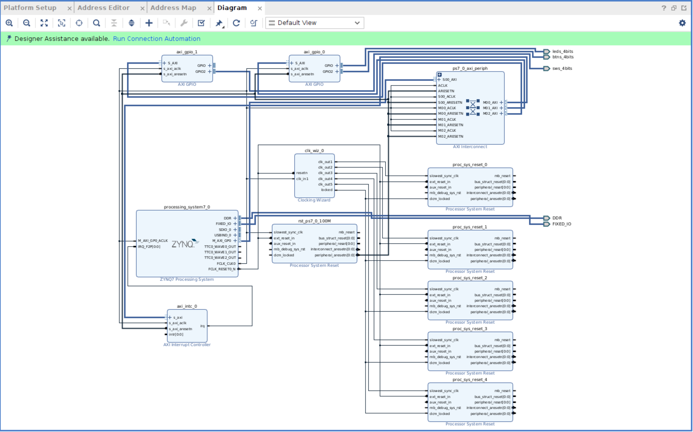
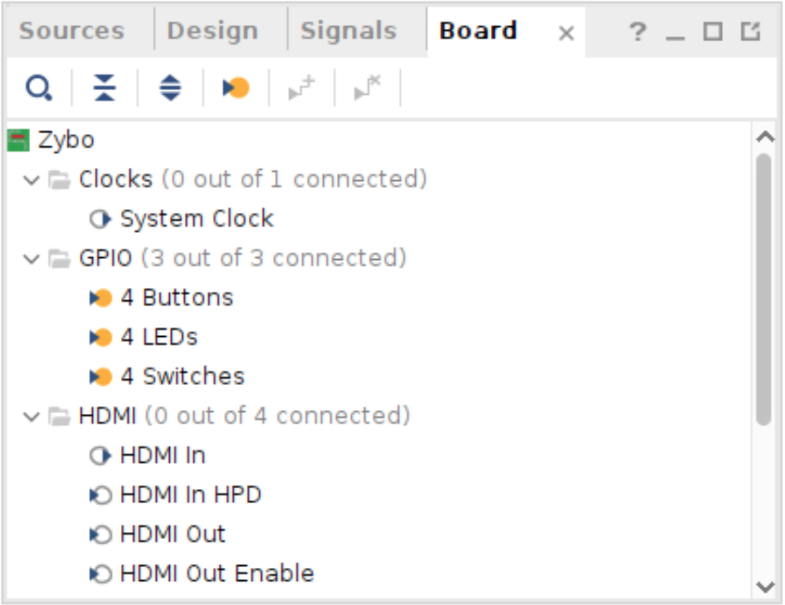

# Poznatky 16.02.2023

- předmětem dneška je vyřešit aby šli GPIO LED + BTN + SWITCH
- už šlo GPIO LED a BTN ale switch k tomu je horší, protože nevím, jaké GPIO použít a když se dá automatická inicializace (propojení), tak to vytvoří další BTNS i když už jsou propojené, možná zkusím to udělat obráceně... nebo podle zapojení z videa [YouTube](https://www.youtube.com/watch?v=duwX_kTc8K8) **HOTOVO**
- další úkol je vyzkoušet, zda lze spouštět různé dva kernely, když se dají do extern C a přidají jako HW funkce a vytvoří se pro to cl::Kernel dle návodu, resp. ukázkového příkladu..., jinak by se to muselo vyřešit asi jinak
  - teoreticky to dle dokumentace lze, zkouším, jak to jde v praxi
- další úkol je vyzjistit, jak fungují class v FPGA a zda je to možné, ale mělo by
- pokračovat na cmodelu v [cmodel](./../code/test-program/cmodel/)
- více si pročíst něco o pragma optimalizací, nejlepší by bylo to přidat už i do latexu, ale nejsem si jistý, co všechno tam budu dávat, tak nechci předbíhat

- **POVEDLO SE UDĚLAT GPIO I NA SWITCH LED BTN**, ale je problém, že je zobrazováno i gpio nepoužité, které je způsobeno tím, že je tam 8 pozic, 2 x 4, takže zkusit, zda tam nelze dát nějaké signle nebo output do nějaké díry..., **[ZATÍM NEVYŘEŠENO]**, ale asi tento prebuild blok, který je prakticky složen z normálního bloku nejde editovat tak, aby se přidali interafaces nebo odebrali
  - funkční je `zybo-gpio-all`
  - při přidávání nové platformy do Vitis, je třeba upravit práva na složku software, resp. tam, kde je `boot` a `sysroot` folder (radši rovnou dělám celou `software` složku, je to víc safe), jinak to nebude zkompilované, protože vznikne error kopírování `sysroots` -> `sudo chmod 755 -R software`
- pokud je použito GPIO_AXI_0 => LED (GPIO) + BTN (GPIO2) a GPIO_AXI_1 => SW (GPIO2)





## Ukázka namapování gpio

```

#gpiochip1008

gpiochip1008 -> NULL
gpiochip1009 -> NULL
gpiochip1010 -> NULL
gpiochip1011 -> NULL

gpiochip1012 -> SW0(G15)
gpiochip1013 -> SW1(P15)
gpiochip1014 -> SW2(W13)
gpiochip1015 -> SW3(T16)

#gpiochip1016

gpio1016 -> LD0(M14)
gpio1017 -> LD1(M15)
gpio1018 -> LD2(G14)
gpio1019 -> LD3(D18)

gpio1020 -> BTN0(R18)
gpio1021 -> BTN1(P16)
gpio1022 -> BTN2(U16)
gpio1023 -> BTN3(Y16)

#gpiochip890 – je tam 118 portů z PS

gpio948 -> BTN4(MIO050)
atd.
```

## Pro kopírování na kód

```c++
//main.cpp

```

```c++
//krnl_main.cpp

```

```c++
//allocator.h

```
