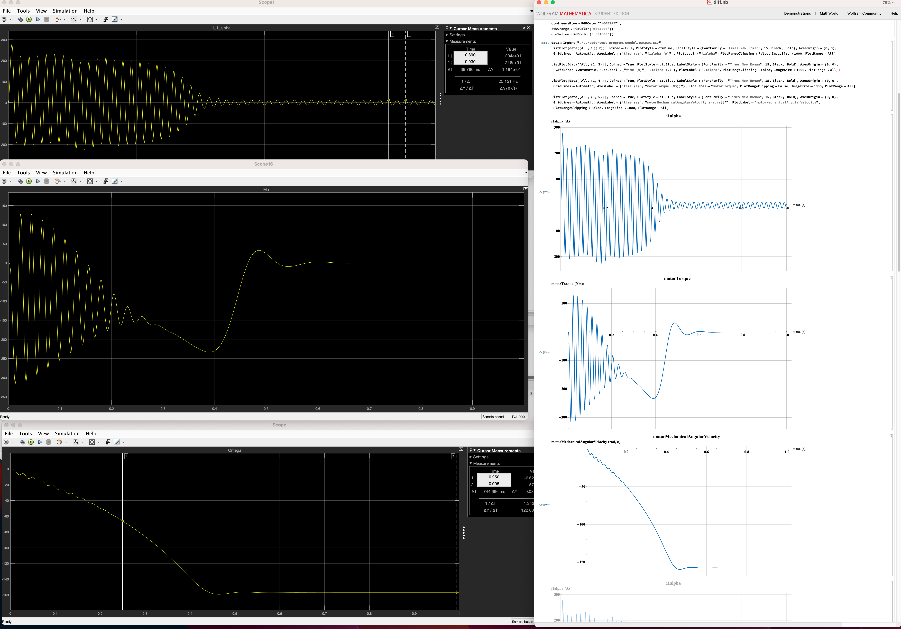
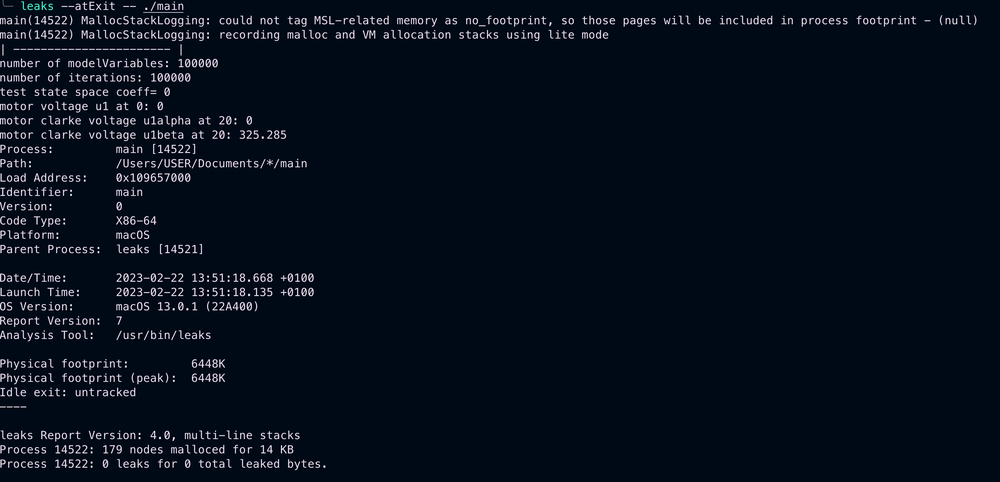

# Poznatky 21.02.2023

- dělám block design na pmod
- model v [cmodel](./../code/test-program/cmodel/) již na pc začal fungovat, oprail jsem chyby v diskretizaci, přepis hodnot atd., v [diff.nb](./../misc/diff.nb) je možné se podívat na průběhy, že se shodují s [matlab](./../misc/matlab-asm-ept-2/), v matlabu jsem opravil Clark transformaci, měl jsem tam špatně znaménka u této úlohy..

## Ukázka dat z modelu v PC

- vlevo matlab (simulace se stejnými parametry simulace) vpravo mathematika - výstupy z cmodelu

## Leaks demo – něco jako Valgrind pro macOS

- pro kontrolu memory leaks
  
