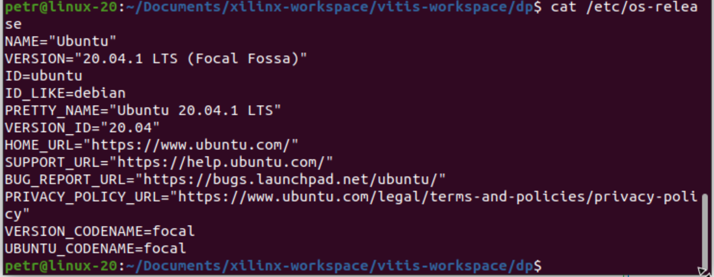

# Poznatky 23.02.2023

- jen ukázka linux verze



- pracuji na tom, aby bylo trackováno i paní kódu v remote - proxmox serveru, který je připojen na fpga, ovšem je probléms s workspacem atd, takže ztrácím zbytečně čas problematickou věcí indexace directory a hledáním kernel funkcí, které zas nejsou vidět, vitis je strašně zabugovanej.... nejhorší je, že když se kernel funkce přidají ručně, tak třeba nefungují....
- chtělo by to přechod na headeless mode - bez GUI ale jen z terminálu, to skoro jde, až na prvotní inicializaci
- přestalo fungovat base workspace...
- když je třeba někam přenášet project, nekopírovat tka jak je ale vyexportovat do zipu jako projekt a pak to importovat, jinak to nebude už možné naimportovat zpátky - špatnej SW...

- výborný zdroj na fpga, sice jsou většinou jiné, ale pracuje to taky na xilinxu [Adam Taylor](https://www.hackster.io/adam-taylor)

## Git Single and Orphaned Branch

### Vytvoření orphaned branch bez historie a souborů

```bash
git switch --orphan <new branch>
git commit --allow-empty -m "Initial commit on orphan branch"
git push -u origin <new branch>

```

### Stažení jen samotné branch

```bash
git clone -b <branchname> --single-branch <remote-repo-url> #This automatically configures passwordless-auth as the local branch and only tracks this branch.

# bez --single-branch by to trackovalo i ostatní branches

# zkontrolovat, zda je skutečně stažena jen jedna branch pomocí

git remote show origin
```

### Zdroje

[Single Orphaned Branch](https://stackoverflow.com/questions/13969050/creating-a-new-empty-branch-for-a-new-project/13969482#13969482)
[Download Single Branch](https://www.freecodecamp.org/news/git-clone-branch-how-to-clone-a-specific-branch/)

## Pro kopírování na kód

```c++
//main.cpp

```

```c++
//krnl_main.cpp

```

```c++
//allocator.h

```
