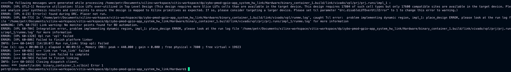

# Poznatky 24.02.2023

- model z EPT 2 nepůjde do digilentu Zybo 1. verze Zynq7000 s 17,6 K LUT vložit, každý kernel - funkce v extern C představuje další přidávání požadovaných LUT, v analyzéru má každá jiný počet LUT než by dávalo dohromady dle zobrazené chyby, snažil jsem se optimalizovat a stát pod tou hodnotou, ale nelze ani vygenerovat sinus napětí (sinus tam není tak náročný, horší je "celkový kernel", nepřišel jsem na to, jak dále zminimalizovat počet potřebných LUT)

- níže je zobrazen výpis z linkování `hw_link` s chybou ohledně LUT

- zkouším tedy dělat I-n model pouze stylem data proudu a otáček dovnitř, data ohledně toku ven

- dobré tutoriály na fpga a akcelerované aplikace (poté odkazuje na hackster) [knitronics](https://www.knitronics.com/), nebo také [hackster](https://www.hackster.io/news/accelerate-your-robotics-design-with-the-kria-kr260-robotics-starter-kit-89191a42080d)
- možná informace o SPI [https://chanon-khong.medium.com/zynq-reading-analog-value-from-adc-ltc2314-with-axi-quad-spi-11be59b6d693](https://chanon-khong.medium.com/zynq-reading-analog-value-from-adc-ltc2314-with-axi-quad-spi-11be59b6d693)

- pdf s informacemi o interruptu na zynq [pdf](https://prof.bht-berlin.de/fileadmin/prof/svoss/CES/Datenblaetter/how-to-use-interrupts-on-zynqsoc.pdf)

- gpio na sysfs [https://xilinx-wiki.atlassian.net/wiki/spaces/A/pages/18842142/GPIO+User+Space+App](https://xilinx-wiki.atlassian.net/wiki/spaces/A/pages/18842142/GPIO+User+Space+App)

- kria tutorial petalinux accelerated app [https://www.hackster.io/whitney-knitter/accelerated-design-development-on-kria-kr260-in-vitis-2022-1-883799](https://www.hackster.io/whitney-knitter/accelerated-design-development-on-kria-kr260-in-vitis-2022-1-883799)

- kria tutorial petalinux accelerated app [https://www.hackster.io/whitney-knitter/getting-started-with-the-kria-kr260-in-petalinux-2022-1-daec16](https://www.hackster.io/whitney-knitter/getting-started-with-the-kria-kr260-in-petalinux-2022-1-daec16)

- open source kria carrier board for som [https://github.com/antmicro/kria-k26-devboard](https://github.com/antmicro/kria-k26-devboard)
