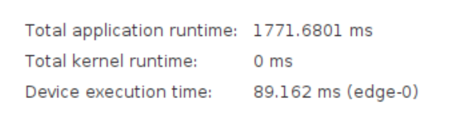

# Poznatky 25.02.2023

- v digilent zybo vitis hls nelze mít v kernelu v top funkci strukturu, ve která je alokovaná posix_memalign v hostu a v ní jsou pak alokované pointery taktéž posix_memalign, v klasickém C++ to není problém, ale v HLS ano

- snažím se přesunout a uzpůsobit I-n model pro SoC

- scp na mac os, kde je nová verze a funguje přes protokol sftp a ne scp je třeba zpnout lagacy mode

```bash
scp -O filename.boo root@hostname:/mnt

```

- načtení 10 000 hodnot otáčivé mechanické rychlosti, proudů i1 i2 i3 a výpočet 10 000 hodnot amplitudy ps2Amplitude - bez optimalizací
  

- ale je divné, že při řešení jedné hodnoty je doba výpočtu v kernelu i s přesuny jedné hodnoty atd.
  

- povedl se mi krásný I-n model co měl z kernelu výstup velikost psi2Amplitude, ale když se tam mělo dát ještě arcTan, tak nebylo dost slices LUTs, tudíž to nelze a zase musím teda měnit celou strukturu programu
