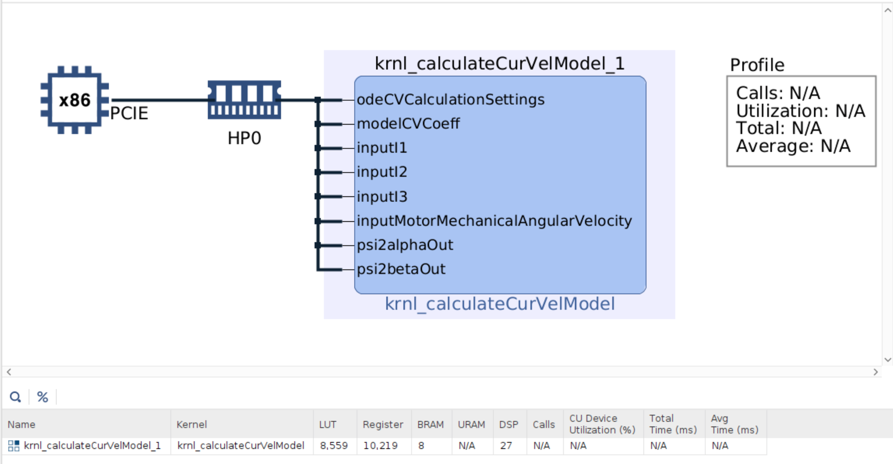
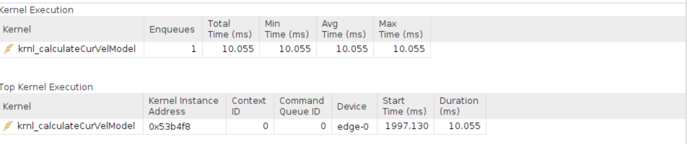
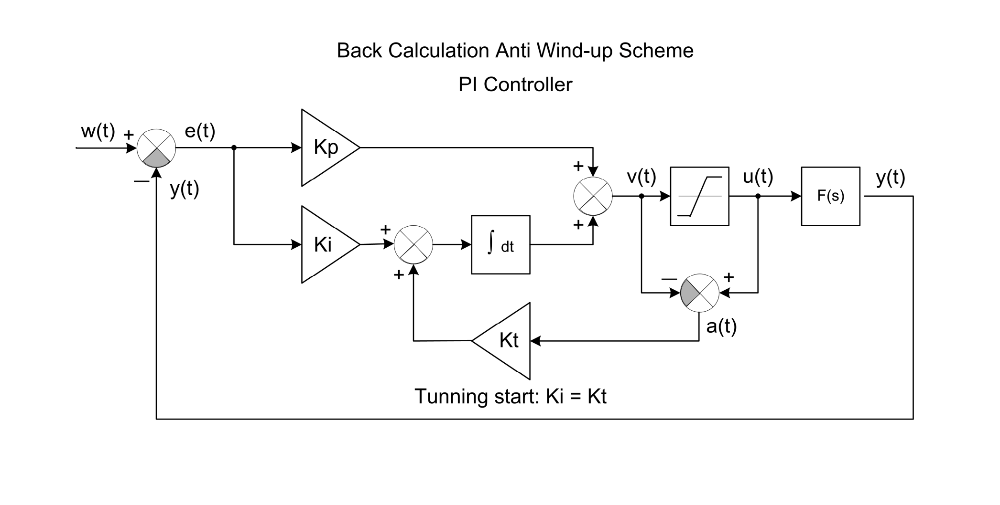
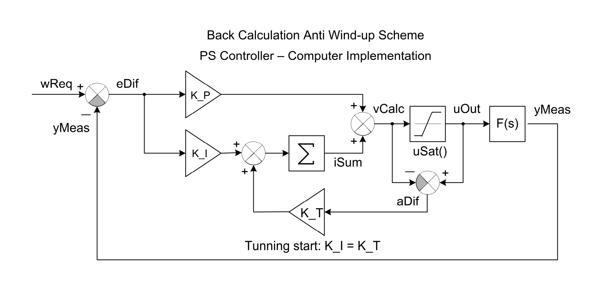

# Poznatky 26.02.2023

- podařilo se mi optimalizovat kód v kernelu a hostu na to abych využil na RK4 (pouze RK4) FPGA `8 559 LUT` - screen je níže



- pro zpracování 10 000 hodnot v FPGA na RK4 je třeba cca `10.0547 ms`, to vychází na `1 mikro sekundu` jedna hodnota, dát hodnoty do kernelu, spustit a ukončit kernel trvá `2.071 ms`



- pro kernel zpracování jedné hodnoty - emulace vstupu z čidla pomocí vstupu klávesnice
- pro zpacování jedné hodnoty RK4 v kernelu je třeba `0.461 ms`, to je kvůli režii dat, využito `8 699 LUT`
- od začátku spouštění kernelu do jeho konce v host programu bylo naměřeno `1.594 ms`

- zjištění, které je napsáno v branch `soc-code` ohledně profilování kernelu - pokud se použije flag `--profile profile.cfg` (je lepší absolutní cesta, házelo mi to random chybu po chvíli, i když před tím to šlo i relativně - prostě IDE zabugované) kdy `profile.cfg` obsahuje informace profilování kernelu jako např.

```cfg
#zybo-pmod-gpio-app_system/Hardware/profile.cfg
[profile]
data=all:all:all
memory=all
stall=all:all
exec=all:all
aie=all
```

- když se to dává do upraveného kernelu vlastně, po tom co došlo k jeho změně - třeba jen smazání komentáře, no tak to hází chybu, že je využito moc LUTs, více než 17,6 K, ve `vitis_analyzer` je i však v tomto případě uvedená estimated nižší hodnota LUTs, než uvádí linker, je to prostě divné, musel jsem tento profilovací soubor vyřadit z příkazů pro `v++`

- snaha zprovoznit timery a interrupty, sice v dokumentaci zynq něco o tom je, mluví se jen o registrech ale nikde jsem nenašel, jak se do nich vlastně zapisuje, což je divné... hledal jsem tudíž postupy ohledně toho, jak může takový interrupt a timer fungovat, protože v oficiální xilinx dokumentaci, dostupné na [xilinx](https://xilinx.github.io/Embedded-Design-Tutorials/docs/2021.1/build/html/docs/Introduction/ZynqMPSoC-EDT/7-design1-using-gpio-timer-interrupts.html) prostě zase nefungují odkazy na referenční design, z toho se nedá nic poté vyčíst

- našel jsem nějakou prezenaci s postupem ohledně bare-metal aplikace a interruptů, zkusím to aplikovat na linux, ale jak už je u vivado klasické, pokud zkopíruji celý projekt, přidám jen timer a udělám vše jako vždy, tak to u buildění linuxu spadne, takže musím celé od znova, je to nepříjemný způsob řešení...

- odkaz na prezentaci, ze které se budu pokoušet čerpat

  - [Prezentace ohledně interrupts](https://people-ece.vse.gmu.edu/coursewebpages/ECE/ECE699_SW_HW/S16/viewgraphs/ECE699_lecture_5.pdf)

- zkopírovaný kód z prezentace, který se budu snažit pochopit, vygooglit a implementovat

```c++
#include "xparameters.h" #include "xgpio.h" #include "xtmrctr.h" #include "xscugic.h" #include "xil_exception.h" #include "xil_printf.h"
// Parameter definitions
#define INTC_DEVICE_ID
#define TMR_DEVICE_ID
#define BTNS_DEVICE_ID
#define LEDS_DEVICE_ID
#define INTC_GPIO_INTERRUPT_ID
C Program (1)
XPAR_FABRIC_AXI_GPIO_0_IP2INTC_IRPT_INTR
#define INTC_TMR_INTERRUPT_ID XPAR_FABRIC_AXI_TIMER_0_INTERRUPT_INTR
#define BTN_INT XGPIO_IR_CH1_MASK
#define TMR_LOAD 0xF8000000

XGpio LEDInst, BTNInst; XScuGic INTCInst; XTmrCtr TMRInst; static int led_data;
static int btn_value;
static int tmr_count;
//----------------------------------------------------
// PROTOTYPE FUNCTIONS
//----------------------------------------------------
static void BTN_Intr_Handler(void *InstancePtr);
static void TMR_Intr_Handler(void *InstancePtr);
static int InterruptSystemSetup(XScuGic *XScuGicInstancePtr);
static int IntcInitFunction(u16 DeviceId, XTmrCtr *TmrInstancePtr, XGpio *GpioInstancePtr);


void BTN_Intr_Handler(void *InstancePtr) {
// Disable GPIO interrupts
XGpio_InterruptDisable(&BTNInst, BTN_INT);
// Ignore additional button presses
if ((XGpio_InterruptGetStatus(&BTNInst) & BTN_INT) !=BTN_INT) {
return; }
btn_value = XGpio_DiscreteRead(&BTNInst, 1); // Increment counter based on button value
// Reset if center button pressed
if(btn_value != 8)
led_data = led_data + btn_value; else
led_data = 0;
XGpio_DiscreteWrite(&LEDInst, 1, led_data); (void) XGpio_InterruptClear(&BTNInst, BTN_INT);
// Enable GPIO interrupts XGpio_InterruptEnable(&BTNInst, BTN_INT);
}

void TMR_Intr_Handler(void *InstancePtr) {
if (XTmrCtr_IsExpired(&TMRInst, 0)){
// Once timer has expired 3 times, stop, increment counter
// reset timer and start running again
if(tmr_count == 3){
XTmrCtr_Stop(&TMRInst, 0);
tmr_count = 0;
led_data++;
XGpio_DiscreteWrite(&LEDInst, 1, led_data); XTmrCtr_Reset(&TMRInst, 0); XTmrCtr_Start(&TMRInst, 0);
}
else tmr_count++;
}
}


int main (void) {
int status;
// Initialise LEDs
status = XGpio_Initialize(&LEDInst, LEDS_DEVICE_ID); if(status != XST_SUCCESS) return XST_FAILURE;
// Initialize Push Buttons
status = XGpio_Initialize(&BTNInst, BTNS_DEVICE_ID); if(status != XST_SUCCESS) return XST_FAILURE;
// Set LEDs direction to outputs XGpio_SetDataDirection(&LEDInst, 1, 0x00); // Set all buttons direction to inputs XGpio_SetDataDirection(&BTNInst, 1, 0xFF);

//----------------------------------------------------
// SETUP THE TIMER //----------------------------------------------------
status = XTmrCtr_Initialize(&TMRInst, TMR_DEVICE_ID); if(status != XST_SUCCESS)
return XST_FAILURE;
XTmrCtr_SetHandler(&TMRInst, TMR_Intr_Handler, &TMRInst); XTmrCtr_SetResetValue(&TMRInst, 0, TMR_LOAD); XTmrCtr_SetOptions(&TMRInst, 0,
XTC_INT_MODE_OPTION | XTC_AUTO_RELOAD_OPTION);

// Initialize interrupt controller
status = IntcInitFunction(INTC_DEVICE_ID, &BTNInst); if(status != XST_SUCCESS) return XST_FAILURE; while(1);
return 0;
}

int IntcInitFunction(u16 DeviceId, XTmrCtr *TmrInstancePtr, XGpio *GpioInstancePtr)
{
XScuGic_Config *IntcConfig; int status;
// Interrupt controller initialization
IntcConfig = XScuGic_LookupConfig(DeviceId); status = XScuGic_CfgInitialize(&INTCInst, IntcConfig,
IntcConfig->CpuBaseAddress); if(status != XST_SUCCESS) return XST_FAILURE;
// Call to interrupt setup
status = InterruptSystemSetup(&INTCInst); if(status != XST_SUCCESS) return XST_FAILURE;

// Connect GPIO interrupt to handler
status = XScuGic_Connect(&INTCInst, INTC_GPIO_INTERRUPT_ID,
(Xil_ExceptionHandler) BTN_Intr_Handler, (void *)GpioInstancePtr);
if(status != XST_SUCCESS) return XST_FAILURE;
// Connect timer interrupt to handler
status = XScuGic_Connect(&INTCInst, INTC_TMR_INTERRUPT_ID,
(Xil_ExceptionHandler)TMR_Intr_Handler, (void *)TmrInstancePtr);
if(status != XST_SUCCESS) return XST_FAILURE;

// Enable GPIO interrupts interrupt XGpio_InterruptEnable(GpioInstancePtr, 1); XGpio_InterruptGlobalEnable(GpioInstancePtr);
// Enable GPIO and timer interrupts in the controller XScuGic_Enable(&INTCInst, INTC_GPIO_INTERRUPT_ID);
XScuGic_Enable(&INTCInst, INTC_TMR_INTERRUPT_ID);
return XST_SUCCESS; }


int InterruptSystemSetup(XScuGic *XScuGicInstancePtr) {
// Enable interrupt XGpio_InterruptEnable(&BTNInst, BTN_INT); XGpio_InterruptGlobalEnable(&BTNInst);
Xil_ExceptionRegisterHandler(XIL_EXCEPTION_ID_INT, (Xil_ExceptionHandler) XScuGic_InterruptHandler,
XScuGicInstancePtr);
Xil_ExceptionEnable();
return XST_SUCCESS; }
```

- přidat do header souborů

```c++
#ifndef REGULATOR_H
#define	REGULATOR_H

// code


#endif	/* REGULATOR_H */
```

## Regulátor

- regulátor s anti-windupem vychází ze zapojení z DEP [moodle.fel.cvut.cz](https://moodle.fel.cvut.cz/pluginfile.php/343391/mod_resource/content/3/B1M14DEP-2022-08z-cislicovy-regulator-2.pdf)




