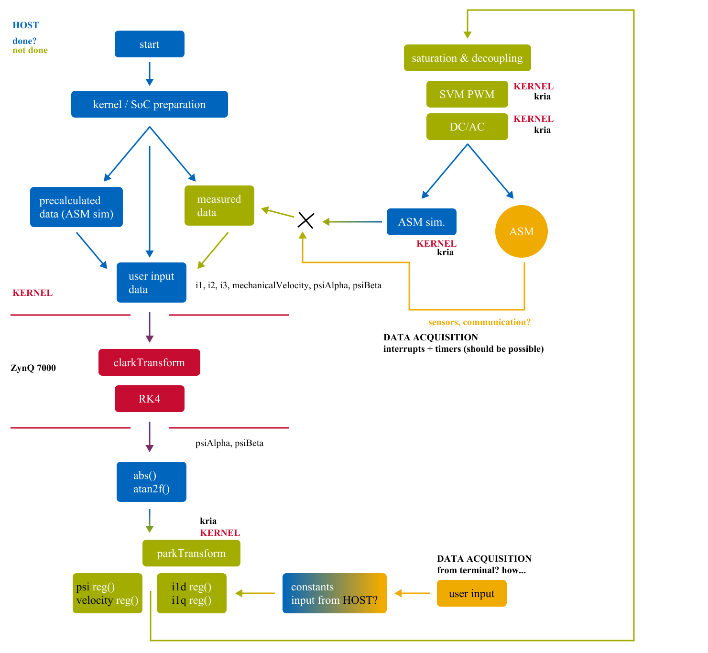

# Poznatky 27.02.2023

- ukázkové video ohledně interruptu dle návodu - pouze GPIO a bez custom IP bloku ve vivado [YouTube](https://www.youtube.com/watch?v=UmsLH8q0el0)

- configuration vitis compilation [profile.cfg] [https://www.xilinx.com/developer/articles/using-configuration-files-to-control-vitis-compilation.html](https://www.xilinx.com/developer/articles/using-configuration-files-to-control-vitis-compilation.html)

## TO DO

- snaha o zprovoznění timeru a přerušení
- snaha o zprovoznění výstupu regulátorů, omezení a odvazbení
- SVM PWM
- prezentování možných postupů v práci na FEL [program flow](./images/20230226/20230226_brainstorm-program-flow.png), pobavení se o KRIA ?
- další dny pak přemýšlení, jak při while(1) akvizicovat hodnoty konstant regulátorů a žádaných hodnot z terminálu

- program brainstorm flow z 20260226
  

- pracuji na zprovoznění interrupts v Linux

  - v případě bare-metal aplikace se dá použít klasický kód ze zmíněné prezentace, dojde ke kompilaci, ovšem v případě linuxu to nejde, jsou to dva odlišné přístupy a v bare-metal nelze akcelerovat v kernelu, nebo jsem ještě na to nepřišel...
  - to v linuxu je hardcore, jakože fakt hardcore, zlatej pic
  - našel jsem postup na jinou desku ale podobný SoC, chybí mi tam informace o jedné části s IP, ale možná to nějak půjde dogooglit

    - [1. díl](https://www.linkedin.com/pulse/gpio-petalinux-part-1-roy-messinger/)
    - [2. díl](https://www.linkedin.com/pulse/gpio-petalinux-part-2-roy-messinger/)
    - [3. díl](https://www.linkedin.com/pulse/gpio-petalinux-part-3-go-uio-roy-messinger/)

    - odkaz na článek ve na který se článek odkazuje [https://www.programmersought.com/article/82086335623/](https://www.programmersought.com/article/82086335623/)
    - odkaz na kód, na který se článek odkazuje [https://github.com/aimeemikaelac/xilinx_zedboard_c/blob/master/src/gpio-dev-mem-test.c](https://github.com/aimeemikaelac/xilinx_zedboard_c/blob/master/src/gpio-dev-mem-test.c)

    - ukázka k'du řešení interruptu v HLS asi [https://www.kernel.org/doc/html/v4.12/driver-api/uio-howto.html#example-code-using-uio-pci-generic](https://www.kernel.org/doc/html/v4.12/driver-api/uio-howto.html#example-code-using-uio-pci-generic)
    - další uio ukázka [https://yurovsky.github.io/2014/10/10/linux-uio-gpio-interrupt.html](https://yurovsky.github.io/2014/10/10/linux-uio-gpio-interrupt.html)

  - neukazuje tam sice timer, ale interrupt pro GPIO a z toho by to šlo odvodit, cílem je nejdříve zprovoznit GPIO

- gpio dokumentace ohledně registrů [xilinx](https://docs.xilinx.com/v/u/en-US/pg144-axi-gpio)
- [xilinx linux uio driver](https://github.com/Xilinx/linux-xlnx/blob/master/drivers/uio/uio_pdrv_genirq.c)
- další zajímavé je linux driver, kde je timer a je to popsáno na [xilinx](https://support.xilinx.com/s/article/62363?language=en_US)
- další věc co prozkoumat s interrutem od timeru [https://github.com/imrickysu/ZYNQ-Cookbook/blob/master/recipe/HowToHandleInterruptFromPL.md]

- odkazy na fórum, proč nejde dělat to co v bare-metal také v linuxu

  - [https://support.xilinx.com/s/question/0D52E00006hpTrBSAU/app-in-petalinux-error-found-xparametersh?language=en_US](https://support.xilinx.com/s/question/0D52E00006hpTrBSAU/app-in-petalinux-error-found-xparametersh?language=en_US) -
    - [https://support.xilinx.com/s/question/0D52E00006hpaaPSAQ/building-applications-for-petalinux?language=en_US](https://support.xilinx.com/s/question/0D52E00006hpaaPSAQ/building-applications-for-petalinux?language=en_US)
    - [https://support.xilinx.com/s/question/0D52E00006hpV2rSAE/move-bare-metal-standalone-app-to-linux?language=en_US](https://support.xilinx.com/s/question/0D52E00006hpV2rSAE/move-bare-metal-standalone-app-to-linux?language=en_US)
    - [https://support.xilinx.com/s/question/0D52E00006lLh2uSAC/axi-timer-interrupt-in-linux?language=en_US](https://support.xilinx.com/s/question/0D52E00006lLh2uSAC/axi-timer-interrupt-in-linux?language=en_US)
    - [https://support.xilinx.com/s/question/0D52E00006hpZIESA2/ar-50572-axitimer-interrupts-in-linux?language=en_US](https://support.xilinx.com/s/question/0D52E00006hpZIESA2/ar-50572-axitimer-interrupts-in-linux?language=en_US)

- trochu info ohledně interruptů [https://xilinx-wiki.atlassian.net/wiki/spaces/A/pages/18842490/Testing+UIO+with+Interrupt+on+Zynq+Ultrascale](https://xilinx-wiki.atlassian.net/wiki/spaces/A/pages/18842490/Testing+UIO+with+Interrupt+on+Zynq+Ultrascale)

## Nějaké odkazy na fóra ohledně interruptů

- [https://support.xilinx.com/s/question/0D52E00006hpJ1NSAU/is-the-uio-driver-only-for-interrupt-handling?language=en_US](https://support.xilinx.com/s/question/0D52E00006hpJ1NSAU/is-the-uio-driver-only-for-interrupt-handling?language=en_US)
- [https://support.xilinx.com/s/question/0D52E00006hpdrkSAA/custom-hardware-with-uio?language=en_US](https://support.xilinx.com/s/question/0D52E00006hpdrkSAA/custom-hardware-with-uio?language=en_US)
- [https://community.element14.com/products/devtools/avnetboardscommunity/avnetboard-forums/f/software-application-development/36052/axi-gpio-interrupt](https://community.element14.com/products/devtools/avnetboardscommunity/avnetboard-forums/f/software-application-development/36052/axi-gpio-interrupt)
- [https://support.xilinx.com/s/question/0D52E00006hptYlSAI/ps-gpio-interrupt-using-uio-driver?language=en_US](https://support.xilinx.com/s/question/0D52E00006hptYlSAI/ps-gpio-interrupt-using-uio-driver?language=en_US)
- [https://www.linuxquestions.org/questions/programming-9/gpio-uio-interrupt-error-on-zynq-7020-a-4175624060/](https://www.linuxquestions.org/questions/programming-9/gpio-uio-interrupt-error-on-zynq-7020-a-4175624060/)
- [https://support.xilinx.com/s/question/0D52E00007FSgjQSAT/changing-gpio-interrupt-mechanism?language=en_US](https://support.xilinx.com/s/question/0D52E00007FSgjQSAT/changing-gpio-interrupt-mechanism?language=en_US)
- [https://support.xilinx.com/s/question/0D52E00006iHjK6SAK/how-to-setup-an-interrupt-for-an-axi-gpio-which-occurs-at-rising-edge-of-the-signal?language=en_US](https://support.xilinx.com/s/question/0D52E00006iHjK6SAK/how-to-setup-an-interrupt-for-an-axi-gpio-which-occurs-at-rising-edge-of-the-signal?language=en_US)

## Prý petalinux bible

- [https://docs.xilinx.com/v/u/2019.1-English/ug1144-petalinux-tools-reference-guide](https://docs.xilinx.com/v/u/2019.1-English/ug1144-petalinux-tools-reference-guide)
