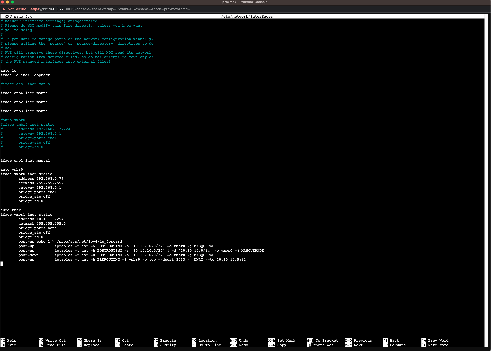

# Poznatky 01.03.2023

- rozchozoval jsem proxmox IP forwarding přes jednu MAC adresu
- chci zprovoznit interrupty
- asi udělám zprovoznění timeru ve future/thread a až dojde k přerušení z timeru v tom threadu (aby neblokovalo main), tak bude validní a já budu moci zpracovat data

- ukázka mého blocking interrupt with read() [YouTube](https://youtu.be/tArh6LW92QM)
- ukázka ne blocking read protože je specifikováno v open file descriptior, že nemá být blocking, check linux man [YouTube](https://youtu.be/7mcAWSGORMg)
- poll() je blocking, vždy, stanovuje se proto interval...
- lepší je tedy použít pro naší aplikaci read() ne blocking, že je to jakoby if... na interrupt

## Záloha odkazů

(potřebuji funkční PC a s tolika záložkami to nedám, vše se týká interruptu)

- [https://docs.xilinx.com/v/u/en-US/xapp1172_zynq_ps_xadc](https://docs.xilinx.com/v/u/en-US/xapp1172_zynq_ps_xadc)
- [https://www.embedded.com/device-drivers-in-user-space/](https://www.embedded.com/device-drivers-in-user-space/)
- [https://www.osadl.org/fileadmin/dam/rtlws/12/Koch.pdf](https://www.osadl.org/fileadmin/dam/rtlws/12/Koch.pdf)
- [https://www.programmersought.com/article/82086335623/](https://www.programmersought.com/article/82086335623/)
- [https://www.kernel.org/doc/html/v4.12/driver-api/uio-howto.html](https://www.kernel.org/doc/html/v4.12/driver-api/uio-howto.html)
- [https://www.linkedin.com/pulse/gpio-petalinux-part-3-go-uio-roy-messinger/](https://www.linkedin.com/pulse/gpio-petalinux-part-3-go-uio-roy-messinger/)
- [https://www.linkedin.com/pulse/gpio-petalinux-part-2-roy-messinger/](https://www.linkedin.com/pulse/gpio-petalinux-part-2-roy-messinger/)
- [https://www.linkedin.com/pulse/gpio-petalinux-part-1-roy-messinger/](https://www.linkedin.com/pulse/gpio-petalinux-part-1-roy-messinger/)
- [https://www.xilinx.com/content/dam/xilinx/support/documents/ip_documentation/axi_intc/v4_1/pg099-axi-intc.pdf](https://www.xilinx.com/content/dam/xilinx/support/documents/ip_documentation/axi_intc/v4_1/pg099-axi-intc.pdf)
- [https://docs.xilinx.com/v/u/en-US/pg079-axi-timer](https://docs.xilinx.com/v/u/en-US/pg079-axi-timer)
- [https://people-ece.vse.gmu.edu/coursewebpages/ECE/ECE699_SW_HW/S16/viewgraphs/ECE699_lecture_5.pdf](https://people-ece.vse.gmu.edu/coursewebpages/ECE/ECE699_SW_HW/S16/viewgraphs/ECE699_lecture_5.pdf)
- [https://xilinx-wiki.atlassian.net/wiki/spaces/A/pages/18842142/GPIO+User+Space+App](https://xilinx-wiki.atlassian.net/wiki/spaces/A/pages/18842142/GPIO+User+Space+App)
- [https://docs.xilinx.com/v/u/en-US/pg079-axi-timer](https://docs.xilinx.com/v/u/en-US/pg079-axi-timer)
- [https://community.nxp.com/t5/PowerQUICC-Processors/Interrupt-Handling/m-p/624498](https://community.nxp.com/t5/PowerQUICC-Processors/Interrupt-Handling/m-p/624498)
- [https://www.emdalo.com/posts/linux-uio-for-microchip-fpga-designs/](https://www.emdalo.com/posts/linux-uio-for-microchip-fpga-designs/)
- [https://www.kernel.org/doc/html/v5.4/driver-api/uio-howto.html#](https://www.kernel.org/doc/html/v5.4/driver-api/uio-howto.html#)
- [https://daniel.haxx.se/docs/poll-vs-select.html](https://daniel.haxx.se/docs/poll-vs-select.html)
- [https://stackoverflow.com/questions/38304715/using-select-to-detect-a-block-on-a-uio-device-file](https://stackoverflow.com/questions/38304715/using-select-to-detect-a-block-on-a-uio-device-file)
- [https://www.embedded.com/interrupts-in-c/](https://www.embedded.com/interrupts-in-c/)
- [https://yairgadelov.me/linux-uio-driver-to-handle-with-irq-source./](https://yairgadelov.me/linux-uio-driver-to-handle-with-irq-source./)
- [https://www.youtube.com/watch?v=LOCsN3V1ECE](https://www.youtube.com/watch?v=LOCsN3V1ECE)
- [https://ieeexplore.ieee.org/document/1609868](https://ieeexplore.ieee.org/document/1609868)
- [https://unix.stackexchange.com/questions/136274/can-i-achieve-functionality-similar-to-interrupts-in-linux-userspace](https://unix.stackexchange.com/questions/136274/can-i-achieve-functionality-similar-to-interrupts-in-linux-userspace)

## Uložení zajímavého článku přeposlaného od pana Doc. Bauera

- [https://ieeexplore.ieee.org/document/9774004](https://ieeexplore.ieee.org/document/9774004)

## Proxmox

```bash
# nano /etc/network/interfaces
# ifreload -a
# network interface settings; autogenerated
# Please do NOT modify this file directly, unless you know what
# you're doing.
#
# If you want to manage parts of the network configuration manually,
# please utilize the 'source' or 'source-directory' directives to do
# so.
# PVE will preserve these directives, but will NOT read its network
# configuration from sourced files, so do not attempt to move any of
# the PVE managed interfaces into external files!

auto lo
iface lo inet loopback

#iface eno1 inet manual

iface eno4 inet manual

iface eno2 inet manual

iface eno3 inet manual

#auto vmbr0
#iface vmbr0 inet static
#       address 192.168.0.77/24
#       gateway 192.168.0.1
#       bridge-ports eno1
#       bridge-stp off
#       bridge-fd 0


iface eno1 inet manual

auto vmbr0
iface vmbr0 inet static
        address 192.168.0.77
        netmask 255.255.255.0
        gateway 192.168.0.1
        bridge_ports eno1
        bridge_stp off
        bridge_fd 0

auto vmbr1
iface vmbr1 inet static
        address 10.10.10.254
        netmask 255.255.255.0
        bridge_ports none
        bridge_stp off
        bridge_fd 0
        post-up echo 1 > /proc/sys/net/ipv4/ip_forward
        post-up         iptables -t nat -A POSTROUTING -s '10.10.10.0/24' -o vmbr0 -j MASQUERADE
        post-up         iptables -t nat -A POSTROUTING -s '10.10.10.0/24' ! -d '10.10.10.0/24' -o vmbr0 -j MASQUERADE
        post-down       iptables -t nat -D POSTROUTING -s '10.10.10.0/24' -o vmbr0 -j MASQUERADE
        post-up         iptables -t nat -A PREROUTING -i vmbr0 -p tcp --dport 3033 -j DNAT --to 10.10.10.5:22 # for SSH via port 3033 as username@hostname -p 3033 to connect to 10.10.10.5
```

nejsem si jistý posledním `post-up` - kdyžtak se to bez postupu `iptables -t nat -A PREROUTING -i vmbr0 -p tcp --dport 3033 -j DNAT --to 10.10.10.5:22` dá vložit jako command do shellu v proxmoxu, jina to vypadá taky takto


