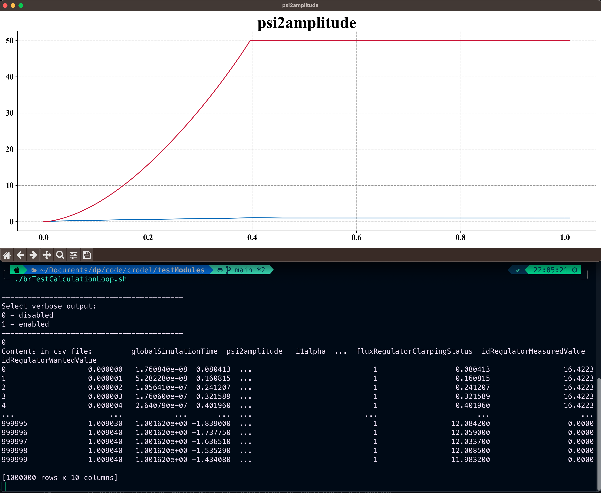

# Poznatky 04.03.2023

- práce na testovacím souboru cmodelu + opravování jeho chyb [testCalculationLoop](/code/cmodel/testModules/testCalculationLoop.cpp/)
- ukázkový výstup po spuštění skriptu [brTestCalculationLoop.sh](/code/cmodel/testModules/brTestCalculationLoop.sh)
  - samozřejmě chybí popisy os, lelgenda atd. ale to v testovacích případech momentálně není řešeno, přidá se možná později
    
