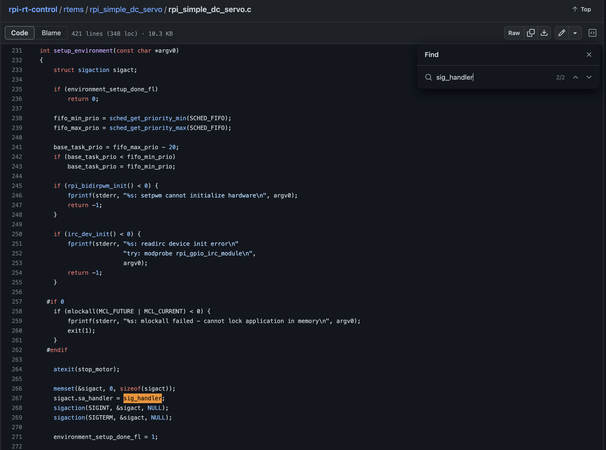
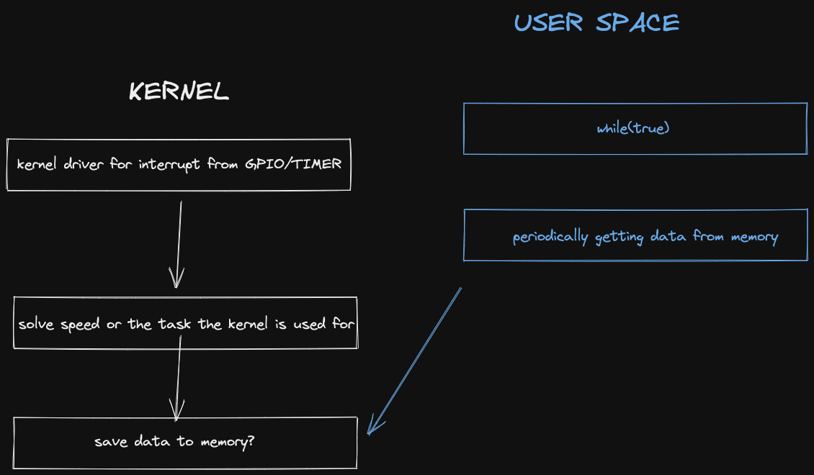

# Poznatky 06.03.2023

- zjišťování, zda multithreading nějak pomůže aplikaci
- pro další aplikaci spojení FPGA a ARM, pokud nepůjde vytvořit řízení přímo v FPGA, jsou přerušení v userspace příliš pomalá, je třeba si napsat driver
- driver na raspberry pi z FELu je napsaný v [https://github.com/ppisa/rpi-rt-control/blob/master/kernel/modules/rpi_gpio_irc_module.c](https://github.com/ppisa/rpi-rt-control/blob/master/kernel/modules/rpi_gpio_irc_module.c)
- přednáška o tom v [https://www.youtube.com/watch?v=uMfY-sKf0HA](https://www.youtube.com/watch?v=uMfY-sKf0HA) Pavel Píša
  - kernel modul od Pavla Píši na Raspberry Pi inkrementální čidlo [https://github.com/ppisa/rpi-rt-control/blob/master/rtems/rpi_simple_dc_servo/rpi_gpio_irc_rtems.c](https://github.com/ppisa/rpi-rt-control/blob/master/rtems/rpi_simple_dc_servo/rpi_gpio_irc_rtems.c)
- nejlepší bude taky zjistit, zda existuje i patch na petalinux pro RTS (real time systems)
- při ukončování aplikace zajistit zastavení motoru - aplikace
- přečíst článek o DTC implementaci v HLS a upravovat kódy mé aplikace [https://imperix.com/doc/implementation/fpga-based-direct-torque-control](https://imperix.com/doc/implementation/fpga-based-direct-torque-control)

- postup pro c++ [https://www.tutorialspoint.com/how-do-i-catch-a-ctrlplusc-event-in-cplusplus](https://www.tutorialspoint.com/how-do-i-catch-a-ctrlplusc-event-in-cplusplus)
- nebo [https://stackoverflow.com/questions/1641182/how-can-i-catch-a-ctrl-c-event](https://stackoverflow.com/questions/1641182/how-can-i-catch-a-ctrl-c-event)
- na raspberry pi vhodné využívat RTEMS [https://www.rtems.org/](https://www.rtems.org/)
- linux kernel tutorial with characters [http://derekmolloy.ie/writing-a-linux-kernel-module-part-2-a-character-device/](http://derekmolloy.ie/writing-a-linux-kernel-module-part-2-a-character-device/)

- vyzkoušet RT patch na petalinux - mělo by to více přiblížit a optimalizovat SoC

  - postupy v odkazech
  - [Petalinux patch realtime postup](https://wiki.trenz-electronic.de/display/PD/How+to+install+the+linux-rt+%28Real-Time%29+patch)
  - [Hackster realtime patch petalinux](https://www.hackster.io/LogicTronix/real-time-optimization-in-petalinux-with-rt-patch-on-mpsoc-5f4832)

- real time linux foudnation [https://wiki.linuxfoundation.org/realtime/start](https://wiki.linuxfoundation.org/realtime/start)

## Linux driver odkazy

- obecný e-book na linux kernel drivery [https://sysprog21.github.io/lkmpg/](https://sysprog21.github.io/lkmpg/)
- video jak napsat GPIO interrupt modul, z toho budu nejspíše vycházet [Let's code a Linux Driver - 11: Using GPIO Interrupts in a Linux Kernel Module](https://www.youtube.com/watch?v=oCTNuwO9_FA)
- další popis UIO linux driveru [https://www.kernel.org/doc/html/v4.12/driver-api/uio-howto.html](https://www.kernel.org/doc/html/v4.12/driver-api/uio-howto.html)

- compiling petalinux module = linux kernel driver [https://docs.xilinx.com/v/u/2017.2-English/ug1144-petalinux-tools-reference-guide](https://docs.xilinx.com/v/u/2017.2-English/ug1144-petalinux-tools-reference-guide) page 58

## Možný nápad jak bude komunikovat aplikace s kernelem

## Budoucnost pro další vývoj akcelerace buďto stále v FPGA nebo zkusit na katedře i GPU CUDA

- oficiální popis CUDA programming [https://docs.nvidia.com/cuda/cuda-c-programming-guide/](https://docs.nvidia.com/cuda/cuda-c-programming-guide/)

## Cmode v C++

- sice mám pěknou API co jsem udělal, ale asi bude třeba ty funkce zase unrollnout do basic částí a ty implementovat jako samostatné funkce a na to dávat pragma

## Petalinux kernel version

- třeba pro verzi 2022.1 zde [https://xilinx-wiki.atlassian.net/wiki/spaces/A/pages/2347204609/2022.1+Release](https://xilinx-wiki.atlassian.net/wiki/spaces/A/pages/2347204609/2022.1+Release)

## Článek o FPGA kde implementovali řízení, mega suprové latency, nechápu jak to udělat u sebe

- použili pouze fpga s VHDL
- [https://ieeexplore.ieee.org/document/4271569](https://ieeexplore.ieee.org/document/4271569)

## Tyhle mají taky na SoC docela zpoždění

- [https://ieeexplore.ieee.org/document/4540273](https://ieeexplore.ieee.org/document/4540273)
