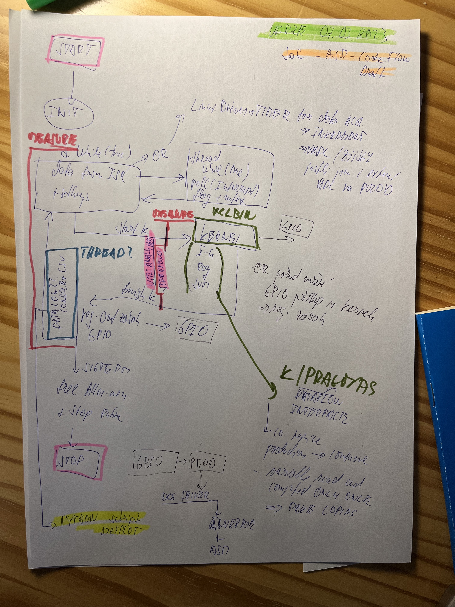

# Poznatky 07.03.2023

## TODO

- nový vivado design, kde bude timer s enabled interrupt, GPIO led + sw s enabled interrupt, PMOD B,C,D,E
  - použít na to patchnutý petalinux s RT
  - nezapomenout nastavit kernel a udělat to podle návodu z linkedin, build, upravit device tree = přidat interrupty timeru a gpio
  - zkusit jen package command a dát do zyba jestli funguje
  - poté vitis a vacc
  - po funkci zkusit nahrát kód s interruptem v PS
- linux rt patch [https://www.hackster.io/LogicTronix/real-time-optimization-in-petalinux-with-rt-patch-on-mpsoc-5f4832](https://www.hackster.io/LogicTronix/real-time-optimization-in-petalinux-with-rt-patch-on-mpsoc-5f4832)
- zkusit napsat basic linux driver, který bude uschovávat hodnotu v device [http://derekmolloy.ie/writing-a-linux-kernel-module-part-2-a-character-device/](http://derekmolloy.ie/writing-a-linux-kernel-module-part-2-a-character-device/)
- zkusit otevírat userspace v FPGA nebo reagovat na inputy v fpga
- vitis DATAFLOW pragma - v modelu porušuji single consumer a producer - udělat vždycky v I-b modelu po jedné RK4 hodnotě stepu split, pokud chápu, tak by mělo pomoci splitnout proměnnou na tolikrát, kolikrát je čtena a být čtena jen jednou [https://docs.xilinx.com/r/en-US/ug1399-vitis-hls/Limitations-of-Control-Driven-Task-Level-Parallelism](https://docs.xilinx.com/r/en-US/ug1399-vitis-hls/Limitations-of-Control-Driven-Task-Level-Parallelism)
- udělat to, že z pointeru na struct by se mělo ve funkci číst pouze jednou - udělat tedy zas kopie

## Na další dny

- pokud ještě nebude kria, tak nejdříve zálohovat na branch `soc-code` stávající kód, i do denních poznámek na I-n model PS+PL a zkusit přepsat kód na použití pouze arrays a popř. HLS stream a také použít různé konektory `gmem`

## Neprofesionální návrh architektury, která by mohla být výstupem této nebo další práce navazující na DP

- nejsou zakresleny akvizice dat, protože nemám senzory, čidla a motor

