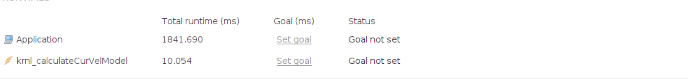

# Poznatky 07.03.2023

## TODO

- nový vivado design, kde bude timer s enabled interrupt, GPIO led + sw s enabled interrupt, PMOD B,C,D,E = **zkouším nejdřív patch na HW jen timeru co byl vytvořen dříve**
  - použít na to patchnutý petalinux s RT **zkouším, hledám správnou verzi linuxu a patche aby to sedělo a nedávalo chybu**, zkusit ještě postup patche na [github](https://github.com/fred-framework/meta-retis), ale moc to nevidím
  - nezapomenout nastavit kernel a udělat to podle návodu z linkedin, build, upravit device tree = přidat interrupty timeru a gpio
  - zkusit jen package command a dát do zyba jestli funguje
  - poté vitis a vadd
  - po funkci zkusit nahrát kód s interruptem v PS
- linux rt patch [https://www.hackster.io/LogicTronix/real-time-optimization-in-petalinux-with-rt-patch-on-mpsoc-5f4832](https://www.hackster.io/LogicTronix/real-time-optimization-in-petalinux-with-rt-patch-on-mpsoc-5f4832)
- zkusit napsat basic linux driver, který bude uschovávat hodnotu v device [http://derekmolloy.ie/writing-a-linux-kernel-module-part-2-a-character-device/](http://derekmolloy.ie/writing-a-linux-kernel-module-part-2-a-character-device/)
- zkusit otevírat userspace v FPGA nebo reagovat na inputy v fpga = **ZATÍM SE NEPOVEDLO, MUSELA BY SE PŘEDAT ADRESA A VELIKOST FD A VOID PTR, TO JE TŘEBA VYZKOUŠET, JAKÁ JE**, našla se velikost ale neexistují funkce `#include <poll.h>` třeba... nejde ty funkce tam vložit, ani je nepůjde includnout v IDE a v nadřazené části není možnost a do CPU je to blbost, ale zkusil jsem to, bez úspěchu
- vitis DATAFLOW pragma - v modelu porušuji single consumer a producer - udělat vždycky v I-n modelu po jedné RK4 hodnotě stepu split, pokud chápu, tak by mělo pomoci splitnout proměnnou na tolikrát, kolikrát je čtena a být čtena jen jednou [https://docs.xilinx.com/r/en-US/ug1399-vitis-hls/Limitations-of-Control-Driven-Task-Level-Parallelism](https://docs.xilinx.com/r/en-US/ug1399-vitis-hls/Limitations-of-Control-Driven-Task-Level-Parallelism)
- udělat to, že z pointeru na struct by se mělo ve funkci číst pouze jednou - udělat tedy zas kopie

## Dobrá zpráva (trochu)

- rozčleněním kódu pro kernel tak, jak je ukázáno v [in-hls-refactoring](./code/20220307/in-hls-refactoring/) se mi povledlo oproti použití vyšší abstrakce pomocí class atd. snížit čas oproti [20230225](./20230225.md) cca 9x z `89,1 ms` na `10,05 ms` pro 10 k hodnot `clark + psi2alpha psi2beta`
- když jsem zrušil duplicitní hodnoty, zhoršil se čas na výpočet 100 k hodnot o přibližně `0,003 ms`, ukázka kódu kernelu je v [in-hls-refactoring](./code/20220307/in-hls-refactoring/krnl_main_refactored_without_duplicity_values.c%2B%2B)

### 100 k hodnot

## Na další dny

- pokud ještě nebude kria, tak nejdříve zálohovat na branch `soc-code` stávající kód, i do denních poznámek na I-n model PS+PL a zkusit přepsat kód na použití pouze arrays a popř. HLS stream a také použít různé konektory `gmem`

## Neprofesionální návrh architektury, která by mohla být výstupem této nebo další práce navazující na DP

- nejsou zakresleny akvizice dat, protože nemám senzory, čidla a motor

## Kód

### Práce na I-n modelu

### Záloha

- I-n model funkční [code](./code/20220307/)
