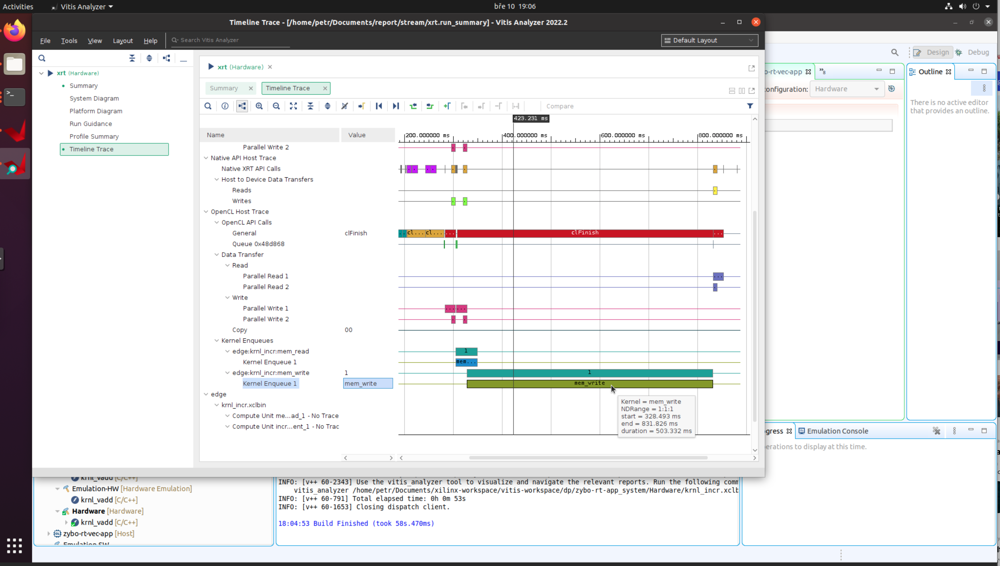

# Poznatky 10.03.2023

- pořád řeším jakým způsobem snížit kernel execution time a celé to zrychlit aniž by se zvýšil počet luts při změně interaces, protože se to do zybo už nevejde
- když se udělá stream kernelů jen s integerem, jde to docela rychle, pokud ovšem s float a <64,32> hodnotou, je to pomalé dle obrázku

- schraňoval jsem informace o kria, je tam trochu jiný postup nahrávání aplikací
- open source emulace různých desek [https://renode.io/](https://renode.io/)
- induction motoro model with hls [https://www.researchgate.net/publication/251930807_High_Level_Synthesis_of_Real_Time_embedded_emulating_system_for_Motor_controller](https://www.researchgate.net/publication/251930807_High_Level_Synthesis_of_Real_Time_embedded_emulating_system_for_Motor_controller)
- [High Level Synthesis Design Methodologies for Rapid Prototyping Digital Control Systems](https://www.sciencedirect.com/science/article/pii/S1474667015350953)

## Odkazy na fóra, kde řeší taky rychlosti kernelů a přenosů dat

- [https://support.xilinx.com/s/question/0D52E00006hpNPLSA2/vitis-alveo-how-to-force-burst-transfer-of-kernel-output-vector?language=en_US](https://support.xilinx.com/s/question/0D52E00006hpNPLSA2/vitis-alveo-how-to-force-burst-transfer-of-kernel-output-vector?language=en_US)
- [https://support.xilinx.com/s/question/0D52E00006hpNTmSAM/alveo-u250-vitis-hls-simulationhw-latency-15-us-hardware-measurement-200-us?language=en_US](https://support.xilinx.com/s/question/0D52E00006hpNTmSAM/alveo-u250-vitis-hls-simulationhw-latency-15-us-hardware-measurement-200-us?language=en_US)
- [https://support.xilinx.com/s/question/0D52E00006hpNTmSAM/alveo-u250-vitis-hls-simulationhw-latency-15-us-hardware-measurement-200-us?language=en_US](https://support.xilinx.com/s/question/0D52E00006hpNTmSAM/alveo-u250-vitis-hls-simulationhw-latency-15-us-hardware-measurement-200-us?language=en_US)
- [https://support.xilinx.com/s/question/0D52E00006vy1fHSAQ/how-to-stream-data-between-host-and-kernel?language=en_US](https://support.xilinx.com/s/question/0D52E00006vy1fHSAQ/how-to-stream-data-between-host-and-kernel?language=en_US)

## Overlap host and kernel nějak nefungovalo

[https://xilinx.github.io/Vitis_Accel_Examples/2020.2/html/overlap.html](https://xilinx.github.io/Vitis_Accel_Examples/2020.2/html/overlap.html)
