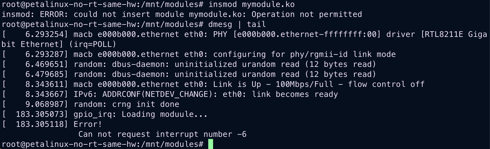

# Poznatky 16.03.2023

- mám připravený build linuxu bez interruptu na GPIO
- připravený build mymodule_edited z YT návodu
- připravený build kernel modulu ohledně zápisu do device

- zjistit, zda aby šel interrupt pověsit dle YT je třeba aby byl na GPIO pověšený interrupt v HDF a nebo ne
- zjistit zápis do /dev, zda to funguje
- vyřešit, jakou variantu akvizice dat dělat a podle toho se přizpůsobit - zeptat se vedoucího na jeho názor

  - multi threading, second thread just while loop and mutexes
  - multi threading with future, wait for data acquisition - blocking of main program
  - kernel loadable module - it is more hardcore, but has higher priority than user program

- momentálně zkouším v device tree bez GPIO interruptů a v HDF bez interruptu do GPIO s [mymodule_edited.c](./code/20230314/mymodule_edited.c), které by se mělo pověsit na interrupt, asi to nepůjde, taky vyzkoušet modul z tutoriálu na vytvoření device = **TAK TO NEJDE SE POVĚSIT, POVĚŠOVALO BY SE TO NA INTERRUPT S ID (-6)**, zkusím ještě dát interrupt do device tree a ne do BD

  - ukázka hlášky
    

- když se spustí tutorial kernel module a zapíše se pomocí `echo test > /dev/deviceName`, dojde k chybě v linuxu... proto chci vyzkoušet psát z userspace programu, protože jinak kernel modul vypadá, že funguje, prootože dostal i major number atd.

- zkusil jsem vykompilovat pomocí GCC test z internetu ale samozřejmě to nejde, protože to není cross kompilace, takže musím udělat --sdk a zkusit basic testovací program na `petalinux-no-rt-same-hw` s modulem `tutorial` pro zápis do device, abych mohl řešit algoritmus akvizice dat

  - asi je chyba v tutoriálu, že místo `spritf` má být použito `copy_from_user(message,buffer,len);`

  - protože je v plánu, že v kernelu bude spouštěn PL timer (nebo SW kernel timer) a po vyhození interruptu dojde k sejmutí hodnot z „čidla“ a vložení hodnoty do `/dev/deviceName`, ze které si to bude brát userspace aplikace

- pokud to nepůjde, v BD ve vivado přidat z GPIO do interruptu vstup a vybuildit linux a zkusit zase my module

## Jak interrupty PMOD při použití zybo-no-rt-same-hw-app

1. zapnout zybo
2. připojit k JB na port plus na zem druhý pól
3. zjistit ve vivado adresy a přečíst si GPIO manuál ohledně registrů [xilinx](https://docs.xilinx.com/v/u/en-US/pg144-axi-gpio)
4. pokud mám už získané adresy podle `zybo-no-rt-same-hw-app` první verze bude postup
   1. `devmem 0x41220128 w 0x3` povolení interruptu obou kanálů GPIO
   2. `devmem 0x4122011c w 0x80000000` GIE
   3. zmáčknout tlačítko na breadbordu - spojit pól s GND
   4. `devmem 0x41220120 w 0x1` , protože je reakce zatím na lvl, někdy je problém a je třeba vícekrát kontrolovat registry
   5. `devmem 0x41220120` zkontrolovat, že je zde `0x00000000`, pokud ne, opakovat `devmem 0x41220120 w 0x1`
   6. `echo 0x1>/dev/uio0` pokud je používán generic interrupt [info zde](https://kernel.googlesource.com/pub/scm/linux/kernel/git/bp/bp/+/refs/tags/edac_for_4.20/Documentation/driver-api/uio-howto.rst), keyword = `Writing userspace driver using uio_pci_generic`
   7. opakovat od 3. (sepnutí tlačítka)

- doporučení - sledovat na jiném terminálu `watch -n 0.1 "cat /proc/interrupts"` a pokud je člověk líný psát, tak také stav registru Interrupt status register for GPIO `watch -n 0.1 "devmem 0x41220120"`

## Otázka akvizice dat

- otázka zní, zda v PL pustit timer a na základně interruptu od něj v uio tak ve vedlejším threadu sbírat data ze vstupu
- nebo v kernelu pustit SW timer a na jeho základě akvizicovat data do /dev/devName a z toho to pak číst z aplikace
- nevím, jak v kernelu reagovat na PL interrupt od timeru, protože to je v UIO

- [mymodule_edited.c](./code/20230314/mymodule_edited.c) asi nepůjde, protože by se musel implementovat driver něco jako GPIO generic, nejde to takto napsat easy, jako v raspberyy pi, ale něco jako [mymodule.c](./code/20230314/mymodule.c)

- asi nejvíc easy bude získávat data ve vedlejším threadu a mutexovat když se budou do proměnné ty data dávat, linux kernel driver by byl asi na to moc složitý, jako reagovat na interrupty timeru, musel by se číst třeba registr a nebo prostě udělat něco jako [mymodule.c](./code/20230314/mymodule.c), v device tree by byl v compatible nastavený stejný compatible a v handleru ukládání dat do /dev/devName jako v tutoriálu

- takže zkusím udělat jen tak „pro zábavu toto“

  - do device tree dát k timeru compatible mymodule2 které bude jen basic example, zda se interrupt chytí a když nastartuji atd tak zda se provede interrupt handler

  ### Příprava commandů na timer pro tento test

  - adresa timeru `0x42800000`

  ```bash

  devmem 0x42800000 w 0x1C0

  echo 0x1 > /dev/uio2 # toto asi u mého driveru na interrupty nebude, to by bylo při generic uio # uio2 je to podle zjištění při prohlížení cat /sys/class/uio/uio2/name

  devmem 0x42800004 w 0xAFFFFFFF

  devmem 0x42800000 w 0xE0

  devmem 0x42800008 w 0x0

  devmem 0x42800000 w 0xC0
  ```

  - neboli sekvence

  ```bash
  devmem 0x42800000 w 0x1C0&&echo 0x1 > /dev/uio2&&devmem 0x42800004 w 0xAFFFFFFF&&devmem 0x42800000 w 0xE0&&devmem 0x42800008 w 0x0&&devmem 0x42800000 w 0xC0
  ```

- snaha o reformátování [Generic UIO Driveru od Magnuse Damma](https://github.com/Xilinx/linux-xlnx/blob/master/drivers/uio/uio_pdrv_genirq.c)
- **odkaz na reformátování** [uio_pdrv_genirq_EDITED_COMPATIBLE.c](./code/20230316/uio_pdrv_genirq_EDITED_COMPATIBLE.c)

- budu to řešit asi klaickým UIO driverem v userspacu a dalším threadem, linux driver samostatný je momentálně moc hardcore
- poslední vyzkoušet tento návod na UIO driver [https://yairgadelov.me/linux-uio-driver-to-handle-with-irq-source./](https://yairgadelov.me/linux-uio-driver-to-handle-with-irq-source./)
- ještě informace ohledně zpoždění
  - [https://elinux.org/images/b/b0/Uio080417celfelc08.pdf](https://elinux.org/images/b/b0/Uio080417celfelc08.pdf)
  - [https://www.osadl.org/fileadmin/dam/rtlws/12/Koch.pdf](https://www.osadl.org/fileadmin/dam/rtlws/12/Koch.pdf)

## Chyba v tutoriálu na kernel driver device

```c
 /* @file   ebbchar.c
 * @author Derek Molloy
 * @date   7 April 2015
 * @version 0.1
 * @brief   An introductory character driver to support the second article of my series on
 * Linux loadable kernel module (LKM) development. This module maps to /dev/ebbchar and
 * comes with a helper C program that can be run in Linux user space to communicate with
 * this the LKM.
 * @see http://www.derekmolloy.ie/ for a full description and follow-up descriptions.
 * @see  http://derekmolloy.ie/writing-a-linux-kernel-module-part-2-a-character-device/ for tutorial
 */

#include <linux/init.h>           // Macros used to mark up functions e.g. __init __exit
#include <linux/module.h>         // Core header for loading LKMs into the kernel
#include <linux/device.h>         // Header to support the kernel Driver Model
#include <linux/kernel.h>         // Contains types, macros, functions for the kernel
#include <linux/fs.h>             // Header for the Linux file system support
#include <linux/uaccess.h>          // Required for the copy to user function
#define  DEVICE_NAME "ebbchar"    ///< The device will appear at /dev/ebbchar using this value
#define  CLASS_NAME  "ebb"        ///< The device class -- this is a character device driver

MODULE_LICENSE("GPL");            ///< The license type -- this affects available functionality
MODULE_AUTHOR("Derek Molloy");    ///< The author -- visible when you use modinfo
MODULE_DESCRIPTION("A simple Linux char driver for the BBB");  ///< The description -- see modinfo
MODULE_VERSION("0.1");            ///< A version number to inform users

static int    majorNumber;                  ///< Stores the device number -- determined automatically
static char   message[256] = {0};           ///< Memory for the string that is passed from userspace
static short  size_of_message;              ///< Used to remember the size of the string stored
static int    numberOpens = 0;              ///< Counts the number of times the device is opened
static struct class*  ebbcharClass  = NULL; ///< The device-driver class struct pointer
static struct device* ebbcharDevice = NULL; ///< The device-driver device struct pointer

// The prototype functions for the character driver -- must come before the struct definition
static int     dev_open(struct inode *, struct file *);
static int     dev_release(struct inode *, struct file *);
static ssize_t dev_read(struct file *, char *, size_t, loff_t *);
static ssize_t dev_write(struct file *, const char *, size_t, loff_t *);

/** @brief Devices are represented as file structure in the kernel. The file_operations structure from
 *  /linux/fs.h lists the callback functions that you wish to associated with your file operations
 *  using a C99 syntax structure. char devices usually implement open, read, write and release calls
 */
static struct file_operations fops =
{
   .open = dev_open,
   .read = dev_read,
   .write = dev_write,
   .release = dev_release,
};

/** @brief The LKM initialization function
 *  The static keyword restricts the visibility of the function to within this C file. The __init
 *  macro means that for a built-in driver (not a LKM) the function is only used at initialization
 *  time and that it can be discarded and its memory freed up after that point.
 *  @return returns 0 if successful
 */
static int __init ebbchar_init(void){
   printk(KERN_INFO "EBBChar: Initializing the EBBChar LKM\n");

   // Try to dynamically allocate a major number for the device -- more difficult but worth it
   majorNumber = register_chrdev(0, DEVICE_NAME, &fops);
   if (majorNumber<0){
      printk(KERN_ALERT "EBBChar failed to register a major number\n");
      return majorNumber;
   }
   printk(KERN_INFO "EBBChar: registered correctly with major number %d\n", majorNumber);

   // Register the device class
   ebbcharClass = class_create(THIS_MODULE, CLASS_NAME);
   if (IS_ERR(ebbcharClass)){                // Check for error and clean up if there is
      unregister_chrdev(majorNumber, DEVICE_NAME);
      printk(KERN_ALERT "Failed to register device class\n");
      return PTR_ERR(ebbcharClass);          // Correct way to return an error on a pointer
   }
   printk(KERN_INFO "EBBChar: device class registered correctly\n");

   // Register the device driver
   ebbcharDevice = device_create(ebbcharClass, NULL, MKDEV(majorNumber, 0), NULL, DEVICE_NAME);
   if (IS_ERR(ebbcharDevice)){               // Clean up if there is an error
      class_destroy(ebbcharClass);           // Repeated code but the alternative is goto statements
      unregister_chrdev(majorNumber, DEVICE_NAME);
      printk(KERN_ALERT "Failed to create the device\n");
      return PTR_ERR(ebbcharDevice);
   }
   printk(KERN_INFO "EBBChar: device class created correctly\n"); // Made it! device was initialized
   return 0;
}

/** @brief The LKM cleanup function
 *  Similar to the initialization function, it is static. The __exit macro notifies that if this
 *  code is used for a built-in driver (not a LKM) that this function is not required.
 */
static void __exit ebbchar_exit(void){
   device_destroy(ebbcharClass, MKDEV(majorNumber, 0));     // remove the device
   class_unregister(ebbcharClass);                          // unregister the device class
   class_destroy(ebbcharClass);                             // remove the device class
   unregister_chrdev(majorNumber, DEVICE_NAME);             // unregister the major number
   printk(KERN_INFO "EBBChar: Goodbye from the LKM!\n");
}

/** @brief The device open function that is called each time the device is opened
 *  This will only increment the numberOpens counter in this case.
 *  @param inodep A pointer to an inode object (defined in linux/fs.h)
 *  @param filep A pointer to a file object (defined in linux/fs.h)
 */
static int dev_open(struct inode *inodep, struct file *filep){
   numberOpens++;
   printk(KERN_INFO "EBBChar: Device has been opened %d time(s)\n", numberOpens);
   return 0;
}

/** @brief This function is called whenever device is being read from user space i.e. data is
 *  being sent from the device to the user. In this case is uses the copy_to_user() function to
 *  send the buffer string to the user and captures any errors.
 *  @param filep A pointer to a file object (defined in linux/fs.h)
 *  @param buffer The pointer to the buffer to which this function writes the data
 *  @param len The length of the b
 *  @param offset The offset if required
 */
static ssize_t dev_read(struct file *filep, char *buffer, size_t len, loff_t *offset){
   int error_count = 0;
   // copy_to_user has the format ( * to, *from, size) and returns 0 on success
   error_count = copy_to_user(buffer, message, size_of_message);

   if (error_count==0){            // if true then have success
      printk(KERN_INFO "EBBChar: Sent %d characters to the user\n", size_of_message);
      return (size_of_message=0);  // clear the position to the start and return 0
   }
   else {
      printk(KERN_INFO "EBBChar: Failed to send %d characters to the user\n", error_count);
      return -EFAULT;              // Failed -- return a bad address message (i.e. -14)
   }
}

/** @brief This function is called whenever the device is being written to from user space i.e.
 *  data is sent to the device from the user. The data is copied to the message[] array in this
 *  LKM using the sprintf() function along with the length of the string.
 *  @param filep A pointer to a file object
 *  @param buffer The buffer to that contains the string to write to the device
 *  @param len The length of the array of data that is being passed in the const char buffer
 *  @param offset The offset if required
 */
static ssize_t dev_write(struct file *filep, const char *buffer, size_t len, loff_t *offset){
    // will not work in kernel... there is info about it in the comments section in the tutorial
   // sprintf(message, "%s(%zu letters)", buffer, len);   // appending received string with its length ///< will not work, had to comment it out, used copy_from_user instead
   // arguments for: copy_from_user(void * to, const void __user * from, unsigned long n)
   copy_from_user(message,buffer,len);
   size_of_message = strlen(message);                 // store the length of the stored message
   printk(KERN_INFO "EBBChar: Received %zu characters from the user\n", len);
   return len;
}

/** @brief The device release function that is called whenever the device is closed/released by
 *  the userspace program
 *  @param inodep A pointer to an inode object (defined in linux/fs.h)
 *  @param filep A pointer to a file object (defined in linux/fs.h)
 */
static int dev_release(struct inode *inodep, struct file *filep){
   printk(KERN_INFO "EBBChar: Device successfully closed\n");
   return 0;
}

/** @brief A module must use the module_init() module_exit() macros from linux/init.h, which
 *  identify the initialization function at insertion time and the cleanup function (as
 *  listed above)
 */
module_init(ebbchar_init);
module_exit(ebbchar_exit);
```

## DO DPT.TEX

- popsat, že se lyší zybo a kria v BOOT managingu, že to není už monolitické a není to fixnuté tak, že když se dělíá aplikace, že se vygenereuje celý set těchto dat, ale že se vytvoří jako na platformu a BOOT.bin se dá do jedné části bootovací sekvence a zbytek do druhé, že je increment approach atd... popis zde: [https://xilinx.github.io/kria-apps-docs/creating_applications/2022.1/build/html/docs/bitstream_management.html](https://xilinx.github.io/kria-apps-docs/creating_applications/2022.1/build/html/docs/bitstream_management.html)
