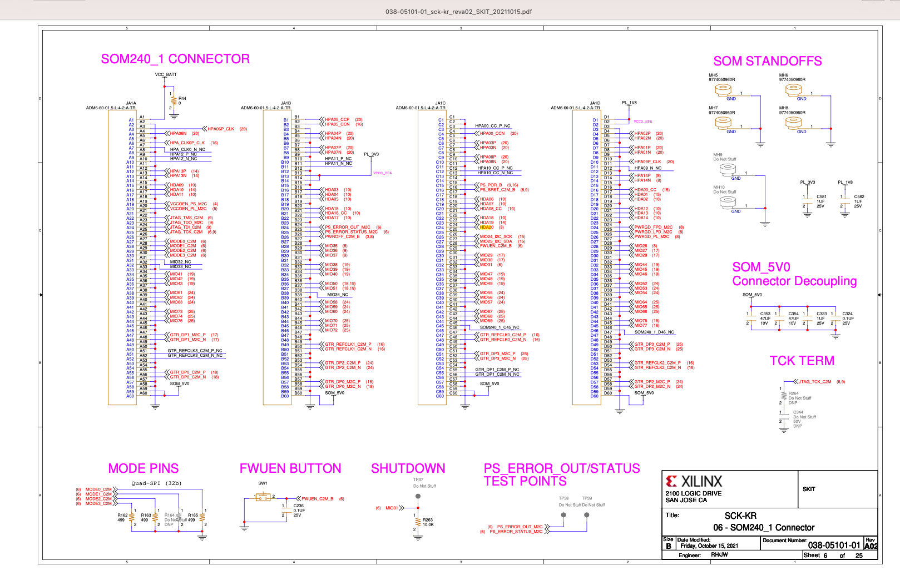
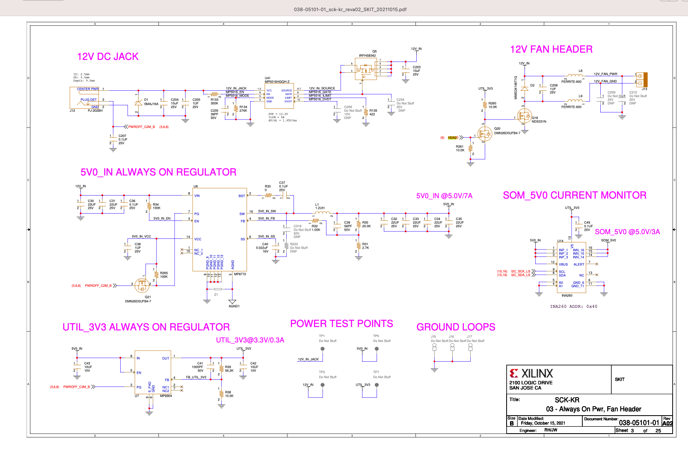

# Poznatky 18.03.2023

## Problém s PINem na FAN

- všude, v [Xilinx Wiki](https://xilinx-wiki.atlassian.net/wiki/spaces/A/pages/1641152513/Kria+K26+SOM#Fan-Control), v návodech [hackster](https://www.hackster.io/whitney-knitter/add-peripheral-support-to-kria-kr260-vivado-2022-1-project-874960), v BSP starter kitu [https://www.xilinx.com/support/download/index.html/content/xilinx/en/downloadNav/embedded-design-tools.html](https://www.xilinx.com/support/download/index.html/content/xilinx/en/downloadNav/embedded-design-tools.html) je řečeno, že je pinout na FAN A12 fyzický port, na PL HDA20
- ale v schematiku ` XTP743 - Kria KR260 Starter Kit Carrier Card Schematics (v1.0)`, download [here](https://www.xilinx.com/member/forms/download/design-license.html?cid=bad0ada6-9a32-427e-a793-c68fed567427&filename=xtp743-kr260-schematic.zip) - main url here -> [https://www.xilinx.com/products/som/kria/kr260-robotics-starter-kit.html#resources](https://www.xilinx.com/products/som/kria/kr260-robotics-starter-kit.html#resources) je FAN pinnutej skutečně na HDA20, ale to je přivedené na C24... ukázka níže
  
  

- video, kde o tom mluvím [YouTube](https://youtu.be/5SWHivKPtBw)

- asi jsem tento problém vyřešil, resp. ještě jsem nevybuildil linux ale přišel jsem proč jsou piny tak, jak jsou... napsal jsem o tom na fóru [Xilinx fórum](https://support.xilinx.com/s/question/0D54U00006alUwcSAE/kria-som-kr260-starter-kit-schematic-pdf-vs-constrains-xdc-pin-confusion-possible-explanation-on-fan-pinout?language=en_US)

### Ukázka constrains z BSP

```
# (C) Copyright 2020 - 2021 Xilinx, Inc.
# SPDX-License-Identifier: Apache-2.0

set_property BITSTREAM.GENERAL.COMPRESS TRUE [current_design]

#Fan Speed Enable
set_property PACKAGE_PIN A12 [get_ports {fan_en_b}]
set_property IOSTANDARD LVCMOS33 [get_ports {fan_en_b}]
set_property SLEW SLOW [get_ports {fan_en_b}]
set_property DRIVE 4 [get_ports {fan_en_b}]

```

## Problémy

- patchnul jsem novější petalinux starším patchem na kriu a asi to byla chyba, protože nemůžu udělat ani zákaldní build (patchnul jsem 2022.2 patchem na 2022.1) obnovuji 2022.2 a zkusím build, pokud nepůjde, stáhnu 2022.1 patchnu a build
- zkouším 2022.2, kde asi tím pádem už bude patch na SOMs zabudovaný, přešlo to přes tu první chybu...
- vznikla další chyba ohledně nedostupnosti git stahování linux-xlnx, ale po dalším commandu `petalinux-build` to přešlo, někdo to psal, že mu to stačilo (ten command na stažení s pomoxí gitu) opakovat a šlo to taky, což se prakticky stalo tí, že jsem dal znovu build
