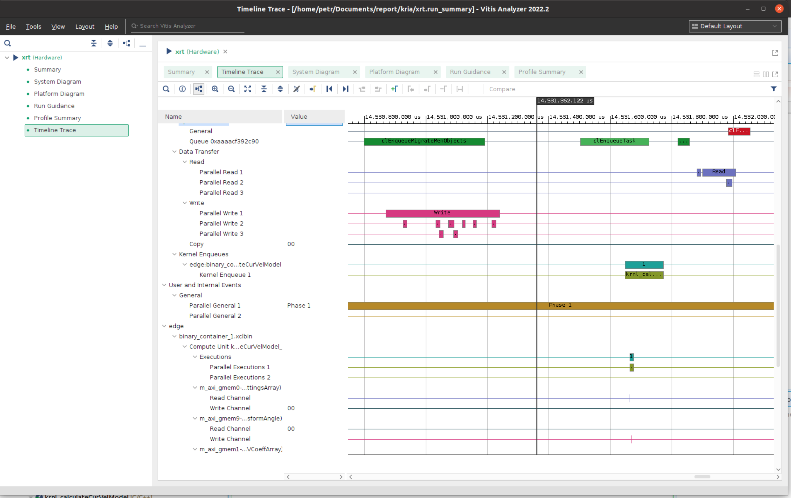

# Poznatky 21.03.2023

- připíšu zhodnocení ohledně zjištění, proč je kernel tak pomalý, v skutku to není kernel co je pomaléhoo ale ty věci okolo...
- udělat to, že všechny parametry budou v jedné array, úplně všechny parametry a všechny vstupy také zvlášť... asi
- takže na vstupu do kernelu budou (kdyby byl jen pro I-n model) dva vektory - (v arg budou 3, vysvětlím proč)

  - v jednom vstupním budou všechny parametry, kóděné za sebou, aby bylo jasné, jak přicházejí a mohli se dát např. do streamu a nebo do temp proměnných v kernelu
  - v druhém vstupním budou vstupní data
  - v jednom výstupním bude zakóděná velikost psi2amplitude a transformangle

- tudíž se minimalizuje přenos dat a snad zrychlí čas na enqueue a data write/read, který je bohužel pro kernel docela limitující dle obr. níže

- tudíž další na řadě jsou optimalizace, optimalizace a optimalizace, kernel sám běží „relativně rychle“, ale ten transfer je špatný
- zítra chci ještě vygenerovat kria-1.1 Vivado s jedním pmod GPIO na test
