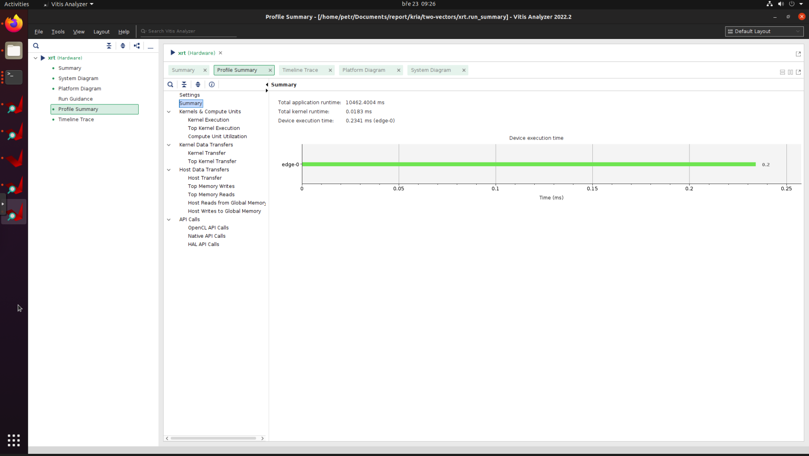

# Poznatky 23.03.2023

- takže když se podívám jen na rychlost kernelu a využití LUTs přio dvou způsobech řešení
- snaha a research jak použít SPI, nakonec jsem to zkusil dát do PL a uvidíme, zda to půjde v petalinuxu (muselo se to povolit v kernelu myslím jako SPI devices), další by to bylo možné pomocí PS jen a nebo pomocí gpio bit bangovat, ale to je pomalejší...

- odkaz na bit bang [bit bang](https://www.beyond-circuits.com/wordpress/tutorial/tutorial24/)
- odkaz na PS [ps](https://www.beyond-circuits.com/wordpress/tutorial/tutorial26/)

- hodně jsem to řešil, co je lepší a jak ADC bude fungovat a celá komunikace

- převáděl jsem do kernelu funkce, zatím jen klasicky copy and paste bez optimalizace, proto to potřebuje 70k LUTs (chci to zkusit snížit), další krok před snížením je dát do outputu to, co je třeba poté zas dát na vstup do vazby (iSum regulátorů, omezení regulátorů, psi2, time pro triangle atd atd, vše co se mění ale je třeba uložit mezi kernel runs)
- poté optimalizace kernelu
- poté buďto zkusit ADC nebo v PS a nebo v dalším kernelu udělat ASM... (příprava na HIL)

- nějaký ADC třeba [MCP3202T-CI/MS](https://cz.farnell.com/microchip/mcp3202t-ci-ms/adc-12bit-100ksps-40-to-85deg/dp/3102772?st=spi)

- vitis IDE už jen na tvorbu projektů a makefiles, kompilace už jen v tmux (app, \_kernels, \_hw_link)

## Přenos více vektorů - arrays, nesoucí hodnoty proměnných

- kernel je pomalejší asi o 1,9 mikrosekund při jednom běhu
- je využito 22,968 LUTs oproti 10,658 LUTs při málo vektorech

## Přenos dvou vektorů

## Uložená data analýzy

- jsou ve složce [analysis-data](./images/20230323/analysis-data/)
