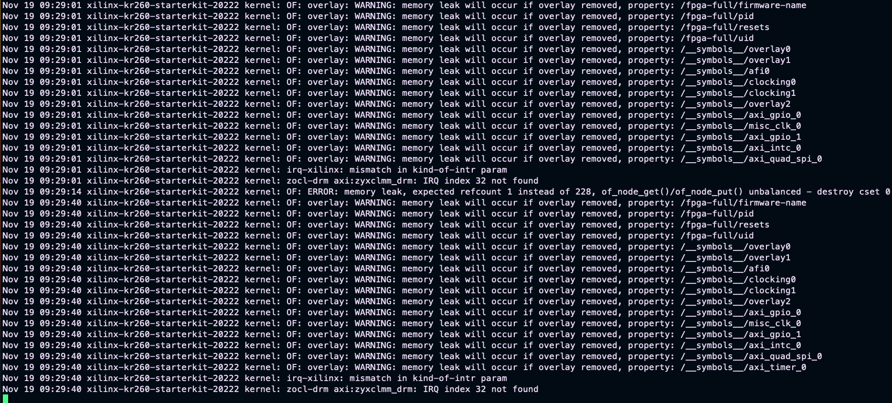

# Poznatky 31.03.2023

- zkusit z pl-custom.dtsi, které se pak předělává na dtbo a vkládá do aplikace odstranit nějaký node a zda to nenaloaduje ten node, abych zjistil, zda to na to reaguje...
- v system-user to nefunguje pomocí &axi_timer_0 ale v pl-custom v petalinux to zkompiluje, ale já tam vkládám vlastně až to vygenerované pomocí xst a při tom se až loadí to, co chci používat, jinak je tam v základu jen to základní pro linux

- když se odstraní timer v pl.dtsi tak skutečně není naloadován
  

- pokud je všechno přivedeno do interrupt controller, není to dobré, hází to chybu v případě připojneí hw interruptu
- předělat hw design ve vivado
- mám uložené dokazy na pl.dtbo atd. aůe žádný neposkytuje dobrý výsledek
