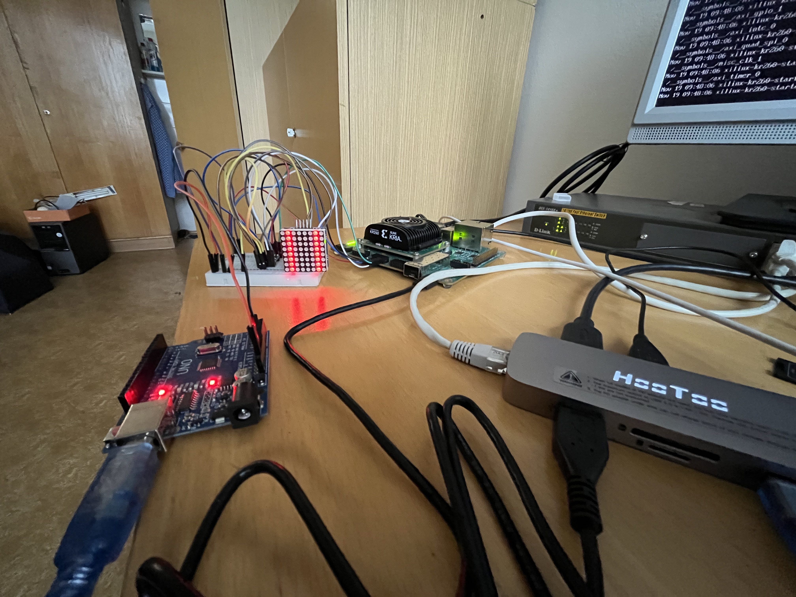

# Poznatky 14.04.2023



- povedlo se SPI přerušení
- konfigurace pro `pl.dtsi` pro timer zůstává stejná - jen přidat "generic-uio", pro AXI QUAD SPI se mění
  - je třeba smazat zaspané drivery `"xlnx,axi-quad-spi-3.2", "xlnx,xps-spi-2.00.a"` a místo nich napsat jen `"generic-uio"`

```txt
compatible = "generic-uio";
```

tudíž

```txt
/*
 * CAUTION: This file is automatically generated by Xilinx.
 * Version: XSCT 2022.2
 * Today is: Thu Apr 13 20:52:51 2023
 */


/dts-v1/;
/plugin/;
/ {
	fragment@0 {
		target = <&fpga_full>;
		overlay0: __overlay__ {
			#address-cells = <2>;
			#size-cells = <2>;
			firmware-name = "kria_bd_wrapper.bit.bin";
			pid = <0x0>;
			resets = <&zynqmp_reset 116>, <&zynqmp_reset 117>, <&zynqmp_reset 118>, <&zynqmp_reset 119>;
			uid = <0x0>;
		};
	};
	fragment@1 {
		target = <&amba>;
		overlay1: __overlay__ {
			afi0: afi0 {
				compatible = "xlnx,afi-fpga";
				config-afi = < 0 0>, <1 0>, <2 0>, <3 0>, <4 0>, <5 0>, <6 0>, <7 0>, <8 0>, <9 0>, <10 0>, <11 0>, <12 0>, <13 0>, <14 0xa00>, <15 0x000>;
			};
			clocking0: clocking0 {
				#clock-cells = <0>;
				assigned-clock-rates = <99999001>;
				assigned-clocks = <&zynqmp_clk 71>;
				clock-output-names = "fabric_clk";
				clocks = <&zynqmp_clk 71>;
				compatible = "xlnx,fclk";
			};
			clocking1: clocking1 {
				#clock-cells = <0>;
				assigned-clock-rates = <99999001>;
				assigned-clocks = <&zynqmp_clk 72>;
				clock-output-names = "fabric_clk";
				clocks = <&zynqmp_clk 72>;
				compatible = "xlnx,fclk";
			};
		};
	};
	fragment@2 {
		target = <&amba>;
		overlay2: __overlay__ {
			#address-cells = <2>;
			#size-cells = <2>;
			axi_gpio_0: gpio@80010000 {
				#gpio-cells = <2>;
				clock-names = "s_axi_aclk";
				clocks = <&misc_clk_0>;
				compatible = "xlnx,axi-gpio-2.0", "xlnx,xps-gpio-1.00.a";
				gpio-controller ;
				reg = <0x0 0x80010000 0x0 0x10000>;
				xlnx,all-inputs = <0x0>;
				xlnx,all-inputs-2 = <0x0>;
				xlnx,all-outputs = <0x0>;
				xlnx,all-outputs-2 = <0x0>;
				xlnx,dout-default = <0x00000000>;
				xlnx,dout-default-2 = <0x00000000>;
				xlnx,gpio-width = <0x8>;
				xlnx,gpio2-width = <0x20>;
				xlnx,interrupt-present = <0x0>;
				xlnx,is-dual = <0x0>;
				xlnx,tri-default = <0xFFFFFFFF>;
				xlnx,tri-default-2 = <0xFFFFFFFF>;
			};
			misc_clk_0: misc_clk_0 {
				#clock-cells = <0>;
				clock-frequency = <199998000>;
				compatible = "fixed-clock";
			};
			axi_gpio_1: gpio@80030000 {
				#gpio-cells = <2>;
				clock-names = "s_axi_aclk";
				clocks = <&misc_clk_0>;
				compatible = "xlnx,axi-gpio-2.0", "xlnx,xps-gpio-1.00.a";
				gpio-controller ;
				reg = <0x0 0x80030000 0x0 0x10000>;
				xlnx,all-inputs = <0x0>;
				xlnx,all-inputs-2 = <0x0>;
				xlnx,all-outputs = <0x0>;
				xlnx,all-outputs-2 = <0x0>;
				xlnx,dout-default = <0x00000000>;
				xlnx,dout-default-2 = <0x00000000>;
				xlnx,gpio-width = <0x8>;
				xlnx,gpio2-width = <0x20>;
				xlnx,interrupt-present = <0x0>;
				xlnx,is-dual = <0x0>;
				xlnx,tri-default = <0xFFFFFFFF>;
				xlnx,tri-default-2 = <0xFFFFFFFF>;
			};
			axi_intc_0: interrupt-controller@80000000 {
				#interrupt-cells = <2>;
				clock-names = "s_axi_aclk";
				clocks = <&misc_clk_0>;
				compatible = "xlnx,axi-intc-4.1", "xlnx,xps-intc-1.00.a";
				interrupt-controller ;
				interrupt-names = "irq";
				interrupt-parent = <&gic>;
				interrupts = <0 89 4>;
				reg = <0x0 0x80000000 0x0 0x10000>;
				xlnx,kind-of-intr = <0x1>;
				xlnx,num-intr-inputs = <0x20>;
			};
			axi_quad_spi_0: axi_quad_spi@80040000 {
				bits-per-word = <32>;
				clock-names = "ext_spi_clk", "s_axi_aclk";
				clocks = <&misc_clk_1>, <&misc_clk_0>;
				compatible = "generic-uio";
				fifo-size = <16>;
				interrupt-names = "ip2intc_irpt";
				interrupt-parent = <&gic>;
				interrupts = <0 91 1>;
				num-cs = <0x4>;
				reg = <0x0 0x80040000 0x0 0x10000>;
				xlnx,num-ss-bits = <0x4>;
				xlnx,spi-mode = <0>;
			};
			misc_clk_1: misc_clk_1 {
				#clock-cells = <0>;
				clock-frequency = <19999800>;
				compatible = "fixed-clock";
			};
			axi_timer_0: timer@80020000 {
				clock-frequency = <199998000>;
				clock-names = "s_axi_aclk";
				clocks = <&misc_clk_0>;
				compatible = "xlnx,axi-timer-2.0", "xlnx,xps-timer-1.00.a", "generic-uio";
				interrupt-names = "interrupt";
				interrupt-parent = <&gic>;
				interrupts = <0 90 4>;
				reg = <0x0 0x80020000 0x0 0x10000>;
				xlnx,count-width = <0x20>;
				xlnx,gen0-assert = <0x1>;
				xlnx,gen1-assert = <0x1>;
				xlnx,one-timer-only = <0x0>;
				xlnx,trig0-assert = <0x1>;
				xlnx,trig1-assert = <0x1>;
			};
			zyxclmm_drm {
				compatible = "xlnx,zocl";
				interrupts-extended = <&axi_intc_0 0 4>, <&axi_intc_0 1 4>, <&axi_intc_0 2 4>, <&axi_intc_0 3 4>, <&axi_intc_0 4 4>, <&axi_intc_0 5 4>, <&axi_intc_0 6 4>, <&axi_intc_0 7 4>, <&axi_intc_0 8 4>, <&axi_intc_0 9 4>,
<&axi_intc_0 10 4>, <&axi_intc_0 11 4>, <&axi_intc_0 12 4>, <&axi_intc_0 13 4>, <&axi_intc_0 14 4>,
<&axi_intc_0 15 4>, <&axi_intc_0 16 4>, <&axi_intc_0 17 4>, <&axi_intc_0 18 4>, <&axi_intc_0 19 4>,
<&axi_intc_0 20 4>, <&axi_intc_0 21 4>, <&axi_intc_0 22 4>, <&axi_intc_0 23 4>, <&axi_intc_0 24 4>,
<&axi_intc_0 25 4>, <&axi_intc_0 26 4>, <&axi_intc_0 27 4>, <&axi_intc_0 28 4>, <&axi_intc_0 29 4>,
<&axi_intc_0 30 4>, <&axi_intc_0 31 4 >;
			};
		};
	};
};

```

## System user takto

```txt
/include/ "system-conf.dtsi"
/ {
        chosen {
        bootargs = "earlycon clk_ignore_unused   uio_pdrv_genirq.of_id=generic-uio";
        stdout-path = "serial0:115200n8";
        };

    timer@0080020000 {
        compatible = "axi_timer_0, generic-uio, ui_pdrv";
        status = "okay";
        };

    axi_quad_spi@80040000 {
    compatible = "axi_quad_spi_0, generic-uio, ui_pdrv";
    status = "okay";
    };
};

```

v kódu bylo potřeba upravit zapínání interruptu a povolení v registrech

## Ukázka s timerem na threadu

- a čekání na SPI přerušení

```c++


#define OCL_CHECK(error, call)                                                                   \
    call;                                                                                        \
    if (error != CL_SUCCESS)                                                                     \
    {                                                                                            \
        printf("%s:%d Error calling " #call ", error code is: %d\n", __FILE__, __LINE__, error); \
        exit(EXIT_FAILURE);                                                                      \
    }

#include "vadd.h"
#include <fstream>
#include <iostream>
#include <stdlib.h>
#include <unistd.h>

#include <sys/mman.h>
#include <fcntl.h>
#include <poll.h>
#include <stdio.h>
#include <chrono>

#include <thread>
#include <mutex>
#include <future>

#define MAP_SIZE 0x10000
#define SPI_SPICR 0x60
#define SPI_SPISR 0x64
#define SPI_DTR 0x68
#define SPI_DRR 0x6C
#define SPI_SPISSR 0x70
#define SPI_TRANSMIT_FIFO_OCUPANCY 0x74
#define SPI_RECEIVE_FIFO_OCUPANCY 0x78
#define SPI_DGIER 0x1C
#define SPI_IPISR 0x20
#define SPI_IPIER 0x28

int threadLoopOutput = 0;
bool isDataFromBackgroundThreadReady = false; // zde je použito proto aby se zajistilo, že nejsou použity v main while smyšce programu na pozadí dvě stejné hodnoty - když nedošlo vlastně ještě k zápisu, jinak kdyby se mohli použít, tak se nebude vůbec tato proměnná v if statements používat
std::mutex gLock;

void threadLoop()
{
    void *timer1ptr;    // pointer to a virtual memory filled by mmap
    int timer1fd;       // file descriptor of uio to reset interrupt in /proc/interrupts
    char *uiod;         // name of the uio to reset interrupts
    uiod = "/dev/uio5"; // check when making changes in a platform
    int irq_on = 1;     // for writing 0x1 to /dev/uioX
    uint32_t info = 1;  // in read function of a interrupt checking

    timer1fd = open(uiod, O_RDWR | O_NONBLOCK); // opening uioX device

    // if error
    if (timer1fd < 1)
    {
        perror("open\n");
        printf("Invalid UIO device file:%s.\n", uiod);
    }

    // for polling the interrupt struct
    struct pollfd fds = {
        .fd = timer1fd,
        .events = POLLIN | POLLOUT,
    };

    // mmap the timer in virtual memory
    timer1ptr = mmap(NULL, MAP_SIZE, PROT_READ | PROT_WRITE, MAP_SHARED, timer1fd, 0);

    // initial values for timer
    *((unsigned *)(timer1ptr)) = 0X1C0;
    write(timer1fd, &irq_on, sizeof(irq_on));
    *((unsigned *)(timer1ptr + 0x4)) = 0xE8287BFF;
    *((unsigned *)(timer1ptr)) = 0XE0;

    // one tick is 0.8 ns, have to wait till data is moved to counter register
    // otherwise it wont start, solve maybe later or ask about it
    std::this_thread::sleep_for(std::chrono::nanoseconds(1));

    *((unsigned *)(timer1ptr + 0x8)) = 0X0;
    *((unsigned *)(timer1ptr)) = 0XC0;

    while (true)
    {
        // std::cout << "Outer loop\n";
        while (true) // polling while
        {
            // std::cout << "Inner loop\n";
            int ret = poll(&fds, 1, -1); // poll on a return value

            // there was change in ret
            if (ret >= 1)
            {
                ssize_t nb = read(timer1fd, &info, sizeof(info));
                if (nb == (ssize_t)sizeof(info))
                {
                    /* Do something in response to the interrupt. */
                    printf("Interrupt #%u!\n", info);
                    // if timer has finished (interrupt has risen)
                    // copy data / insert data to shared variable
                    if (isDataFromBackgroundThreadReady == false)
                    {
                        gLock.lock();                            // mutex locking - any other thread can't access this variable (think it cannot write or read)
                        threadLoopOutput = threadLoopOutput + 1; // edit the shared variable
                        gLock.unlock();                          // mutex unlock
                        isDataFromBackgroundThreadReady = true;  // flag to main while loop that new data is present
                    }
                    break;
                }
            }
        }

        // resolving and starting timer again
        *((unsigned *)(timer1ptr)) = 0X1C0;
        write(timer1fd, &irq_on, sizeof(irq_on));
        *((unsigned *)(timer1ptr + 0x4)) = 0xE8287BFF;
        *((unsigned *)(timer1ptr)) = 0XE0;

        // one tick is 0.8 ns, have to wait till data is moved to counter register
        // otherwise it wont start, solve maybe later or ask about it
        std::this_thread::sleep_for(std::chrono::nanoseconds(1));

        *((unsigned *)(timer1ptr + 0x8)) = 0X0;
        *((unsigned *)(timer1ptr)) = 0XC0; // start
    }

    munmap(timer1ptr, MAP_SIZE);
    close(timer1fd);
}

/*
 * @name     acknowledgeSPIInterrupt
 * @brief    Basic function to acknowledge an interrupt.
 * @todo     Make API from SPI and Interrupt solving. Solve how it works in Linux.
 */

void acknowledgeSPIInterrupt(int fd, void *ptr)
{
    struct pollfd fds = {
        .fd = fd,
        .events = POLLIN | POLLOUT,
    };

    int irq_on = 1;    // for writing 0x1 to /dev/uioX
    uint32_t info = 1; // in read function of a interrupt checking
    off_t interruptStatus;

    while (true)
    {
        int ret = poll(&fds, 1, -1); // poll on a return value

        // there was change in ret
        if (ret >= 1)
        {
            /* Do something in response to the interrupt. */
            printf("AXI Quad SPI Interrupt!\n");
            interruptStatus = *((unsigned *)(ptr + SPI_IPISR));
            // printf("1st From acknowledge IPISR: 0x%lx\n", interruptStatus);
            std::this_thread::sleep_for(std::chrono::nanoseconds(1)); // could not resolve other way now, because reading and writing to register takes more time that one tick probably
            *((unsigned *)(ptr + SPI_IPISR)) = interruptStatus;       // reseting SPI interrupt status register
            write(fd, &irq_on, sizeof(irq_on));
            break;
        }
    }
}

/*
 * @name     SPI communication functions.
 * @brief
 * @todo     Resolve when using multiple slaves to automate slave changing. Eg. when using one slave on 1. SS, just changing 0x01 to 0x00, when using slave only on 2. SS change 0x2 to 0x0, but when using slaves on 1. and 2. SS and activating slave only on SS 1. it should probably be 0x3 (both at 1) to 0x2 (first at 0) to 0x3 (both at 1).
 */

/*
 * @name     sendSPIdata
 * @brief    Send SPI data to desired slave via mapped device.
 * @todo     Implement interrupt and delete sleep_for...
 */
void sendSPIdata(void *ptr, int fd, off_t slaveSelect, off_t data)
{
    *((unsigned *)(ptr + SPI_SPICR)) = 0x1E6;
    *((unsigned *)(ptr + SPI_SPISSR)) = slaveSelect; // 0x01 - slave select 1 to high, when slave no. 2 - it would be 0x02
    *((unsigned *)(ptr + SPI_DTR)) = data;
    *((unsigned *)(ptr + SPI_SPISSR)) = 0x0;
    *((unsigned *)(ptr + SPI_SPICR)) = 0x86;
    // std::this_thread::sleep_for(std::chrono::nanoseconds(1)); // here should be waiting for an interrrupt
    acknowledgeSPIInterrupt(fd, ptr); // acknowledging interrupt
    *((unsigned *)(ptr + SPI_SPISSR)) = slaveSelect;
}

/*
 * @name     initializeSPI
 * @brief    Initialize SPI communication in PL for desired slave and mapped device.
 * @todo     Implement interrupt and delete sleep_for...
 */
void initializeSPI(void *ptr, off_t slaveSelect)
{
    *((unsigned *)(ptr + SPI_SPICR)) = 0x1E6;

    *((unsigned *)(ptr + SPI_DTR)) = 0x06;

    *((unsigned *)(ptr + SPI_SPISSR)) = 0x00;

    *((unsigned *)(ptr + SPI_SPISSR)) = slaveSelect;

    *((unsigned *)(ptr + SPI_SPICR)) = 0x1E6;

    // Interrupt settings

    // Global Interrupt Enable
    *((unsigned *)(ptr + SPI_DGIER)) = 0x80000000;

    // Interrupt enables
    *((unsigned *)(ptr + SPI_IPIER)) = 0x3FFF;
}

/*
 * @name     initializeLEDmatrix
 * @brief    Initialize LED matrix with MAX7219.
 * @todo     Implement interrupt and delete sleep_for...
 */
void initializeLEDmatrix(void *ptr, int fd, off_t slaveSelect)
{
    off_t initilSeq[5] = {0x0900, 0x0a01, 0x0b07, 0x0c01, 0x0f00};

    for (int i = 0; i < 5; i++)
    {
        *((unsigned *)(ptr + SPI_SPICR)) = 0x1E6;
        *((unsigned *)(ptr + SPI_SPISSR)) = slaveSelect; // 0x01 - slave select 1 to high, when slave no. 2 - it would be 0x02
        *((unsigned *)(ptr + SPI_DTR)) = initilSeq[i];
        *((unsigned *)(ptr + SPI_SPISSR)) = 0x0;
        *((unsigned *)(ptr + SPI_SPICR)) = 0x86;
        // std::this_thread::sleep_for(std::chrono::nanoseconds(1)); // here should be waiting for an interrrupt
        acknowledgeSPIInterrupt(fd, ptr); // acknowledging interrupt
        *((unsigned *)(ptr + SPI_SPISSR)) = slaveSelect;
    }
}

/*
 * @name     clearLEDmatrix
 * @brief    Clear LED matrix (set all LEDs to 0).
 * @todo     Implement interrupt and delete sleep_for...
 */
void clearLEDmatrix(void *ptr, int fd, off_t slaveSelect)
{

    off_t clearSeq[8] = {0x100, 0x200, 0x300, 0x400, 0x500, 0x600, 0x700, 0x800};
    for (int i = 0; i < 8; i++)
    {
        *((unsigned *)(ptr + SPI_SPICR)) = 0x1E6;
        *((unsigned *)(ptr + SPI_SPISSR)) = slaveSelect; // 0x01 - slave select 1 to high, when slave no. 2 - it would be 0x02
        *((unsigned *)(ptr + SPI_DTR)) = clearSeq[i];
        *((unsigned *)(ptr + SPI_SPISSR)) = 0x0;
        *((unsigned *)(ptr + SPI_SPICR)) = 0x86;
        // std::this_thread::sleep_for(std::chrono::nanoseconds(1)); // here should be waiting for an interrrupt
        acknowledgeSPIInterrupt(fd, ptr); // acknowledging interrupt
        *((unsigned *)(ptr + SPI_SPISSR)) = slaveSelect;
    }
}

/*
 * @name     printLetterOnLEDMatrix
 * @brief    Print desired letter on a LED matrix.
 * @todo     Implement interrupt and delete sleep_for...
 */
void printLetterOnLEDMatrix(void *ptr, int fd, off_t slaveSelect, off_t *pismeno)
{

    for (int i = 0; i < 8; i++)
    {
        *((unsigned *)(ptr + SPI_SPICR)) = 0x1E6;
        *((unsigned *)(ptr + SPI_SPISSR)) = slaveSelect; // 0x01 - slave select 1 to high, when slave no. 2 - it would be 0x02
        *((unsigned *)(ptr + SPI_DTR)) = pismeno[i];
        *((unsigned *)(ptr + SPI_SPISSR)) = 0x0;
        *((unsigned *)(ptr + SPI_SPICR)) = 0x86;
        // std::this_thread::sleep_for(std::chrono::nanoseconds(1)); // here should be waiting for an interrrupt
        acknowledgeSPIInterrupt(fd, ptr); // acknowledging interrupt

        *((unsigned *)(ptr + SPI_SPISSR)) = slaveSelect;
    }
}

/*
 * @name     Thread for SPI communication.
 * @brief    SPI communication demonstration. Without Interrupts of knowing if the transfer has finished. Need to work on that.
 * @todo     Handle and test interrupts that transfer has finished.
 */
void threadLoopSPI()
{
    void *ptr;  // pointer to a virtual memory filled by mmap
    int fd;     // file descriptor
    char *uiod; // name what device to open
    // uiod = "/dev/mem";
    uiod = "/dev/uio4";
    off_t memoryBase = 0x0080040000; // base memory (in mmap() it is an offset)
    off_t dataToSend;                // data to send to SPI manually
    off_t slaveSelect;               // slave selection (chip select CS)
    int initializeMatrix;            // variable for if statement to initializeMatrix with initialization sequence
    int clearMatrix;                 // variable for if statement to clearMatrix (set all LEDs to 0)
    int modeSelection;               // mode selction to write data manually or to write a letter

    // letter variable
    off_t pismeno[8] = {0b000110000001,
                        0b001011000001,
                        0b001110100001,
                        0b010010010001,
                        0b010110001001,
                        0b011010000101,
                        0b011110000011,
                        0b100010000001};

    fd = open(uiod, O_RDWR | O_NONBLOCK); // opening device

    // if error
    if (fd < 1)
    {
        perror("open\n");
        printf("Invalid UIO device file:%s.\n", uiod);
    }
    else
    {
        std::cout << "Successfully opened device.\n";
    }

    // map PL memory to virtual memory
    ptr = mmap(NULL, MAP_SIZE, PROT_READ | PROT_WRITE, MAP_SHARED, fd, 0);

    // Slave selection
    std::cout << "Input SS (CS):\n";
    scanf("%lx", &slaveSelect);
    printf("Selected SPI slave: 0x%lx\n", slaveSelect);

    // Mode selection
    std::cout << "Select mode: [0] - dataTransfer, [1] - printLetter\n";
    scanf("%i", &modeSelection);

    // SPI communication initialization
    std::cout << "Initializing SPI...\n";
    initializeSPI(ptr, 0x1);
    std::cout << "SPI successfully initialized...\n";

    // LED matrix initialization
    std::cout << "Initialize matrix? [1 = yes / 0 = no]\n";
    scanf("%i", &initializeMatrix);
    (initializeMatrix == 1) ? initializeLEDmatrix(ptr, fd, slaveSelect) : (void)0;
    printf("initializeMatrix is set to: %i\n", initializeMatrix);

    // Clearing matrix
    std::cout << "Clear matrix? [1 = yes / 0 = no]\n";
    scanf("%i", &clearMatrix);
    (clearMatrix == 1) ? clearLEDmatrix(ptr, fd, slaveSelect) : (void)0;
    printf("clearMatrix is set to: %i\n", clearMatrix);

    // Main semaphore
    // 0 - send data via SPI manually
    // 1 - send desired letter defined in pismeno[] array
    switch (modeSelection)
    {
    case 0:
    {
        std::cout << "Input data to transfer:\n";
        scanf("%lx", &dataToSend);
        printf("Value to send via SPI: 0x%lx\n", dataToSend);
        sendSPIdata(ptr, fd, slaveSelect, dataToSend);
        break;
    }

    case 1:
    {
        printLetterOnLEDMatrix(ptr, fd, slaveSelect, pismeno);
        break;
    }
    }

    printf("IPISR: 0x%lx\n", *((unsigned *)(ptr + SPI_IPISR)));
    // Unmaping memory
    munmap(ptr, MAP_SIZE);

    // Closing fd
    close(fd);
}

static const int DATA_SIZE = 4096;

static const std::string error_message =
    "Error: Result mismatch:\n"
    "i = %d CPU result = %d Device result = %d\n";

int main(int argc, char *argv[])
{
    // TARGET_DEVICE macro needs to be passed from gcc command line
    if (argc != 2)
    {
        std::cout << "Usage: " << argv[0] << " <xclbin>" << std::endl;
        return EXIT_FAILURE;
    }

    std::string xclbinFilename = argv[1];

    // Compute the size of array in bytes
    size_t size_in_bytes = DATA_SIZE * sizeof(int);

    // Creates a vector of DATA_SIZE elements with an initial value of 10 and 32
    // using customized allocator for getting buffer alignment to 4k boundary

    std::vector<cl::Device> devices;
    cl_int err;
    cl::Context context;
    cl::CommandQueue q;
    cl::Kernel krnl_vector_add;
    cl::Program program;
    std::vector<cl::Platform> platforms;
    bool found_device = false;

    // traversing all Platforms To find Xilinx Platform and targeted
    // Device in Xilinx Platform
    cl::Platform::get(&platforms);
    for (size_t i = 0; (i < platforms.size()) & (found_device == false); i++)
    {
        cl::Platform platform = platforms[i];
        std::string platformName = platform.getInfo<CL_PLATFORM_NAME>();
        if (platformName == "Xilinx")
        {
            devices.clear();
            platform.getDevices(CL_DEVICE_TYPE_ACCELERATOR, &devices);
            if (devices.size())
            {
                found_device = true;
                break;
            }
        }
    }
    if (found_device == false)
    {
        std::cout << "Error: Unable to find Target Device " << std::endl;
        return EXIT_FAILURE;
    }

    std::cout << "INFO: Reading " << xclbinFilename << std::endl;
    FILE *fp;
    if ((fp = fopen(xclbinFilename.c_str(), "r")) == nullptr)
    {
        printf("ERROR: %s xclbin not available please build\n", xclbinFilename.c_str());
        exit(EXIT_FAILURE);
    }
    // Load xclbin
    std::cout << "Loading: '" << xclbinFilename << "'\n";
    std::ifstream bin_file(xclbinFilename, std::ifstream::binary);
    bin_file.seekg(0, bin_file.end);
    unsigned nb = bin_file.tellg();
    bin_file.seekg(0, bin_file.beg);
    char *buf = new char[nb];
    bin_file.read(buf, nb);

    // Creating Program from Binary File
    cl::Program::Binaries bins;
    bins.push_back({buf, nb});
    bool valid_device = false;
    for (unsigned int i = 0; i < devices.size(); i++)
    {
        auto device = devices[i];
        // Creating Context and Command Queue for selected Device
        OCL_CHECK(err, context = cl::Context(device, nullptr, nullptr, nullptr, &err));
        OCL_CHECK(err, q = cl::CommandQueue(context, device, CL_QUEUE_PROFILING_ENABLE, &err));
        std::cout << "Trying to program device[" << i << "]: " << device.getInfo<CL_DEVICE_NAME>() << std::endl;
        cl::Program program(context, {device}, bins, nullptr, &err);
        if (err != CL_SUCCESS)
        {
            std::cout << "Failed to program device[" << i << "] with xclbin file!\n";
        }
        else
        {
            std::cout << "Device[" << i << "]: program successful!\n";
            OCL_CHECK(err, krnl_vector_add = cl::Kernel(program, "krnl_vadd", &err));
            valid_device = true;
            break; // we break because we found a valid device
        }
    }
    if (!valid_device)
    {
        std::cout << "Failed to program any device found, exit!\n";
        exit(EXIT_FAILURE);
    }

    // These commands will allocate memory on the Device. The cl::Buffer objects can
    // be used to reference the memory locations on the device.
    OCL_CHECK(err, cl::Buffer buffer_a(context, CL_MEM_READ_ONLY, size_in_bytes, NULL, &err));
    OCL_CHECK(err, cl::Buffer buffer_b(context, CL_MEM_READ_ONLY, size_in_bytes, NULL, &err));
    OCL_CHECK(err, cl::Buffer buffer_result(context, CL_MEM_WRITE_ONLY, size_in_bytes, NULL, &err));

    // set the kernel Arguments
    int narg = 0;
    OCL_CHECK(err, err = krnl_vector_add.setArg(narg++, buffer_a));
    OCL_CHECK(err, err = krnl_vector_add.setArg(narg++, buffer_b));
    OCL_CHECK(err, err = krnl_vector_add.setArg(narg++, buffer_result));
    OCL_CHECK(err, err = krnl_vector_add.setArg(narg++, DATA_SIZE));

    // We then need to map our OpenCL buffers to get the pointers
    int *ptr_a;
    int *ptr_b;
    int *ptr_result;
    OCL_CHECK(err,
              ptr_a = (int *)q.enqueueMapBuffer(buffer_a, CL_TRUE, CL_MAP_WRITE, 0, size_in_bytes, NULL, NULL, &err));
    OCL_CHECK(err,
              ptr_b = (int *)q.enqueueMapBuffer(buffer_b, CL_TRUE, CL_MAP_WRITE, 0, size_in_bytes, NULL, NULL, &err));
    OCL_CHECK(err, ptr_result = (int *)q.enqueueMapBuffer(buffer_result, CL_TRUE, CL_MAP_READ, 0, size_in_bytes, NULL,
                                                          NULL, &err));

    // Initialize the vectors used in the test
    for (int i = 0; i < DATA_SIZE; i++)
    {
        ptr_a[i] = rand() % DATA_SIZE;
        ptr_b[i] = rand() % DATA_SIZE;
    }

    // Data will be migrated to kernel space
    OCL_CHECK(err, err = q.enqueueMigrateMemObjects({buffer_a, buffer_b}, 0 /* 0 means from host*/));

    // Launch the Kernel
    OCL_CHECK(err, err = q.enqueueTask(krnl_vector_add));

    // The result of the previous kernel execution will need to be retrieved in
    // order to view the results. This call will transfer the data from FPGA to
    // source_results vector
    OCL_CHECK(err, q.enqueueMigrateMemObjects({buffer_result}, CL_MIGRATE_MEM_OBJECT_HOST));

    OCL_CHECK(err, q.finish());

    // Verify the result
    int match = 0;
    for (int i = 0; i < DATA_SIZE; i++)
    {
        int host_result = ptr_a[i] + ptr_b[i];
        if (ptr_result[i] != host_result)
        {
            printf(error_message.c_str(), i, host_result, ptr_result[i]);
            match = 1;
            break;
        }
    }

    OCL_CHECK(err, err = q.enqueueUnmapMemObject(buffer_a, ptr_a));
    OCL_CHECK(err, err = q.enqueueUnmapMemObject(buffer_b, ptr_b));
    OCL_CHECK(err, err = q.enqueueUnmapMemObject(buffer_result, ptr_result));
    OCL_CHECK(err, err = q.finish());

    std::cout << "TEST " << (match ? "FAILED" : "PASSED") << std::endl;

    std::cout << "-------------------\n";
    std::cout << "testing spi\n";
    threadLoopSPI();

    std::thread backgroundThread(&threadLoop); // initiate a new background Thread

    while (true) // main while loop as in low lvl embedded proc
    {
        std::cout << "Main thread is running!\n";                    // just something to see
        std::this_thread::sleep_for(std::chrono::milliseconds(500)); // simulating some tasks in the background

        // there is new data present from background Thread
        if (isDataFromBackgroundThreadReady)
        {

            // lock the shared resource so any other thread cannot acces it - does not have to be used there, because the isDataFromBackgroundThreadReady prevents thread from entering data inserting
            gLock.lock();
            std::cout << "Background thread output is: " << threadLoopOutput << "\n";
            gLock.unlock();
            isDataFromBackgroundThreadReady = false;
        }
    }

    backgroundThread.join();
    return (0);
}

```
