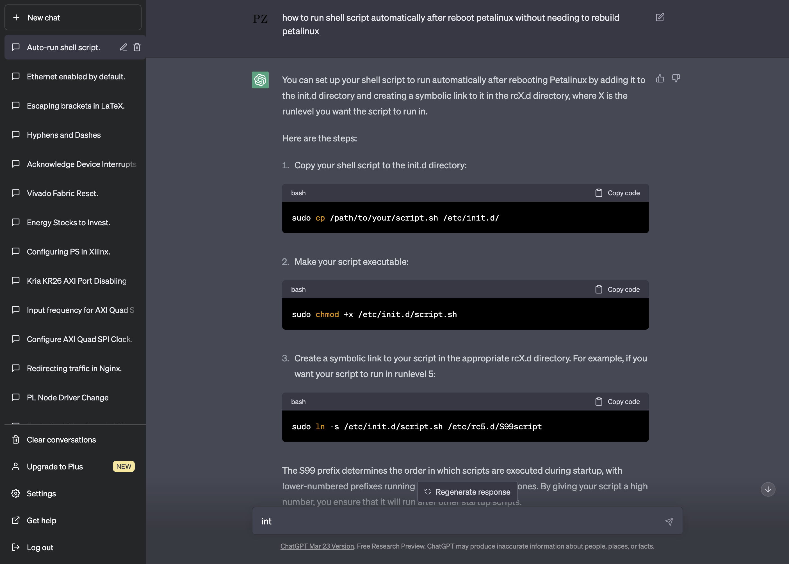

# Poznatky 17.04.2023

- aby se spustil skript a hlavně `eth0` interface na PetaLinux je třeba provést následující kroky - našel jsem to i na fóru, ale zeptal se pro jistotu na test i chatGPT
  

- ale někdy to stále nefunguje a po otevření a zavření souboru zas asi no... nevím..
- chce to dále vyzkoušet, řešení by bylo Orange PI, které bude mít na USB minicomu právě serial port Kria a ETH Orange Pi bude do networku a vzdáleně přes server a network se připojit do orange pi a spustit si minicom

- načítání skriptu po restartu systému

```sh
sudo cp /path/to/your/script.sh /etc/init.d/

sudo chmod +x /etc/init.d/script.sh

sudo ln -s /etc/init.d/script.sh /etc/rc5.d/S99script
```

- skript umístěný v `/etc/init.d/ethernetUp.sh`

```sh
#!/bin/sh


 echo "Starting network interfaces!"
 ip addr
/etc/init.d/networking start
 ip addr
```
