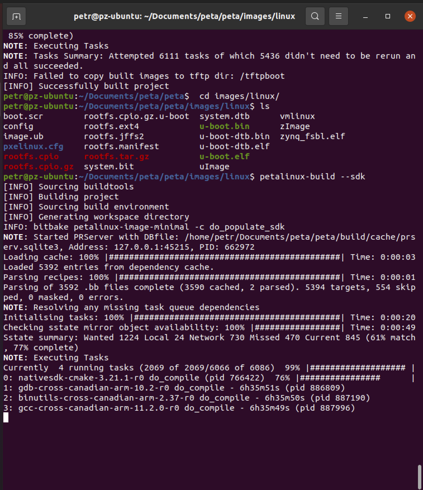
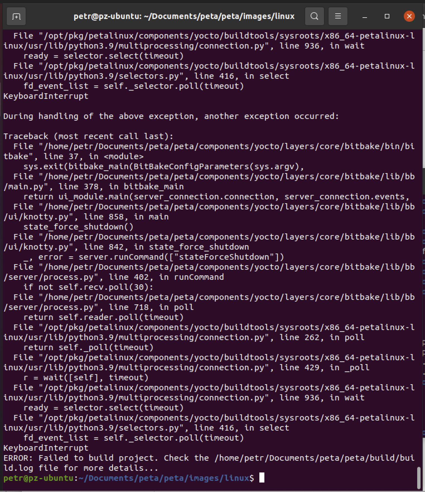

# Research of a subject

Základní base nápadů a poznatků ohledně programování FPGA. Pro a proti programování v C a použití HSL do VHDL nebo Verilog, porovnání s Matlab Coder.

_Advanced numerical model of permanent magnet synchronous motor implemented on FPGA for Hardware-in-in-the-loop systems_

Where to take inspiration

- [Conference paper](http://poseidon2.feld.cvut.cz/conf/poster/)
- [IEEE](https://ieeexplore.ieee.org/document/9432517)
- [Diploma Thesis ČVUT](https://dspace.cvut.cz/bitstream/handle/10467/89815/F3-DP-2020-Sterba-Vojtech-VojtechSterba.pdf?sequence=-1&isAllowed=y)

## Hardware in the loop systems - HIL

- slouží k testování komplexních embeded real time systémů

## FPGA

- Rychlejší switching events
- Procesuje paralelně oproti CPU, které sériově, ale nutnost převést model do diskrétního času, jed dražší
- VHDL nebo HDL programování, docela hard, na to aby se tam naprogramoval v čistém kódu nějaký matematický model
- asi bude programováno v simulinku s HDL compatible blocks a pak převedeno na Xilinx VHDL a implementováno
- FPGA programming in matlab [MathWorks](https://www.mathworks.com/discovery/fpga-programming.html)
- Getting Started With Matlab Programming [MathWorks](https://www.mathworks.com/solutions/fpga-asic-soc-development/resources.html)
- jediné dostupné Intel FPGA, které připadá v úvahu [Mouser](https://cz.mouser.com/ProductDetail/Intel/EK-10CL025U256?qs=HXFqYaX1Q2zh%2FEGiixG4LQ%3D%3D)
- supported FPGAs for HDL verifier [MathWorks](https://www.mathworks.com/help/supportpkg/alterafpgaboards/ug/altera-fpga-board-support-from-hdl-verifier.html)
- kde je možné také vyvíjet a simulovat věci na FPGA od intelu (Lite edice) [Intel](https://www.intel.com/content/www/us/en/collections/products/fpga/software/downloads.html?product=modelsim_ae&s=Newest&f:guidetm83741EA404664A899395C861EDA3D38B=%5BIntel%C2%AE%20Cyclone%C2%AE%5D)
- HDL coder do Matlabu [MathWorks](https://www.mathworks.com/products/hdl-coder.html)
- FPGA YouTube programming video for intel [YouTube](https://www.youtube.com/watch?v=vmraRVxKYss)
- programování FPGA [Design of FPGA-controlled power electronics and drives using MATLAB Simulink](https://ieeexplore-ieee-org.ezproxy.techlib.cz/document/6579155)
- Simulink Modeling and Design of an Efficient Hardware-Constrained FPGA-Based PMSM Speed Controller [Simulink Modeling and Design of an Efficient Hardware-Constrained FPGA-Based PMSM Speed Controller](https://ieeexplore-ieee-org.ezproxy.techlib.cz/document/6179536)
- FPGA Zybo Docs [Docs](https://digilent.com/reference/programmable-logic/zybo/start?redirect=1) - retired, replaced by newer version of Zybo Z7 [Docs](https://digilent.com/reference/programmable-logic/zybo-z7/reference-manual?redirect=1)

# Random notes

- resolver - lepší než encoder, jak funguje? [YouTube](https://www.youtube.com/watch?v=7PKJ52b1Qvs)
- verilog programming [YouTube](https://www.youtube.com/watch?v=vmraRVxKYss)
- tyto kostky jsou řízeny pomocí FPGA [GitHub](https://github.com/kbob/LED-Cube) [Twitter](https://twitter.com/esden/status/1160309492896215040)
- IP znamená Intellectual Property = znovupoužitelý blok, jak už HW tak SW, který není závislý an výrobci a HW, jde použít univerzálněji nebo méně univerzálněji [Info](https://www.techtarget.com/whatis/definition/IP-core-intellectual-property-core)

- rules for newbies with fpga programming generally [Rules for new FPGA designers](http://zipcpu.com/blog/2017/08/21/rules-for-newbies.html)

# Development

- DEPRACATED but still used by PZ development kit [Docs](https://digilent.com/reference/programmable-logic/zybo/start?redirect=1)
- NEW development kit [E-Shop](https://digilent.com/shop/zybo-z7-zynq-7000-arm-fpga-soc-development-board/)
- basic tutoriál na HDL coder [MathWorks](https://www.mathworks.com/help/hdlcoder/ug/getting-started-with-hardware-software-codesign-workflow-for-xilinx-zynq-platform.html)
- development in VIVADO [YouTube](https://www.youtube.com/watch?v=7HVpl1HiZoY)
- VERILOG and VHDL resources [Nandland](https://nandland.com/)
- VERILOG practice [HDLbits](https://hdlbits.01xz.net/wiki/Main_Page)
- C to Verilog article [Hackaday](https://hackaday.com/2015/12/17/xilinx-fpgas-in-c-for-free/)
- LegUp HLS C to verilog [LegUp](http://legup.eecg.utoronto.ca/) - free for non commercial
- C-like HDL use din game [GitHub](https://github.com/JulianKemmerer/PipelineC)
- Python convertsion library to VHDL [MyHDL](https://www.myhdl.org/)
- Vivado HLS Introduction [YouTube](https://www.youtube.com/watch?v=5lYq8_bqAcI)
- Getting started with Vivado HLS Tutorial [YouTube](https://www.youtube.com/watch?v=hZ2RGwLmXc0)
- Vivado HLS has been replaced by Vitis [Vitis Docs](https://www.xilinx.com/support/documentation-navigation/design-hubs/dh0090-vitis-hls-hub.html)
- Vivado Designing with IP [Vivado Docs](https://www.xilinx.com/support/documentation-navigation/design-hubs/dh0003-vivado-designing-with-ip-hub.html)

## Poznatky

- nainstalovat Vitis, protože obsahuje i Vivado, obráceně ne
- na vývojovou destičku digilent použít [Návod](https://digilent.com/reference/programmable-logic/guides/installing-vivado-and-vitis)
- použít podporovanou vezi ubuntu, jinak to nebude fungovat - verze 20.x (v době testování se jedná o poslední podporovanou vezi [20.04](https://releases.ubuntu.com/20.04/)), jaká verze je podporovaná je možné zkontrolovat v [Docs](https://docs.xilinx.com/r/en-US/ug973-vivado-release-notes-install-license/Supported-Operating-Systems)
- jeden z možných návodů na vivado a vitis [YouTube](https://www.youtube.com/watch?v=Mb-cStd4Tqs)
- pokud by se instalace zasekla v poslední části po nainstalování IDE, je možné zrušit v terminálu instalaci Ctrl+C a nainstalovat potřebné balíčky

```bash
sudo apt update
sudo apt upgrade
sudo apt install libncurses5
sudo apt install libtinfo5
sudo apt install libncurses5-dev libncursesw5-dev
sudo apt install ncurses-compat-libs
```

- může se stát, že nebude fungovat `sudo apt install ncurses-compat-libs`, nic se neděje, nevyzkoušel jsem, které jsou crucial pro instalaci
- pro možnosti nastartování je třeba použít `source` command neboli `source /tools/Xilinx/Vitis_HLS/2022.1/settings64.sh`
  `source /tools/Xilinx/Vivado/2022.1/settings64.sh`a poté pouštět pomocí commandů `vivado` resp `vitis_hls`, doporučuji však vytvoři aliasy

```bash
alias vitis_hls="source /tools/Xilinx/Vitis_HLS/2022.1/settings64.sh && vitis_hls"
alias vivado="source /tools/Xilinx/Vivado/2022.1/settings64.sh && vivado"
```

a poté spouštět klasickými commandy (protože nastaveno v aliasu)

- jak rozbalit tar archiv v Linuxu

```bash
tar -xzvf name_of_archive.tar.gz
```

_zdroj: [https://www.nexcess.net/help/how-to-decompress-files-in-gzip](https://www.nexcess.net/help/how-to-decompress-files-in-gzip)_

- zobrazit v linuxu připojená USB zařízení

```
dmesg | grep tty
```

- digilent Adept [Adept](https://digilent.com/reference/software/adept/start?redirect=2#software_downloads) na zobrazení připojených věcí nefunguje

```
djtgcfg enum
```

- někdy spadne syntéza ve Vivado - když je využito mnoho resources nebo chybí knihovny

```bash
sudo apt install libcanberra-gtk-module libcanberra-gtk3-module

```

- pro kódování v Matlabu je třeba stáhnotu v záložce Add-Ons -> Get Hardware Support Packages - Xilinx Zynq support, ale nejde to na macOS, bude třeba asi Windows
- pro funkčnost Matlabu na kódění FPGA Xilinx je třeba mít Vivado nainstalované
- How vitis programming works [https://xilinx.github.io/Vitis-Tutorials/2021-1/build/html/docs/Getting_Started/Vitis/Getting_Started_Vitis.html](https://xilinx.github.io/Vitis-Tutorials/2021-1/build/html/docs/Getting_Started/Vitis/Getting_Started_Vitis.html)

- informace o programování kernelů (pro FPGA) accelerated applications [Xilix](https://docs.xilinx.com/r/en-US/ug1393-vitis-application-acceleration/A-Sample-Application)

- jak optimalizovat programy v HLS [Xilix](https://docs.xilinx.com/r/en-US/ug1399-vitis-hls/Getting-Started-with-Vitis-HLS); _je tam dobrý checklist optimalizace_

- co znamená port v PRAGMA [Xilinx](https://docs.xilinx.com/r/en-US/ug1399-vitis-hls/pragma-HLS-interface)

- 📀 dobrý webinář na Vitis a Vivado obecně [YouTube](https://www.youtube.com/watch?v=a9ozwIT98rc)

- Vitis tutorials od Xilinxu na [GitHub](https://github.com/Xilinx/Vitis-Tutorials)

- možná návod jak udělat Linux a Accelerated App [Hackster.io](https://www.hackster.io/mohammad-hosseinabady2/vitis-2021-1-embedded-platform-for-zybo-z7-20-d39e1a)

- Digilent Zybo Petalinux od Digilentu [GitHub](https://github.com/Digilent/Petalinux-Zybo) (_nefungoval mi_), ale obsahuje popis, jak instalovat Petalinux obecně na Linux

  - source petalinux tools

  ```
   source /opt/pkg/petalinux/settings.sh
  ```

- zde popisují další změny ale ujiného FPGA při řešení petalinux - po kódu ohledne `petalinux-config -c kernel` [Hackster.io](https://www.hackster.io/news/microzed-chronicles-vitis-sw-platform-fd3921137bcf.amp)

- na odkaze [Support Xilinx](https://support.xilinx.com/s/article/73686?language=en_US) je možné dole stáhnout xlsx soubor, který obsahuje skript na nainstalování potřebných knihoven do Linuxu

  - např. pro linux 18.04.4 je dle excelu dostupný tento příkaz, ovšem dle hledání na internetu a hlášky terminalu, balíček `build-essential-dev` neexistuje

  ```bash
  sudo apt-get install gawk python build-essential gcc git make net-tools libncurses5-dev tftpd zlib1g-dev libssl-dev flex bison libselinux1 gnupg wget diffstat chrpath socat xterm autoconf libtool tar unzip texinfo zlib1g-dev gcc-multilib build-essential-dev zlib1g:i386 screen pax gzip
  ```

- qemu_args.txt pro Zybo 7000 ve složce s bootem [Xilinx](https://docs.xilinx.com/r/en-US/ug1393-vitis-application-acceleration/Zynq-7000-PS-Arguments-for-QEMU)

- how to boot petalinux on board xilinx support [Xilinx](https://docs.xilinx.com/r/en-US/ug1144-petalinux-tools-reference-guide/Prerequisites?tocId=8b_X7EaE~qj1uYiTAxonPA)

## Knihovny do Vitis

_když píše, že nenalezl..._

- [OpenCL](https://github.com/definelicht/hlslib/tree/a67e02f263d666e1c7ba649c6755025b5fdd38bf/include/hlslib)
- pack nějakých knihoven [HSLIB](https://github.com/definelicht/hlslib)
- KhronosGroup [OpenCl](https://github.com/KhronosGroup/OpenCL-CLHPP/tree/main/include)
- HLS_STREAM [GitHub](https://github.com/dgschwend/zynqnet/blob/master/_HLS_CODE/vivado_include/hls_stream.h)
- [xcl2.hpp a xcl2.cpp](https://github.com/Xilinx/Vitis_Accel_Examples/tree/master/common/includes/xcl2)

## Nápad jak udělat práci v C nebo Matlab/Simulink

- Nejdříve napsat v C HLS ve Xilix Vitis
- Exportovat IP
- vložit do Xilinx Vivado
- nahrát do FPGA

### Práce v C

#### Problémy 🔴

- nutnost naprogramování vlastních funkcí na transformace, na výpočty atd
- nutnost znalosti alespoň trochu VHDL nebo Verilog
- nutnost více SW
- nutnost ruční optimalizace
- SW je jen na Linux
- Vivado a Vitis mají neskutečně GB velikost
- momentálně nelze rozchodit HW Accelerated Coding

  - [**vyřešeno**] [_nepsrávná verze linuxu, i se správnou petalinux-build --sdk trvá přes 40 minut_] snažím se udělat s pomocí petalinux linux, který by běžel na CPU a tím pádem bych mohl ve Vitis udělat Platformu, která je accelerated na linuxu a tím pádem např. vloži automaticky examples s knihovnami, které nejdou globálně při klasickým embeded řešení načíst, hlásí to chyby a když je ručně vtáhnu z různých odkazů na webu, tak to stejně nefunguje
  - i po šesti hodinách se kompilace zasekne asi po 13 minutách a nejde dál, viz 
  - výpis, který se ukáže po manuálním zrušení 

- při instalaci vitis nainstalovat knihovny z části _Installation_ [Xilinx](https://docs.xilinx.com/r/en-US/ug1393-vitis-application-acceleration/OpenCL-Installable-Client-Driver-Loader)

```bash
sudo apt-get install ocl-icd-libopencl1
sudo apt-get install opencl-headers
sudo apt-get install ocl-icd-opencl-dev
```

- někdy třeba nejde něco spustit nebo zapisovat do něčeho, musím si vzpomenout u čeho ale je někdy důležité změnit i vlastníka

```
sudo chmod -R 755 direcotry_ #moznost zapisu a cteni atd
```

```
sudo chown -R $USER:$USER directory #zmena vlastnika
```

#### Výhody 🟢

- open source ❤️
- možnost snadnějšího portu na jiné FPGA i jiné vendors
- lépe optimalizovat než Matlab
- i SW na managing je open source (matlab ne)
- když bude dobrá optimalizace v C, tak dobrá optimalizace i HDL, lepší efficiency
- SW je na Linux, ale ne na macOS - nevadí, protože Linux může jet i na serveru (Ubuntu)

### Práce v Simulink/Matlab

#### Problémy 🔴

- jsem závislý na Matlabu a Simulinku a na tom, jak dobře vygeneruje HDL code
- jsem závislý na Addonu HDL Coder
- syntéza někdy trvá dlouho
- asi dlouhý kód
- nutnost převedení algoritmů do fixed point
- nutnost mít nainstalované Vivado i Matlab současně

#### Výhody 🟢

- dobře viditelné bloky
- snadno implementovat matematiku - funkce
- mělo by to být prakticky bez práce
- žádná nutnost dalších SW asi
- Matlab a Simulink není tak veliký
